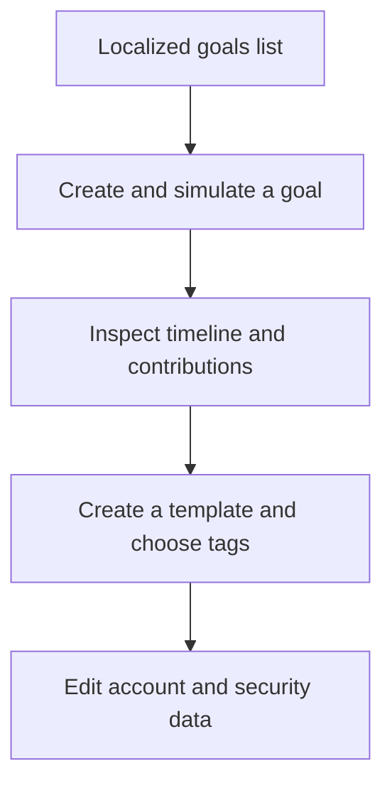
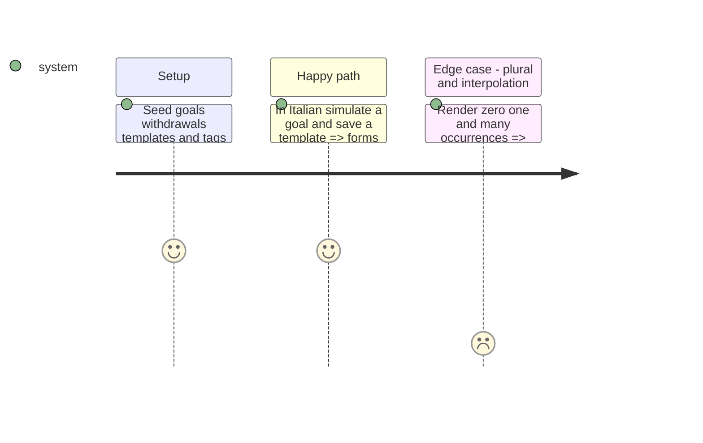

# Instruction: Localize savings goals, templates, tags, and account surfaces

## Architecture projection

```txt
android/src/
├── app/(main)/goal/**                                ✏️ goal routes
├── app/(main)/template/**                            ✏️ template routes
├── features/savings-goals/**                         ✏️ goals, projection, timeline, simulator, withdrawals
├── features/templates/**                             ✏️ template forms and lines
├── features/tags/**                                  ✏️ tag selection and empty states
├── features/account/**                               ✏️ profile/security completion and errors
├── ui/recovery-key-notice.tsx                        ✏️ localized global recovery notice
└── core/i18n/catalogs/{fr,en,de,it}.json             ✏️ add phase keys in lockstep
```

## User Journey



## Test Scope



## Tasks to do

### `1)` Translate remaining product features

1. Translate all visible feature copy and accessibility labels while preserving domain values and payloads.
2. Translate plural/interpolated messages through catalog options, never manual language branches in components.

### `2)` Keep calculations language-neutral

1. Leave savings/budget calculators and encrypted data untouched.
2. Translate only their presentation labels, explanatory text, and validation boundaries.

## Test acceptance criteria

| Task | Acceptance criteria                                                                                                                         |
| ---- | ------------------------------------------------------------------------------------------------------------------------------------------- |
| 1    | Goals, simulator, withdrawals, templates, tags, account sheets, and global recovery notice render wholly in all four languages.             |
| 2    | Zero/one/many and interpolated messages contain correct values and no unresolved catalog tokens; calculation tests are unchanged and green. |
