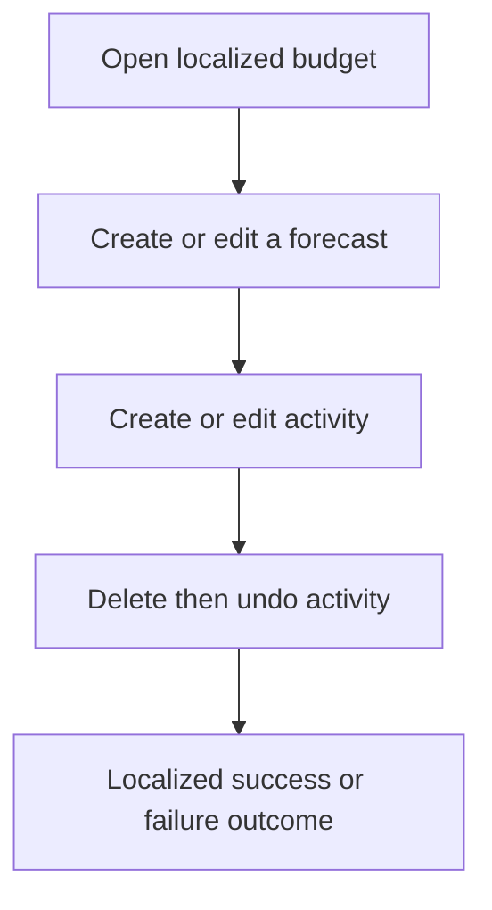
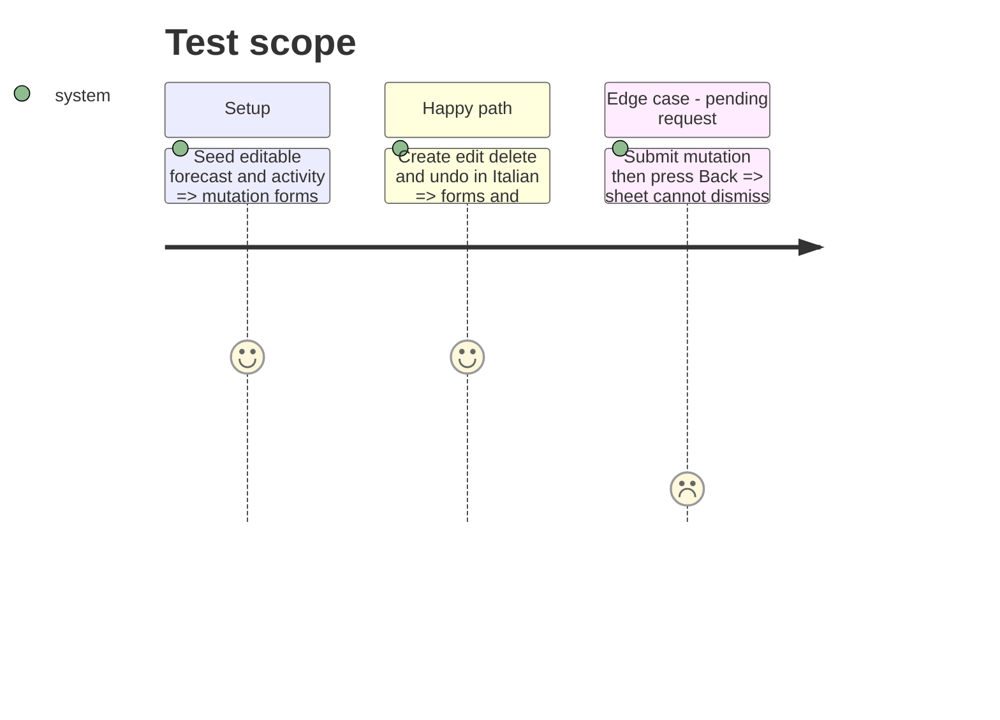

# Instruction: Localize budget and activity mutations

## Architecture projection

```txt
android/src/
├── features/budget-details/components/{budget-line-sheet,budget-detail-overlays}.tsx ✏️ localized forecast create/edit outcomes
├── features/transactions/components/transaction-sheet.tsx       ✏️ localized activity create/edit form
├── features/transactions/use-transaction-removal.ts             ✏️ localized delete and undo outcomes
├── features/{budget-details,transactions}/*draft*.ts             ✏️ semantic validation codes where required
└── core/i18n/{catalogs/*.json,phase6-mutations-i18n.spec.ts}      ✏️ equal keys and focused coverage
```

## User Journey



## Test Scope



## Tasks to do

### `1)` Localize form boundaries

1. Translate field labels, choices, validation, dialogs, progress, and accessibility copy.
2. Preserve API/domain values; expose semantic validation codes where imperative helpers currently return French.

### `2)` Preserve mutation safety

1. Keep pending sheets non-dismissable and retain delete/undo invalidation behavior.
2. Verify each success and failure path in all catalogs.

## Test acceptance criteria

| Task | Acceptance criteria                                                                                            |
| ---- | -------------------------------------------------------------------------------------------------------------- |
| 1    | Forecast and activity create/edit/delete/undo flows render wholly in FR/EN/DE/IT with unchanged payloads.      |
| 2    | A pending mutation cannot be dismissed or submitted twice; cache invalidation and undo behavior remain intact. |
