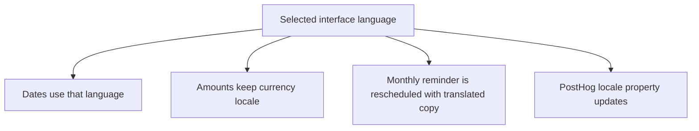
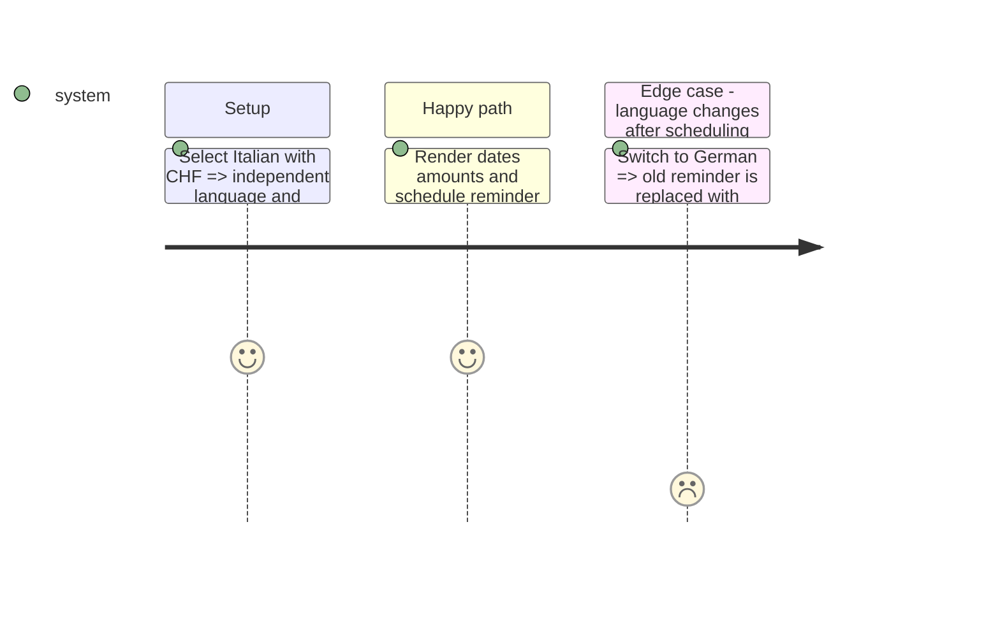

# Instruction: Localize formatters, notifications, and non-visual messages

## Architecture projection

```txt
android/src/
├── core/ui/{date-format.ts,date-format.spec.ts}       ✏️ selected-language dates and grammar-free helpers
├── core/ui/amount-format.ts                           ✏️ verify currency-owned formatting remains unchanged
├── core/notifications/scheduler.ts                    ✏️ localized scheduled notification copy
├── core/notifications/use-reminder-priming.ts         ✏️ reschedule after locale changes
├── core/observability/analytics.ts                    ✏️ sync locale person property
├── core/{api,auth,crypto,system,vault}/**             ✏️ close remaining imperative messages
└── core/i18n/catalogs/{fr,en,de,it}.json              ✏️ complete catalogs
```

## User Journey



## Test Scope



## Tasks to do

### `1)` Separate language-sensitive and currency-sensitive formatting

1. Make date formatters resolve against the current interface locale and remove French-only grammar helpers from call sites.
2. Preserve `CURRENCY_METADATA.numberLocale`, the Swiss apostrophe normalization, masking, signs, and decimals exactly.

### `2)` Update background and analytics surfaces

1. Translate notification content at scheduling time and reschedule the single stable reminder after a locale change.
2. Set the safe PostHog `locale` person property whenever confirmed settings change; emit no raw device locale.

## Test acceptance criteria

| Task | Acceptance criteria                                                                                                  |
| ---- | -------------------------------------------------------------------------------------------------------------------- |
| 1    | Dates follow `fr/en/de/it`; CHF/EUR formatting output remains byte-for-byte compatible with existing amount tests.   |
| 2    | The stable monthly reminder is replaced in the new language and PostHog receives only a normalized supported locale. |
