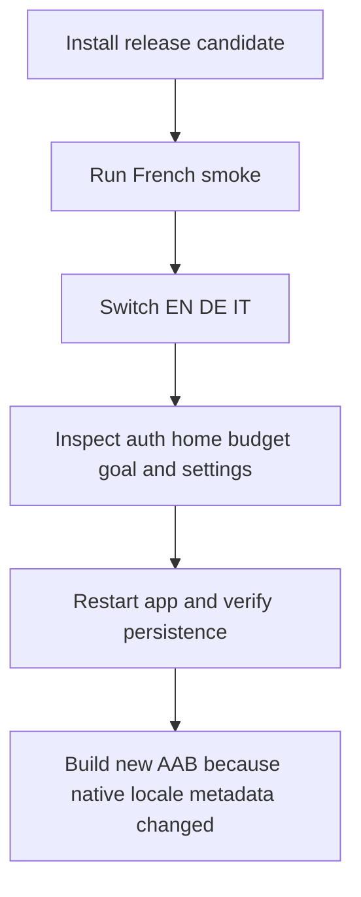
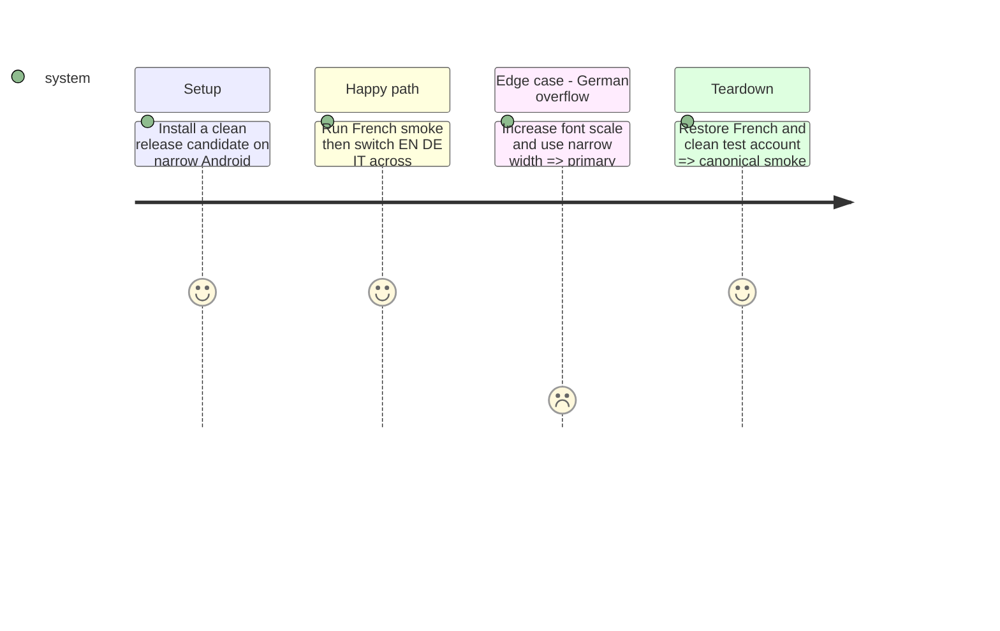

# Instruction: Prove parity, layout resilience, and release readiness

## Architecture projection

```txt
.
├── .github/scripts/lexicon.test.mjs                  ✏️ scan Android catalogs per language
├── android/maestro/smoke.yaml                        ✏️ keep canonical French smoke stable
├── android/maestro/i18n.yaml                         ✅ switch languages and inspect representative flows
├── android/src/core/i18n/catalog-parity.spec.ts      ✏️ reject missing, empty, extra, or raw-key output
├── android/docs-android/RELEASE.md                    ✏️ document supported locales and native rebuild requirement
├── android/app.json                                  ✏️ final supportedLocales config verification
└── android/package.json                              ✏️ release version bump only when cutting the new AAB
```

## User Journey



## Test Scope



## Tasks to do

### `1)` Add automated catalog and vocabulary gates

1. Compare flattened keys and value types across all catalogs; reject blanks, unsupported locale roots, and missing French fallback.
2. Extend the existing multilingual lexicon scanner to Android catalogs.

### `2)` Validate the real application

1. Run Android quality, unit tests, export, canonical Maestro smoke, and the focused locale journey.
2. Manually inspect German at narrow width/font scaling and exercise live switch, restart, sign-out, offline settings failure, notification, and accessibility labels.
3. Bump the Android app/build version only when cutting the new AAB; config-plugin locale metadata requires a native binary and cannot ship by OTA alone.

## Test acceptance criteria

| Task | Acceptance criteria                                                                                                                                                            |
| ---- | ------------------------------------------------------------------------------------------------------------------------------------------------------------------------------ |
| 1    | CI fails on any missing/extra/blank catalog value or banned product word in any Android locale.                                                                                |
| 2    | Quality, unit, export, French smoke, locale journey, narrow German layout, restart/sign-out persistence, rollback, and accessibility checks pass on the release candidate AAB. |
