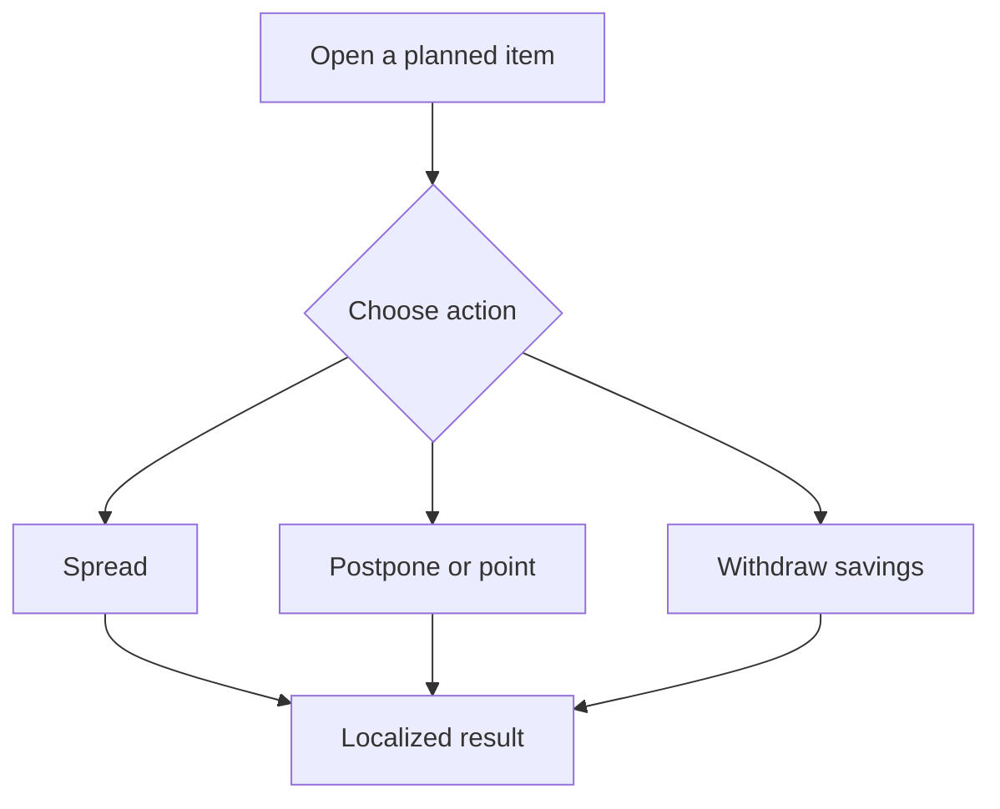
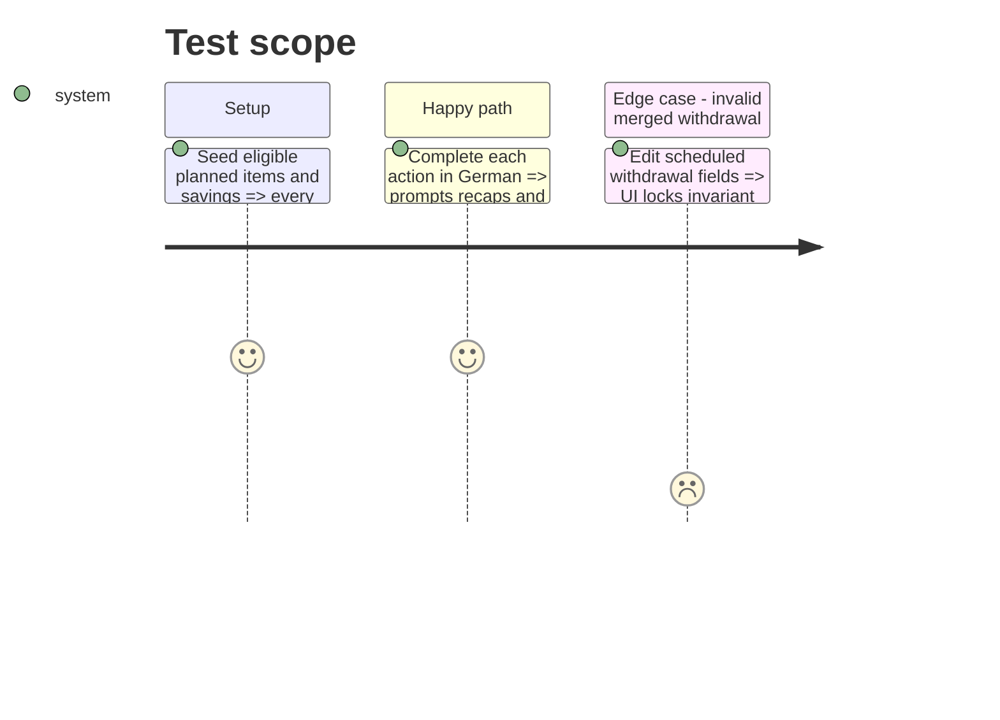

# Instruction: Localize spread, postpone, point, and savings withdrawal

## Architecture projection

```txt
android/src/
├── features/budget-details/spread/{spread-window.ts,components/*.tsx}               ✏️ localized spread validation and sheets
├── features/budget-details/postpone-gate.ts                                          ✏️ semantic postpone outcomes
├── features/budget-details/savings-withdrawal/{withdrawal-gate.ts,components/*.tsx}  ✏️ localized withdrawal journey
├── features/budget-details/components/{budget-line-sheet,point-circle}.tsx           ✏️ localized actions and accessibility
└── core/i18n/{catalogs/*.json,phase7-actions-i18n.spec.ts}                            ✏️ equal keys and focused coverage
```

## User Journey



## Test Scope



## Tasks to do

### `1)` Localize multi-step actions

1. Translate spread, postpone, point, withdrawal, recap, and failure surfaces.
2. Keep action/status identifiers and financial payloads language-neutral.

### `2)` Protect financial invariants

1. Preserve encrypted amount handling and existing eligibility gates.
2. Keep scheduled savings withdrawals constrained to the backend-supported nature and recurrence.

## Test acceptance criteria

| Task | Acceptance criteria                                                                                                 |
| ---- | ------------------------------------------------------------------------------------------------------------------- |
| 1    | Spread, postpone, point, and savings-withdrawal journeys render fully in each locale with no raw catalog token.     |
| 2    | Financial values, eligibility, encryption boundaries, and backend withdrawal invariants are unchanged and verified. |
