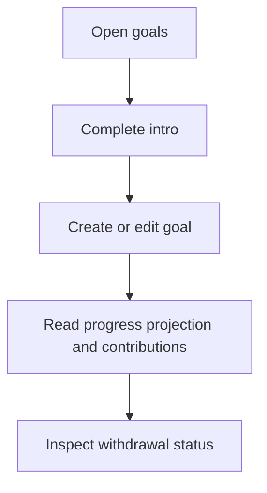
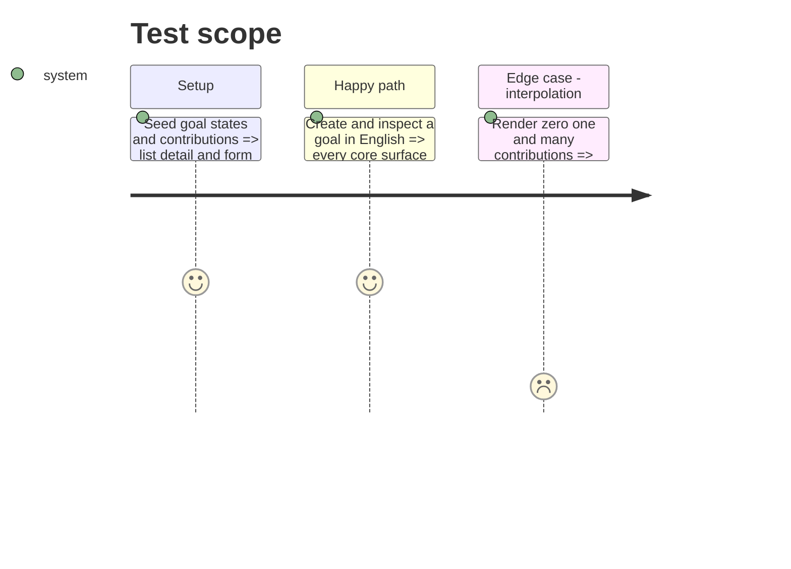

# Instruction: Localize savings-goal core journeys

## Architecture projection

```txt
android/src/
├── app/(main)/goal/{index,[id]}.tsx                         ✏️ localized list and detail states
├── features/savings-goals/{goal-draft,plan-timeline}.ts     ✏️ semantic validation and status variants
├── features/savings-goals/components/{goals-intro,goal-form-sheet,goal-progress-card}.tsx ✏️ localized discovery and form
├── features/savings-goals/components/{goal-projection-chart,goal-contributions,goal-withdrawals}.tsx ✏️ localized progress
└── core/i18n/{catalogs/*.json,phase8-goals-core-i18n.spec.ts} ✏️ equal keys and focused coverage
```

## User Journey



## Test Scope



## Tasks to do

### `1)` Localize goal discovery and editing

1. Translate intro, list/detail states, form validation, and accessibility copy.
2. Replace French-returning helpers with semantic variants translated at presentation.

### `2)` Localize goal progress

1. Translate charts, timeline, contributions, withdrawals, and empty/error states.
2. Leave savings calculations and encrypted amounts untouched.

## Test acceptance criteria

| Task | Acceptance criteria                                                                                      |
| ---- | -------------------------------------------------------------------------------------------------------- |
| 1    | Goal intro, list, detail, and form states render wholly in FR/EN/DE/IT with unchanged API payloads.      |
| 2    | Progress and contribution values remain identical; plurals and interpolations have no unresolved tokens. |
