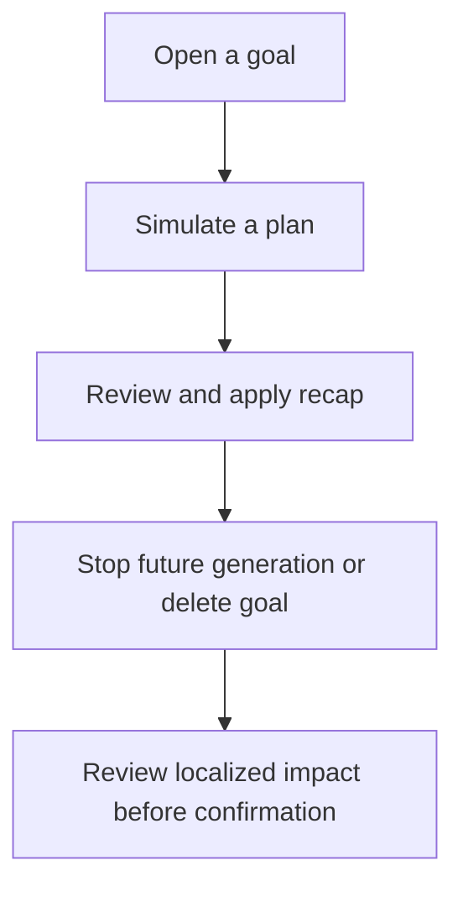
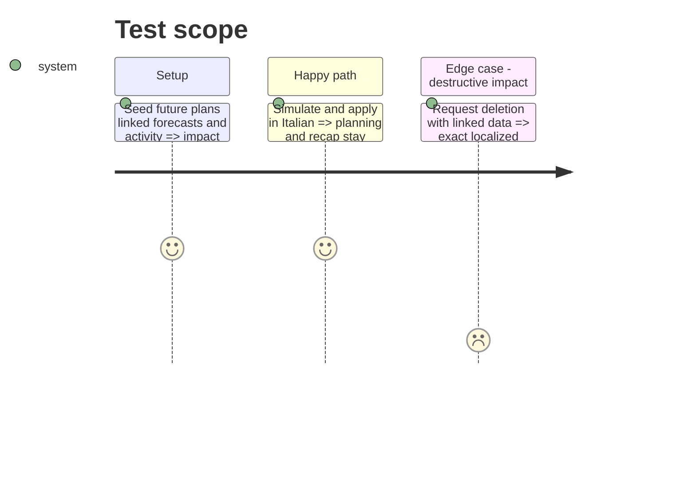

# Instruction: Localize savings-goal planning and destructive journeys

## Architecture projection

```txt
android/src/features/savings-goals/
├── components/simulator/**                                      ✏️ localized plan simulation and recap
├── components/{goal-plan-timeline,goal-state-cards}.tsx          ✏️ localized planning states
├── components/{goal-generation-stop-sheet,goal-deletion-sheet}.tsx ✏️ localized destructive confirmations
├── {plan-simulator,projection-series,goals-vm}.ts                ✏️ language-neutral calculations and variants
└── ../../core/i18n/{catalogs/*.json,phase9-goals-planning-i18n.spec.ts} ✏️ equal keys and focused coverage
```

## User Journey



## Test Scope



## Tasks to do

### `1)` Localize planning tools

1. Translate simulator, monthly plan, recap, constraints, and accessibility copy.
2. Keep projections and allocation formulas language-neutral and unchanged.

### `2)` Localize destructive decisions

1. Translate stop-generation and deletion scopes, linked-data impact, progress, and failures.
2. Preserve confirmation gates and pending-dismiss protections.

## Test acceptance criteria

| Task | Acceptance criteria                                                                                                |
| ---- | ------------------------------------------------------------------------------------------------------------------ |
| 1    | Simulator and plan timeline render in all locales while producing byte-for-byte equivalent calculation results.    |
| 2    | Destructive sheets explain the same impact, require the same confirmation, and cannot dismiss while mutations run. |
