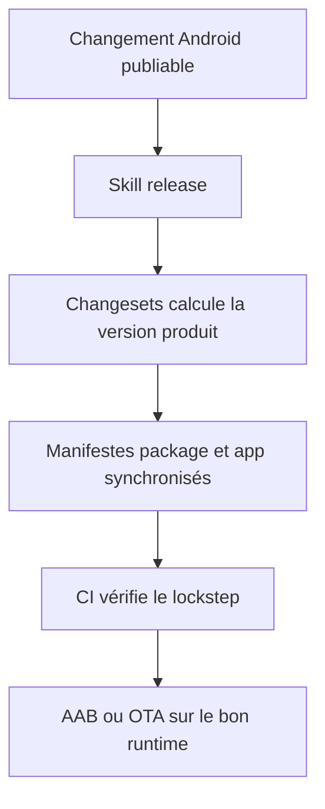
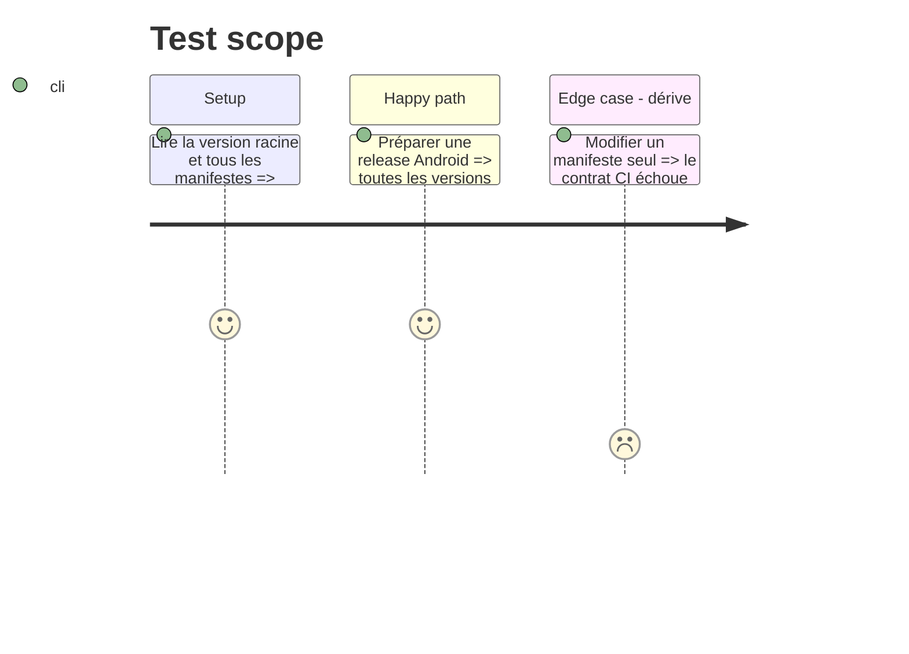

# Instruction: Verrouiller la version produit et la release Android

## Architecture projection

> Tree of the final files. ✅ create · ✏️ modify · ❌ delete

```txt
.
├── .changeset/config.json                                      ✏️ inclure Android et versionner explicitement les packages privés
├── .claude/skills/release/
│   ├── SKILL.md                                                ✏️ détecter, bumper, vérifier et staged Android
│   ├── references/jsts-release.md                             ✏️ documenter Android dans le groupe fixe
│   └── references/semver-conventions.md                       ✏️ intégrer les changements Android au bump produit
├── .github/scripts/ci-security.test.mjs                        ✏️ refuser toute dérive de version ou de contrat de release
├── android/app.json                                           ✏️ réaligner la version applicative sur la racine
├── android/package.json                                       ✏️ réaligner la version workspace sur la racine
├── android/docs-android/RELEASE.md                             ✏️ remplacer l’étape manuelle par l’invariant réel
└── docs/VERSIONING.md                                          ✏️ intégrer Android au modèle produit fixe
```

## User Journey



## Test Scope



## Tasks to do

### `1)` Réparer et définir l’autorité de version

1. Aligner `android/package.json` et `android/app.json` sur la version racine actuelle.
2. Ajouter `pulpe-android` au groupe `fixed` et fixer `privatePackages.version=true`, `tag=false`.

### `2)` Étendre le workflow de release

1. Ajouter `android/**` à la détection des packages et au calcul du bump produit.
2. Après Changesets, copier la cible vers `app.json`, vérifier les sept champs de version et staged les fichiers Android attendus.
3. Mettre à jour les références et la documentation sans toucher à la SemVer iOS indépendante.

### `3)` Rendre la dérive impossible en CI

1. Étendre `ci-security` pour comparer racine, cinq workspaces et `app.json`.
2. Vérifier aussi la présence Android dans le groupe fixe et dans les étapes critiques du skill release.

## Test acceptance criteria

| Task | Acceptance criteria                                                                                                                 |
| ---- | ----------------------------------------------------------------------------------------------------------------------------------- |
| 1    | Racine, frontend, landing, backend, shared, Android package et Android app portent la même version produit ; iOS reste indépendant. |
| 2    | Une correction limitée à `android/**` déclenche un bump produit et le runtime OTA reçoit exactement la version approuvée.           |
| 3    | Une divergence simulée ou le retrait d’Android du groupe fixe fait échouer `test:ci-security`.                                      |
