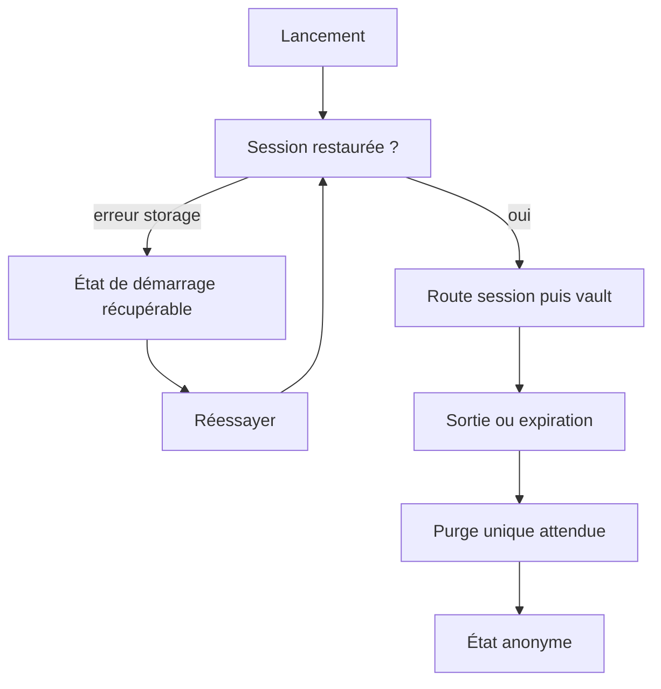
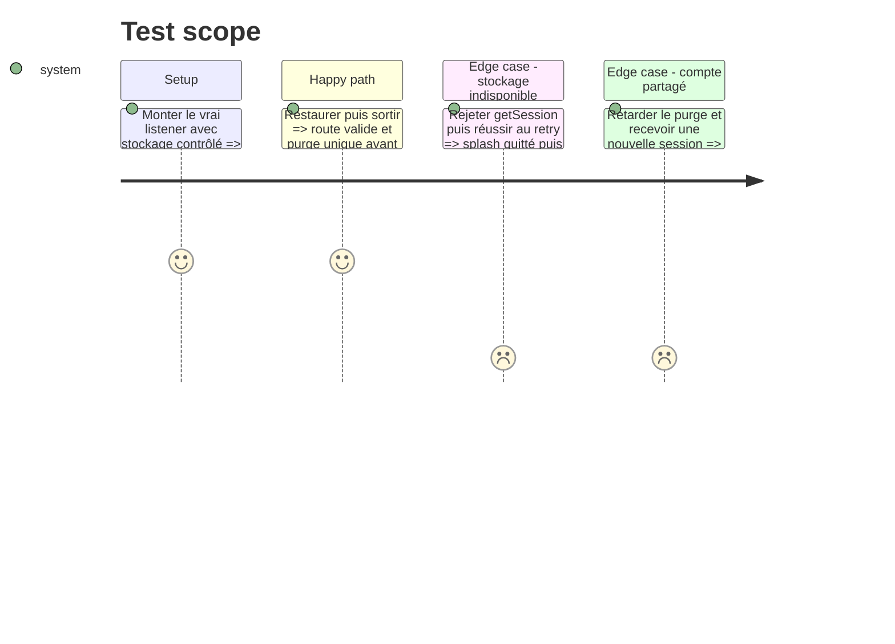

# Instruction: Rendre la restauration et la sortie de session atomiques

## Architecture projection

> Tree of the final files. ✅ create · ✏️ modify · ❌ delete

```txt
.
├── android/src/app/_layout.tsx                                ✏️ sortir du splash sur erreur et offrir le retry existant
├── android/src/core/auth/session-store.ts                     ✏️ restaurer avec erreur explicite et sérialiser le teardown
├── android/src/core/auth/session-store.spec.ts                ✏️ couvrir listener, retry et ordre du purge
├── android/src/core/navigation/route-gates.ts                 ✏️ fermer les groupes pendant une erreur de restauration
├── android/src/core/navigation/route-gates.spec.ts            ✏️ couvrir le nouveau statut dans la matrice
├── android/src/core/observability/analytics.ts                ✏️ réduire l’identité Android au pseudonyme stable
├── android/src/core/observability/analytics.spec.ts           ✏️ interdire e-mail et prénom dans identify
├── android/src/core/i18n/catalogs/fr.json                     ✏️ ajouter la copie canonique du démarrage récupérable
├── android/src/core/i18n/catalogs/en.json                     ✏️ traduire la copie de démarrage
├── android/src/core/i18n/catalogs/de.json                     ✏️ traduire la copie de démarrage
├── android/src/core/i18n/catalogs/it.json                     ✏️ traduire la copie de démarrage
└── docs/CONSENT.md                                             ✏️ ajouter Android et documenter les propriétés réellement envoyées
```

## User Journey



## Test Scope



## Wireframe

```txt
┌─────────────────────────────────┐
│                                 │
│          (1) État système       │
│             [icône]             │
│                                 │
│        (2) Titre + contexte     │
│                                 │
│          (3) Action primaire    │
│                                 │
└─────────────────────────────────┘
```

1. État système : repère non ambigu après la disparition du splash.
2. Titre + contexte : explique l’échec de restauration sans détail technique.
3. Action primaire : relance la restauration dans le même processus.

## Tasks to do

### `1)` Rendre le bootstrap récupérable

1. Ajouter un statut de restauration en erreur et une opération de retry single-flight.
2. Attraper tout rejet initial, cacher le splash et réutiliser `PlaceholderScreen` dans les providers existants.
3. Garder tous les groupes de route fermés tant que le statut est `loading` ou en erreur.

### `2)` Unifier le teardown local

1. Faire passer `signOut`, `endRecoverySession` et `SIGNED_OUT` par la même promesse de purge.
2. Invalider l’écriture de langue, tenter chaque nettoyage, puis seulement publier l’état anonyme.
3. Attendre cette promesse avant d’appliquer une nouvelle session reçue pendant le purge.

### `3)` Minimiser l’identité de diagnostic

1. Conserver UUID Supabase et statut early adopter ; supprimer e-mail, prénom et le code devenu mort.
2. Mettre les tests et `docs/CONSENT.md` en accord avec le réglage opt-out actuel et la surface Android.

## Test acceptance criteria

| Task | Acceptance criteria                                                                                                   |
| ---- | --------------------------------------------------------------------------------------------------------------------- |
| 1    | Un rejet SecureStore ne produit jamais un splash permanent et le retry peut atteindre authentifié ou non authentifié. |
| 2    | Le listener et la sortie explicite déclenchent un seul purge ; aucun groupe auth n’est monté avant sa fin.            |
| 2    | Une session B reçue pendant le nettoyage de A n’est appliquée qu’après le nettoyage et reste intacte.                 |
| 3    | Aucun appel Android `identify` ne contient e-mail, prénom, montant, texte libre ou secret.                            |
