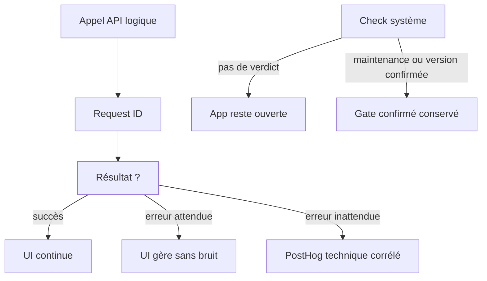
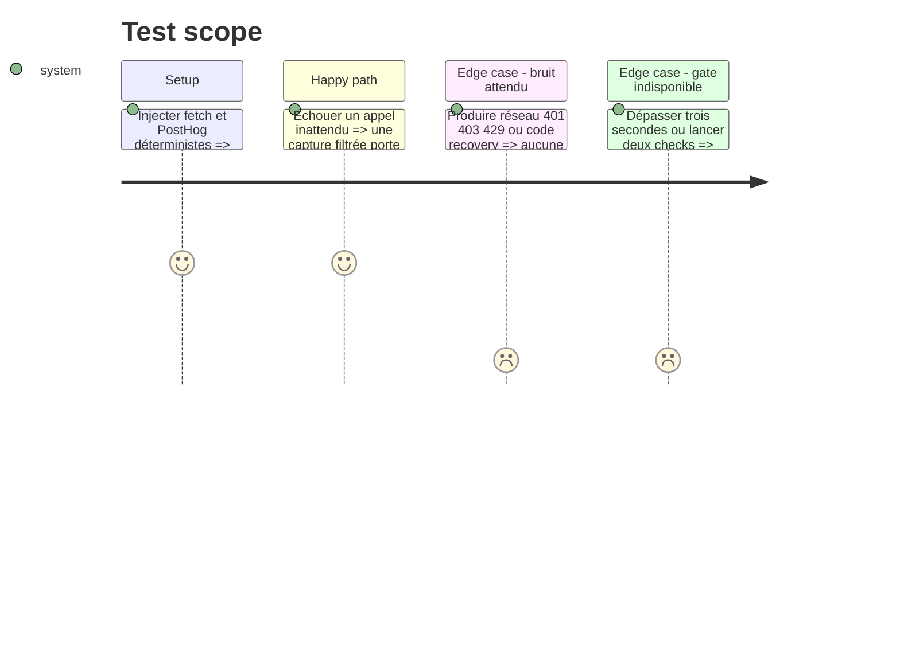

# Instruction: Corréler les erreurs et réaligner le gate système

## Architecture projection

> Tree of the final files. ✅ create · ✏️ modify · ❌ delete

```txt
android/src/
├── app/_layout.tsx                                            ✏️ signaler l’échec de bootstrap une fois Analytics démarré
├── core/api/
│   ├── api-client.ts                                          ✏️ timeout/retry par lecture et capture finale unique
│   ├── api-client.spec.ts                                     ✏️ vérifier corrélation, abort et capture finale
│   ├── api-error.ts                                           ✏️ conserver requestId sur l’erreur normalisée
│   └── api.ts                                                 ✏️ injecter le reporter sans coupler le client à PostHog
├── core/observability/
│   ├── api-error-reporting.ts                                 ✅ filtrer et normaliser les erreurs HTTP
│   ├── api-error-reporting.spec.ts                            ✅ couvrir filtres et assainissement
│   ├── analytics.ts                                           ✏️ exposer captureException avec propriétés assainies
│   └── analytics.spec.ts                                      ✏️ vérifier le respect du réglage diagnostics
├── core/system/system-store.ts                               ✏️ fail-open, vrai timeout et single-flight
├── core/system/system-store.spec.ts                          ✏️ couvrir panne initiale, abort et concurrence
├── core/system/system-gate-screen.tsx                         ✏️ supprimer le gate offline
├── core/i18n/catalogs/fr.json                                ✏️ supprimer la copie offline canonique
├── core/i18n/catalogs/en.json                                ✏️ supprimer la copie offline traduite
├── core/i18n/catalogs/de.json                                ✏️ supprimer la copie offline traduite
└── core/i18n/catalogs/it.json                                ✏️ supprimer la copie offline traduite
```

## User Journey



## Test Scope



## Tasks to do

### `1)` Porter la corrélation jusqu’à l’erreur finale

1. Générer le request ID dans la requête, reprendre l’écho serveur si présent et le conserver sur `ApiError`.
2. Ajouter aux GET des options facultatives `timeoutMs` et `retryCount` sans changer les appels existants.
3. Déclencher le callback d’erreur une fois par appel logique, après les retries d’une lecture.

### `2)` Capturer seulement les incidents actionnables

1. Normaliser l’exception en libellé technique et assainir méthode, statut, code, chemin sans identifiant et request ID.
2. Filtrer réseau/timeout, 401, 403, 429 et les trois codes métier recovery/chiffrement attendus.
3. Respecter le réglage diagnostics et ne jamais transmettre message backend, body, URL brute ou détail Zod.

### `3)` Corriger le gate à la source

1. Supprimer `offline` du type, de l’écran, des catalogues et des tests.
2. Appeler le client avec trois secondes et zéro retry pour provoquer un vrai abort.
3. Partager le check en vol et ne modifier l’état que sur maintenance ou version confirmée ; préserver tout blocage déjà confirmé.

## Test acceptance criteria

| Task | Acceptance criteria                                                                                                                            |
| ---- | ---------------------------------------------------------------------------------------------------------------------------------------------- |
| 1-2  | Un 5xx final est capturé une fois avec `request_id`, méthode, statut, code et chemin anonymisé, jamais avec une donnée utilisateur.            |
| 2    | Les erreurs attendues et tout diagnostic désactivé ne produisent aucune capture.                                                               |
| 3    | Une panne initiale laisse le gate à `ok`, conformément à l’ADR-0017 ; une maintenance ou force-update confirmée survit à une panne ultérieure. |
| 3    | À trois secondes, le fetch est aborté et deux refreshs concurrents n’émettent qu’une requête.                                                  |
