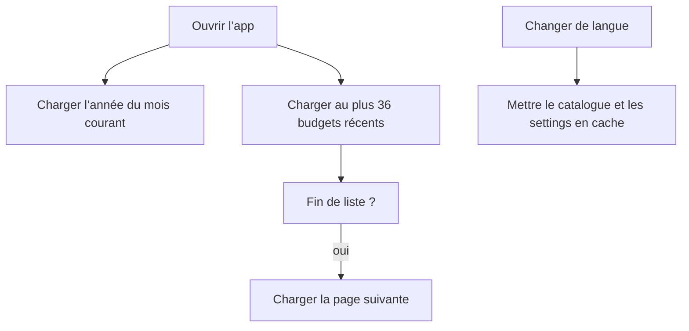
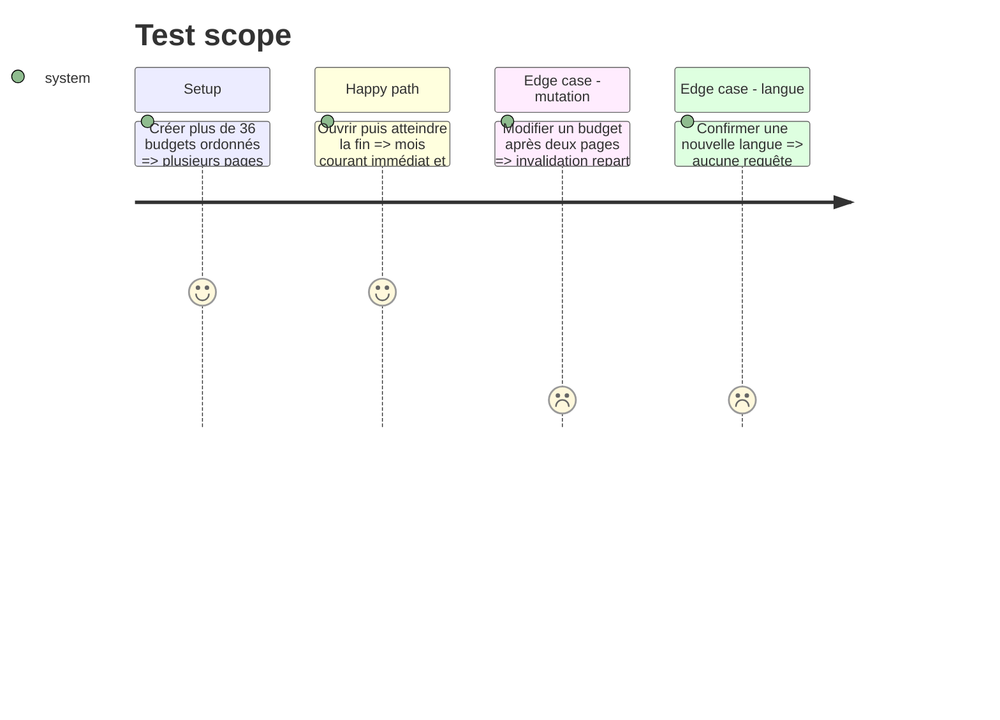

# Instruction: Borner le cache langue et l’historique des budgets

## Architecture projection

> Tree of the final files. ✅ create · ✏️ modify · ❌ delete

```txt
.
├── shared/schemas.ts                                         ✏️ ajouter offset borné à ListBudgetsQuery
├── shared/src/list-budgets-query.spec.ts                    ✅ verrouiller coercition et bornes du contrat
├── backend-nest/src/modules/budget/
│   ├── application/find-all-budgets.use-case.ts             ✏️ inclure offset dans le cache
│   ├── application/find-all-budgets.use-case.spec.ts        ✏️ distinguer les pages dans le cache
│   ├── domain/ports/budget-repository.port.ts               ✏️ porter le filtre offset
│   └── infrastructure/
│       ├── http/budget.controller.ts                        ✏️ documenter le paramètre additif
│       ├── persistence/supabase-budget.repository.ts        ✏️ appliquer un range ordonné
│       └── persistence/supabase-budget.repository.spec.ts   ✏️ couvrir bornes et ordre des pages
└── android/src/
    ├── core/user-settings/user-settings-queries.ts          ✏️ supprimer l’invalidation globale
    ├── features/budgets/budget-api.ts                       ✏️ exposer page de 36 et requête annuelle
    ├── features/budgets/budget-queries.ts                   ✏️ fournir la liste infinie aplatie
    ├── features/current-month/current-month-queries.ts      ✏️ résoudre le mois sans tout l’historique
    ├── features/current-month/current-month-queries.spec.ts ✏️ couvrir la résolution annuelle
    └── app/(main)/(tabs)/budgets.tsx                        ✏️ charger la page suivante en fin de liste
```

## User Journey



## Test Scope



## Tasks to do

### `1)` Supprimer le refetch global de langue

1. Garder uniquement `setQueryData` dans `cacheUserSettings` ; le catalogue local et `LocaleSync` possèdent déjà le rendu.
2. Tester qu’aucune query sans clé n’est invalidée après confirmation serveur.

### `2)` Ajouter une pagination API rétrocompatible

1. Ajouter `offset` optionnel et non négatif, accepté uniquement avec `limit`, au schéma partagé et au cache backend.
2. Appliquer `order(year desc, month desc)` puis `range(offset, offset + limit - 1)` dans le repository.
3. Couvrir limites, coercition, cache distinct et absence de chevauchement.

### `3)` Séparer le mois courant de l’historique

1. Résoudre le mois courant avec `year` et les seuls champs de période nécessaires.
2. Passer la liste à `useInfiniteQuery`, aplatir ses pages dans le hook existant et conserver la même clé d’invalidation.
3. Déclencher la page suivante une seule fois en fin de `SectionList` et afficher son chargement sans masquer les pages présentes.

## Test acceptance criteria

| Task | Acceptance criteria                                                                                                         |
| ---- | --------------------------------------------------------------------------------------------------------------------------- |
| 1    | Une écriture de locale confirmée met à jour settings et traduction sans refetch d’une autre famille de query.               |
| 2    | `offset` est additif, borné, lié à `limit` et ordonné ; les clients actuels sans offset reçoivent la même forme de réponse. |
| 3    | Le premier rendu charge au plus 36 budgets et le mois courant reste trouvable même avec plus de 36 lignes.                  |
| 3    | Chaque fin de liste ajoute une page sans doublon ; une page courte termine le chargement.                                   |
