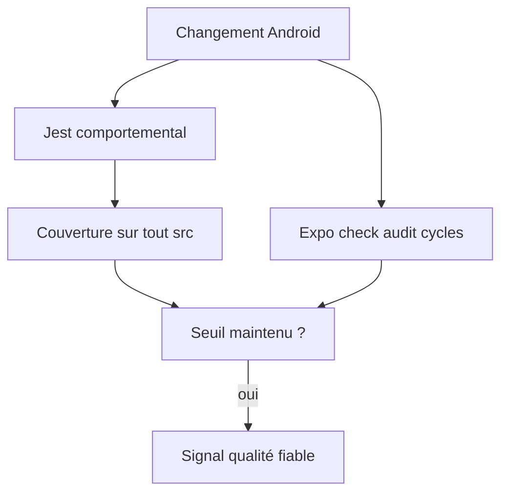
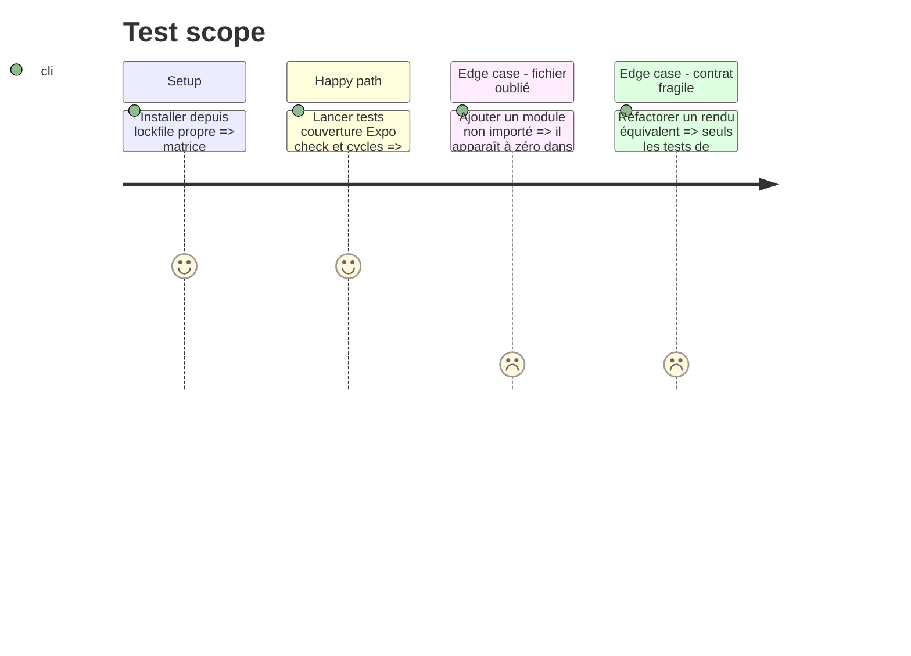

# Instruction: Rendre les tests, dépendances et métriques de qualité honnêtes

## Architecture projection

> Tree of the final files. ✅ create · ✏️ modify · ❌ delete

```txt
.
├── package.json                                               ✏️ accueillir Madge et contrôler compatibilité Expo et cycles Android
├── frontend/package.json                                     ✏️ retirer Madge devenu commun au dépôt
├── android/
│   ├── package.json                                           ✏️ ajouter RNTL, scripts et mises à jour Expo compatibles
│   ├── jest.config.js                                         ✏️ dénominateur complet et seuils mesurés
│   ├── README.md                                              ✏️ documenter les commandes de qualité Android
│   ├── docs-android/DEPENDENCIES.md                          ✅ suivre uniquement les advisories amont non corrigeables
│   ├── src/features/onboarding/onboarding-state.ts           ✅ porter le contrat de données sans dépendance runtime
│   ├── src/features/onboarding/onboarding-store.ts           ✏️ importer le contrat neutre
│   ├── src/features/onboarding/onboarding-selectors.ts       ✏️ supprimer le retour vers le store
│   ├── src/features/onboarding/onboarding-analytics.ts       ✏️ supprimer le retour vers le store
│   ├── src/core/auth/session-vault-lifecycle.spec.ts         ✅ intégrer session, bootstrap vault et routage
│   ├── src/core/auth/reset-password-route.spec.ts            ❌ remplacé par un test de route exécuté
│   ├── src/core/auth/reset-password-route.spec.tsx           ✅ rendre le parcours de récupération
│   ├── src/core/user-settings/required-settings-gate.spec.ts ❌ remplacé par un test de composant exécuté
│   ├── src/core/user-settings/required-settings-gate.spec.tsx ✅ rendre loading, cache et erreur
│   ├── src/features/onboarding/onboarding-accessibility.spec.ts ❌ remplacé par un test d’accessibilité exécuté
│   └── src/features/onboarding/onboarding-accessibility.spec.tsx ✅ vérifier la modalité pendant soumission
└── pnpm-lock.yaml                                             ✏️ figer la résolution validée
```

## User Journey



## Test Scope



## Tasks to do

### `1)` Installer le minimum de test UI supporté

1. Ajouter React Native Testing Library via `expo install --dev`, sans dépendre directement de `react-test-renderer` avec React 19.
2. Garder les tests de route hors de `src/app` et mocker seulement la frontière `useRouter` : le helper Expo Router 57 suppose encore un rendu RNTL synchrone, incompatible avec RNTL 14.

### `2)` Corriger le dénominateur et poser le plancher réel

1. Collecter tout `src` TS/TSX, hors specs, types purs et helpers de test explicitement justifiés.
2. Mesurer après les phases 1 à 4, fixer le seuil global au plancher observé et des seuils ciblés auth/vault/api sans inventer de pourcentage.
3. Faire exécuter cette couverture par la commande Jest appelée en CI.

### `3)` Séparer comportement et contrat statique

1. Convertir d’abord restore/sign-out, bootstrap vault, gate, query states, accessibilité modale et destructions en tests exécutés.
2. Convertir les trois specs projetées en tests de rendu et conserver les scans source pour les invariants globaux : frontières, primitive unique, tokens et absence de fuite PostHog.
3. Examiner les autres scans pendant la migration et ne les modifier que s’ils prétendent couvrir un comportement déjà exécuté ailleurs.

### `4)` Réduire la dette de toolchain sans override isolé

1. Appliquer seulement les patchs compatibles proposés par Expo, puis relancer export, Jest et audit.
2. Déplacer Madge de `frontend/package.json` vers le `package.json` racine, puis étendre `deps:check` à `expo install --check` et aux graphes frontend et Android.
3. Casser le cycle onboarding révélé par le nouveau contrôle en déplaçant uniquement son contrat de données dans un module de type neutre.
4. Consigner les advisories sans correctif, leur chemin build-only et la condition de retrait à la prochaine release Expo.

## Test acceptance criteria

| Task | Acceptance criteria                                                                                                                                                   |
| ---- | --------------------------------------------------------------------------------------------------------------------------------------------------------------------- |
| 1-3  | Le rapport inclut chaque module de production ; un module jamais importé ne disparaît plus du dénominateur.                                                           |
| 2    | La CI échoue sous la baseline mesurée et les seuils ciblés ne peuvent pas baisser silencieusement.                                                                    |
| 3    | Aucun test source ne prétend prouver un comportement runtime ; session vers vault et routage sont intégrés, et les scans restants nomment un invariant architectural. |
| 4    | Expo check, export production, tests, cycles et audit passent ; toute advisory restante est build-only, sans correctif amont et tracée avec condition de sortie.      |
