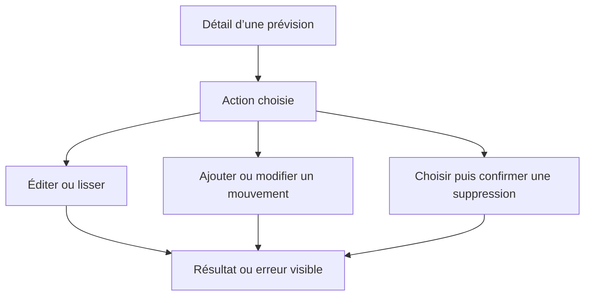
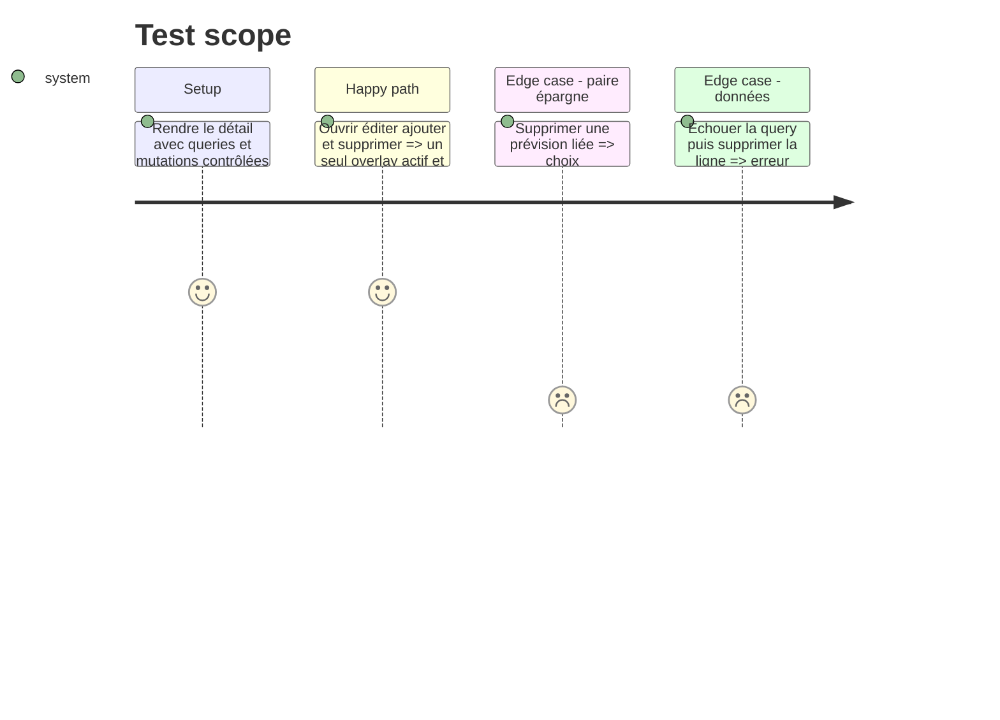

# Instruction: Réduire le couplage de la route de détail

## Architecture projection

> Tree of the final files. ✅ create · ✏️ modify · ❌ delete

```txt
android/src/
├── features/budget-details/components/
│   ├── budget-line-detail-overlays.tsx                      ✅ posséder formulaires dialogues notices et mutations associées
│   └── budget-line-detail-overlays.spec.tsx                 ✅ couvrir les transitions destructives
├── features/budget-details/budget-line-detail-screen.spec.tsx ✅ remplacer les assertions textuelles de query state
├── app/(main)/budget/[id]/line/[lineId].tsx                 ✏️ garder chargement rendu et menu de haut niveau
└── core/system/detail-query-states.spec.ts                  ❌ remplacé par des tests de rendu ciblés
```

## User Journey



## Test Scope



## Tasks to do

### `1)` Donner un propriétaire aux overlays du détail

1. Reprendre le pattern `BudgetDetailOverlays` déjà présent pour centraliser états, notices, formulaires et dialogues du détail de ligne.
2. Laisser à la route les queries, les valeurs dérivées, le contenu et le menu d’actions ; communiquer par une poignée impérative minimale.
3. Déplacer les helpers propres aux overlays avec eux et supprimer les états devenus morts.

### `2)` Tester les transitions, pas la forme du fichier

1. Couvrir erreur de query, ligne absente, ajout/édition, undo et les deux scopes de suppression liée.
2. Supprimer `detail-query-states.spec.ts` une fois ces comportements exécutés.

## Test acceptance criteria

| Task | Acceptance criteria                                                                                                    |
| ---- | ---------------------------------------------------------------------------------------------------------------------- |
| 1    | La route ne possède plus les états ni mutations des overlays ; chaque action garde le même résultat utilisateur.       |
| 2    | Les suppressions simple et liée, leurs erreurs et l’undo sont prouvés par rendu et événements, sans lecture de source. |
