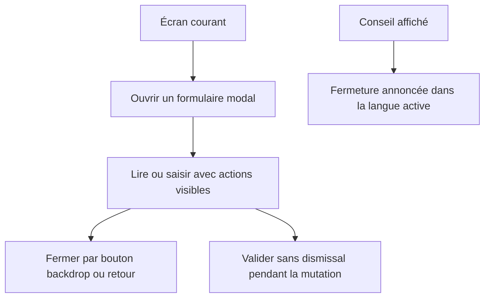
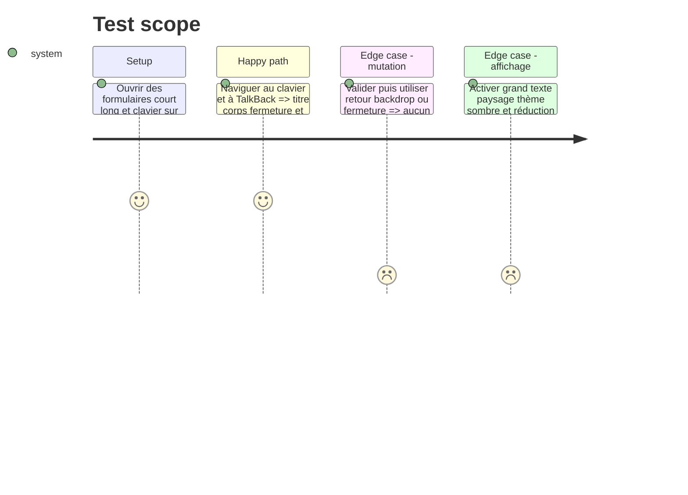

# Instruction: Assumer le formulaire modal et terminer l’accessibilité

## Architecture projection

> Tree of the final files. ✅ create · ✏️ modify · ❌ delete

```txt
android/
├── DESIGN.md                                                  ✏️ définir le pattern formulaire modal Android
└── src/
    ├── core/ui/sheet.tsx                                     ✏️ exposer FormModal et une fermeture visible accessible
    ├── core/ui/sheet.spec.ts                                 ✏️ couvrir fermeture et blocage pendant écriture
    ├── core/tips/tooltip.tsx                                 ✏️ localiser le label TalkBack
    ├── core/tips/tooltip.spec.tsx                            ✏️ rendre le tooltip dans les quatre langues
    ├── features/account/components/change-password-sheet.tsx ✏️ consommer FormModal
    ├── features/account/components/confirm-password-sheet.tsx ✏️ consommer FormModal
    ├── features/account/components/profile-sheet.tsx         ✏️ consommer FormModal
    ├── features/account/components/verify-recovery-key-sheet.tsx ✏️ consommer FormModal
    ├── features/budget-details/components/budget-line-sheet.tsx ✏️ consommer FormModal
    ├── features/budget-details/savings-withdrawal/components/savings-withdrawal-sheet.tsx ✏️ consommer FormModal
    ├── features/budget-details/spread/components/spread-existing-sheet.tsx ✏️ consommer FormModal
    ├── features/budget-details/spread/components/spread-occurrences-sheet.tsx ✏️ consommer FormModal
    ├── features/current-month/components/realized-balance-sheet.tsx ✏️ consommer FormModal
    ├── features/savings-goals/components/goal-deletion-sheet.tsx ✏️ consommer FormModal
    ├── features/savings-goals/components/goal-form-sheet.tsx ✏️ consommer FormModal
    ├── features/savings-goals/components/goal-generation-stop-sheet.tsx ✏️ consommer FormModal
    ├── features/savings-goals/components/simulator/goal-plan-apply-recap.tsx ✏️ consommer FormModal
    ├── features/savings-goals/components/simulator/goal-plan-simulator-sheet.tsx ✏️ consommer FormModal
    ├── features/tags/tag-picker.tsx                          ✏️ consommer FormModal
    ├── features/templates/components/template-form-sheet.tsx ✏️ consommer FormModal
    ├── features/templates/components/template-line-sheet.tsx ✏️ consommer FormModal
    └── features/transactions/components/transaction-sheet.tsx ✏️ consommer FormModal
```

## User Journey



## Test Scope



## Wireframe

```txt
┌─────────────────────────────────┐
│ (1) Écran courant               │
│                                 │
│     ┌─────────────────────┐     │
│     │ (2) Titre       [×] │     │
│     ├─────────────────────┤     │
│     │ (3) Corps défilant  │     │
│     │     champs/contenu  │     │
│     ├─────────────────────┤     │
│     │ (4) Actions fixes   │     │
│     └─────────────────────┘     │
└─────────────────────────────────┘
```

1. Écran courant : contexte conservé sous la surface modale.
2. En-tête : titre du formulaire et fermeture visible.
3. Corps : contenu ou champs défilants, dégagés du clavier.
4. Actions : validation et annulation toujours accessibles.

## Tasks to do

### `1)` Rendre la primitive honnête et découvrable

1. Renommer l’export partagé en `FormModal`, conserver le `Modal` natif et migrer les consommateurs mécaniquement.
2. Ajouter une fermeture visible dans l’en-tête, traduite et désactivée avec retour/backdrop pendant `isBusy`.
3. Documenter ce choix dans `android/DESIGN.md` ; ne pas ajouter de poignée, swipe ou dépendance bottom-sheet.

### `2)` Corriger le dernier label TalkBack en dur

1. Utiliser `useTranslation` et `common.close` dans le tooltip.
2. Tester FR, EN, DE et IT par rendu, sans inspecter le fichier source.

### `3)` Valider la primitive une fois pour tous ses consommateurs

1. Tester sur appareil ou émulateur un formulaire court, un long avec champ, une suppression et une mutation lente.
2. Croiser clavier, retour Android, TalkBack, font scale 1,3, paysage, clair/sombre et réduction de mouvement.
3. Rejouer le smoke Maestro et l’export de production après la migration partagée.

## Test acceptance criteria

| Task | Acceptance criteria                                                                                                                          |
| ---- | -------------------------------------------------------------------------------------------------------------------------------------------- |
| 1    | Chaque ancien consommateur utilise la même primitive `FormModal`, avec fermeture visible et blocage de toute dismissal pendant une écriture. |
| 2    | TalkBack annonce la fermeture du conseil dans chacune des quatre langues.                                                                    |
| 3    | Aucun champ, footer ou action ne passe sous le clavier ; retour, backdrop et bouton fermer suivent la même règle de dismissal.               |
| 3    | Quality, couverture, audit, export Expo et smoke Maestro sont verts sur la version Android synchronisée.                                     |
