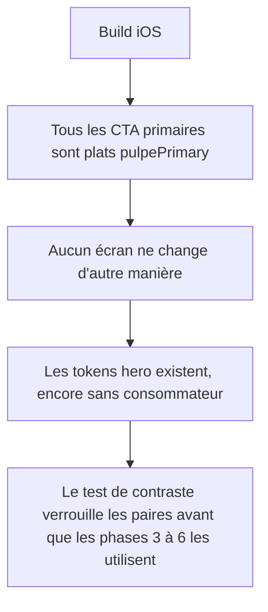
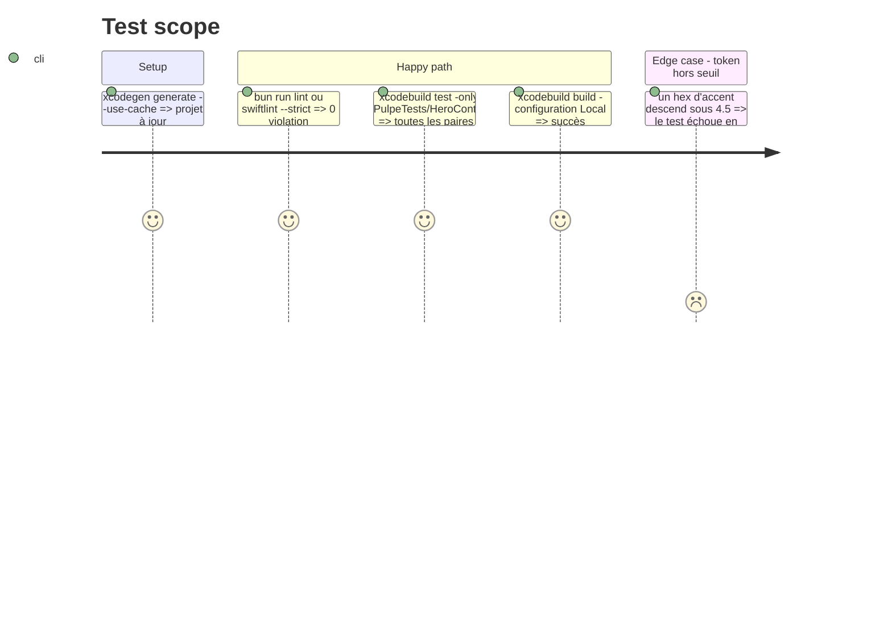

# Instruction: fondation, tokens de contraste, CTA plat, règles, test de contraste

## Architecture projection

> Tree of the final files. ✅ create · ✏️ modify · ❌ delete

```txt
.
├── DESIGN.md                                                   ✏️ Two-Zone : hero = surface de marque constante ; dégradé réservé au hero, CTA plat
├── ios/DESIGN.md                                               ✏️ §2 palette hero, §4 élévation, §5 boutons + nouvelles règles « One Hero », « One Ledger », « Three Families »
├── .claude/rules/01-standards/ios-ui-design.md                 ✏️ aligner le paragraphe Two-Zone sur la nouvelle règle
├── ios/.swiftlint.yml                                          ✏️ retirer l'exclusion `BudgetDetailHero.swift` de `no_adhoc_capsule_chip` (prépare la phase 4)
└── ios/
    ├── Pulpe/Shared/Extensions/Color+Pulpe.swift               ✏️ ajouter heroSurface, heroSurfaceTop, heroInk, heroInkSecondary, heroTile, heroAccent{Positive,Caution,Deficit,Info}
    ├── Pulpe/Shared/Design/DesignTokens.swift                  ✏️ Opacity.heroTile (0.12), Opacity.heroArea (0.22), BorderWidth.chartLine (2.5)
    ├── Pulpe/Shared/Design/PrimaryButtonStyle.swift            ✏️ remplissage plat `Color.pulpePrimary` au lieu de `onboardingGradient`
    └── PulpeTests/Shared/Design/HeroContrastTests.swift        ✅ ratios WCAG calculés sur les paires du hero, light et dark
```

## User Journey



## Test Scope



## Tasks to do

### `1)` Ajouter les tokens du hero dans `Color+Pulpe.swift`

> Une palette de hero qui passe AA sur la forêt, dérivée de la palette dark mode existante ; aucune couleur nouvelle hors surface.

1. `heroSurface` : light `#0E3A1C`, dark `#0B2E16`. `heroSurfaceTop` : light `#14512A`, dark `#0E3A1C` (haut du dégradé, à peine plus clair, c'est la seule profondeur).
2. `heroInk` : light `#FFFFFF`, dark `#F3F9F5`. `heroInkSecondary` : `#CFE8D6` dans les deux schémas.
3. `heroAccentPositive` `#7EDB83`, `heroAccentCaution` `#E5A33A`, `heroAccentDeficit` `#F08A6A`, `heroAccentInfo` `#5AA8E0`, identiques light/dark (ils vivent sur la forêt).
4. `heroTile` : `heroInk.opacity(DesignTokens.Opacity.heroTile)`. Pas de bordure pleine sur les tuiles : une teinte translucide, jamais un trait (règle Emil : ombre ou teinte semi-transparente plutôt que bordure solide).
5. Documenter dans la doc de chaque token qu'il remplace `homeHero*` et `heroTint*`, qui restent jusqu'à la migration de leur dernier consommateur (phases 3 et 4). Ne rien supprimer ici.

### `2)` Ajouter les opacités et l'épaisseur de trait

> Trois tokens, tous consommés en phase 3.

1. `DesignTokens.Opacity.heroTile = 0.12`, `Opacity.heroArea = 0.22` (aire sous la courbe).
2. `DesignTokens.BorderWidth.chartLine = 2.5` si aucun token de trait de graphique n'existe (vérifier `GoalProjectionChart` et `HomeHeroCard+Chart` qui passent aujourd'hui un `lineWidth` : s'il y a une valeur brute, la remplacer par ce token dans les deux fichiers).

### `3)` Aplatir le CTA primaire

> Un seul élément saturé par écran : le hero. Le bouton ne porte plus de dégradé.

1. `PrimaryButtonStyle` : fond `Color.pulpePrimary` (état activé), `primaryContainerDisabled` inchangé, texte `pulpePrimaryOn` inchangé.
2. Vérifier que `onboardingGradient` garde un consommateur (welcome / auth) ; sinon le marquer à supprimer en phase 8.
3. Passer le retour de pression à `scale(0.97)` + opacité existante si `DesignTokens.Animation` a déjà un preset « press » ; sinon garder l'opacité seule. Pas de nouveau preset.

### `4)` Écrire le test de contraste

> Le seul garde-fou qui échoue si une phase suivante « éclaircit un peu » la forêt.

1. `HeroContrastTests.swift` : helper luminance relative WCAG sur `UIColor` résolu pour `UITraitCollection(userInterfaceStyle:)` light puis dark.
2. Paires texte à 4.5 : (`heroInk`, `heroSurface`), (`heroInkSecondary`, `heroSurface`), chaque `heroAccent*` sur `heroSurface`, (`heroInk`, `heroSurfaceTop`).
3. Paires non-texte à 3.0 : (`heroSurface`, `appBackground`), (`heroTile` composité sur `heroSurface`, `heroSurface`) n'est pas testé (c'est une surface, pas un signal).
4. Le message d'échec nomme la paire, le schéma et le ratio mesuré.

### `5)` Mettre les docs au niveau des tokens

> Les règles avant les écrans ; les phases 3 à 7 citent ces règles.

1. `DESIGN.md` § Colors « The Two-Zone Rule » : la zone émotion est une surface de marque profonde, l'état financier se lit dans le verdict, un chip et l'accent, jamais dans la couleur de la surface. § Elevation : les dégradés restent réservés au hero ; le CTA est plat.
2. `ios/DESIGN.md` §2 : table hero (surface, encre, accents, tuile) avec les ratios mesurés. §4 : « The Glass Restraint Rule » inchangée ; ajouter « The Hero Depth Rule » (dégradé 2 stops + `Shadow.zoneBoundary`, rien d'autre). §5 Buttons : primaire plat. Ajouter trois règles nommées : **One Hero Rule** (toute surface avec un état financier dominant utilise `HeroZone`), **One Ledger Rule** (carte groupée + hairlines + disque leading, `pulpeRowCard` n'habille plus une ligne), **Three Families Rule** (au plus trois familles de chips par écran, 1-de-N = `SegmentedPicker`, `.muted` jamais sur le canvas). Retirer la phrase « Stat pills ... migration to PulpeChip.muted is a follow-up ».
3. `.claude/rules/01-standards/ios-ui-design.md` : même formulation Two-Zone, une ligne.
4. `ios/.swiftlint.yml` : retirer `BudgetDetailHero.swift` des exclusions de `no_adhoc_capsule_chip`. Le lint produira un warning sur le fichier jusqu'à la phase 4 ; l'accepter n'est pas possible en `--strict`, donc ne faire ce retrait qu'en même temps que la phase 4 si `--strict` bloque le commit (noter le choix dans le commit).

## Test acceptance criteria

| Task | Acceptance criteria |
| ---- | ------------------- |
| 1 | `Color.heroSurface`, `heroSurfaceTop`, `heroInk`, `heroInkSecondary`, `heroTile`, `heroAccentPositive/Caution/Deficit/Info` compilent et rendent les hex prévus en light et dark. |
| 2 | Aucun `lineWidth:` numérique brut ne subsiste dans `HomeHeroCard+Chart.swift` ni `GoalProjectionChart.swift`. |
| 3 | Sur l'accueil, « Ajouter une opération » rend un vert plat sans dégradé ; l'état désactivé de « Ajouter » dans la sheet de saisie est inchangé. |
| 4 | `HeroContrastTests` passe ; en remplaçant temporairement `heroAccentInfo` par `#0061A6`, le test échoue en nommant la paire. |
| 5 | `ios/DESIGN.md` contient les trois règles nommées et la table hero ; `DESIGN.md` ne contient plus « gradient, financial-state-keyed » pour la zone émotion. |
