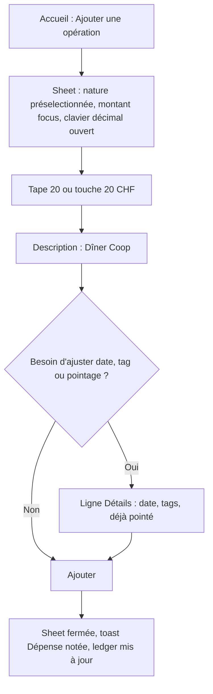
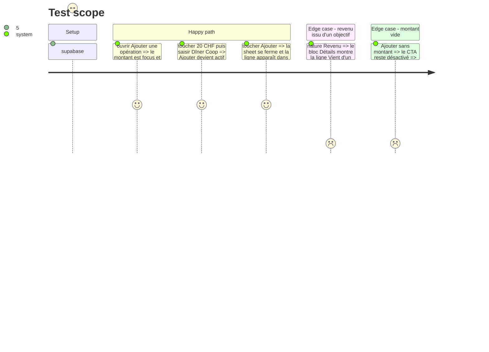

# Instruction: saisie d'une opération en trois blocs

## Architecture projection

> Tree of the final files. ✅ create · ✏️ modify · ❌ delete

```txt
.
└── ios/
    ├── Pulpe/Shared/Components/FormCard.swift                          ✅ conteneur de formulaire groupé : pulpeCard + VStack + `FormRowDivider`
    ├── Pulpe/Shared/Components/TransactionDateSelector.swift           ✏️ variante `.row` (libellé à gauche, valeur à droite, sans fond propre)
    ├── Pulpe/Shared/Components/CheckedToggle.swift                     ✏️ variante `.row`
    ├── Pulpe/Shared/Components/TagPickerField.swift                    ✏️ variante `.row` (le libellé « Tags » devient le titre de la ligne)
    ├── Pulpe/Shared/Components/SheetFormContainer.swift                ✏️ ordre de focus : montant d'abord, description ensuite (déjà le cas, vérifier après réordonnancement)
    ├── Pulpe/Features/CurrentMonth/Components/AddTransactionSheet.swift ✏️ trois blocs : montant, quoi, détails ; CTA
    └── PulpeTests/Features/CurrentMonth/AddTransactionSheetTests.swift ✏️ valeurs par défaut (date = aujourd'hui, pointé = vrai), canSubmit inchangé
```

Consommateurs des atomes modifiés à balayer avant de fermer la phase (ils gardent le style `.standalone` par défaut et ne doivent pas bouger visuellement) : `Features/Budgets/BudgetDetails/AddBudgetLineSheet.swift`, `AddAllocatedTransactionPage.swift`, `EditTransactionPage.swift`, `Features/Onboarding/Steps/AddCustomExpenseSheet.swift`, `Shared/Components/EditBudgetLineSheet.swift`.

## User Journey



## Test Scope



## Wireframe

```
┌─────────────────────────────────────┐
│ (1) [x]     Noter une dépense       │
├─────────────────────────────────────┤
│ (2) [ Revenu | Dépense | Épargne ]  │
│                                     │
│ (3)            CHF                  │
│              0.00                   │
│            ──────────               │
│     [10] [15] [20] [30]             │
│                                     │
│ (4) ┌─────────────────────────────┐ │
│     │ Description   Dîner Coop    │ │
│     ├─────────────────────────────┤ │
│     │ Tags          Aucun tag  >  │ │
│     └─────────────────────────────┘ │
│                                     │
│ (5) ┌─────────────────────────────┐ │
│     │ Date          18 août 2026  │ │
│     ├─────────────────────────────┤ │
│     │ Déjà pointé            (on) │ │
│     └─────────────────────────────┘ │
│                                     │
│ (6) [        Ajouter              ] │
│         indice de validation        │
└─────────────────────────────────────┘
```

1. Barre de la sheet : fermeture et titre, inchangés (`SheetFormContainer`).
2. Nature : `KindToggle` existant, seul contrôle au-dessus du montant parce qu'il colore le montant.
3. Bloc montant : `HeroAmountField` + `QuickAmountChips`, clavier décimal système, focus automatique. Le seul bloc sans carte.
4. Bloc « quoi » : une `FormCard`, deux lignes, hairline entre elles. Description en premier (requis), tags en second.
5. Bloc « détails » : une `FormCard`, date (par défaut aujourd'hui) et pointage (par défaut activé) ; la ligne « Vient d'un objectif » s'insère ici pour un revenu.
6. CTA plat pleine largeur + indice de validation existant.

## Tasks to do

### `1)` Créer `FormCard`

> Un conteneur, une hairline, réutilisé par les phases 4 à 7 pour toute ligne de formulaire ou de détail.

1. `FormCard { content }` : `VStack(spacing: 0)` + `.pulpeCard()`, padding horizontal `Spacing.lg`.
2. `FormRowDivider` : `Divider` avec `Color.outlineVariant`, inset `Spacing.lg` à gauche, pour séparer deux lignes.
3. Pas de gestion automatique des séparateurs : l'appelant place `FormRowDivider()` entre deux lignes. Un `#Preview` avec deux lignes.

### `2)` Donner une variante `.row` aux trois atomes

> Même composant, deux habits ; le standalone reste le défaut pour ne rien casser ailleurs.

1. `TransactionDateSelector(style: .row)` : `HStack { Text("Date") ; Spacer ; DatePicker compact }`, hauteur `ListRow.minHeight`, sans `inputBackgroundSoft`.
2. `CheckedToggle(style: .row)` : titre + sous-titre existant à gauche, `Toggle` à droite, sans fond.
3. `TagPickerField(style: .row)` : « Tags » à gauche, valeur (« Aucun tag » ou chips) à droite, chevron ; le libellé flottant disparaît.
4. Conserver les identifiants d'accessibilité existants sur chaque variante.

### `3)` Réordonner `AddTransactionSheet` en trois blocs

> Montant d'abord, contexte ensuite, détails en dernier ; sept blocs deviennent trois cartes et un CTA.

1. Ordre du `SheetFormContainer` : `KindToggle`, `CurrencyAmountPicker` (si activé), `HeroAmountField`, `QuickAmountChips`, `FormCard` quoi (description, tags), `FormCard` détails (date `.row`, pointé `.row`, origine objectif `.row` si `savingsGoalOrigin.isOffered`), `ErrorBanner`, `addButton`.
2. Supprimer le commentaire justifiant la date en tête ; le remplacer par une ligne : la date est un détail, aujourd'hui par défaut.
3. La `SavingsGoalPickerField` reste sous sa ligne, dans la même carte, animée comme aujourd'hui.
4. Ne toucher ni `canSubmit`, ni `addTransaction()`, ni la conversion de devise.
5. Vérifier les cinq consommateurs listés dans la projection : aucune différence visuelle attendue.

### `4)` Adapter les tests

> Le comportement ne change pas ; les défauts deviennent explicites.

1. `AddTransactionSheetTests` : test « la date par défaut est aujourd'hui », test « pointé par défaut est vrai », les tests `canSubmit` existants restent verts.

## Test acceptance criteria

| Task | Acceptance criteria |
| ---- | ------------------- |
| 1 | `FormCard` rend une carte `surface` radius `card` ; deux lignes séparées par une hairline `outlineVariant` alignée sur le texte. |
| 2 | Les cinq consommateurs existants (`AddBudgetLineSheet`, `AddAllocatedTransactionPage`, `EditTransactionPage`, `AddCustomExpenseSheet`, `EditBudgetLineSheet`) sont visuellement identiques avant/après sur le simulateur. |
| 3 | À l'ouverture de la sheet, le montant est focus avec le clavier décimal ; la sheet montre trois blocs (montant, carte quoi, carte détails) puis le CTA ; aucun conteneur n'a un fond différent de `surface` ou du canvas. |
| 3 | Pour un revenu, la ligne « Ce revenu vient d'un objectif d'épargne » apparaît dans la carte détails et dévoile `SavingsGoalPickerField` sous elle. |
| 4 | `xcodebuild test -only-testing:PulpeTests/AddTransactionSheetTests` passe avec les deux nouveaux tests. |
