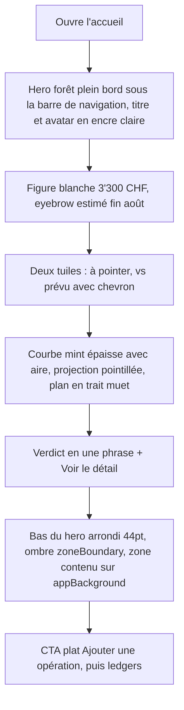
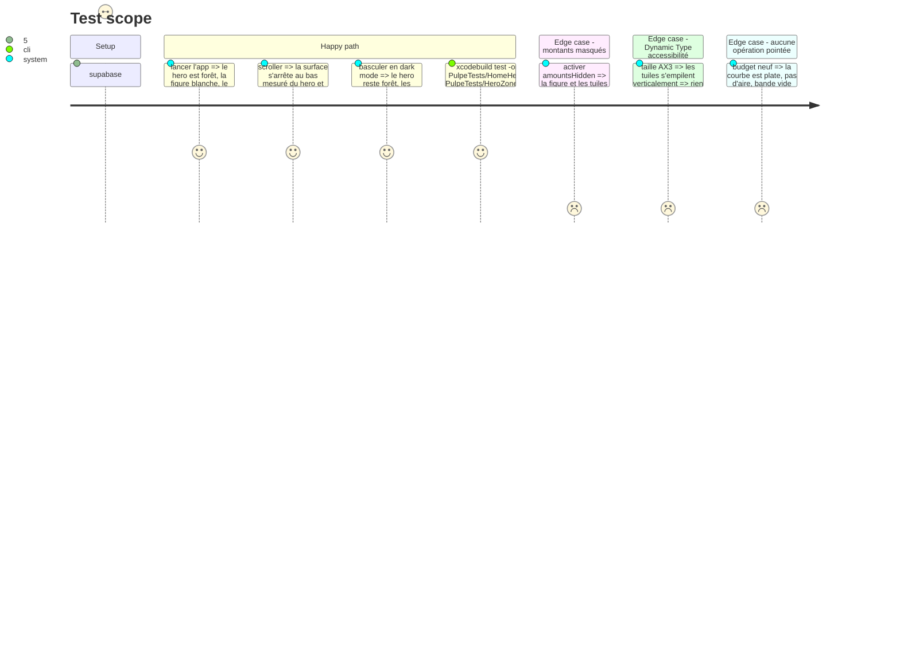

# Instruction: hero de référence sur l'accueil, `HeroZone` partagé

## Architecture projection

> Tree of the final files. ✅ create · ✏️ modify · ❌ delete

```txt
.
└── ios/
    ├── Pulpe/Shared/Components/HeroZone/
    │   ├── HeroZoneSurface.swift                                   ✅ depuis HomeHeroSurfaceBackground : dégradé heroSurfaceTop → heroSurface, CornerRadius.zone, Shadow.zoneBoundary
    │   ├── HeroZoneTracker.swift                                   ✅ depuis HomeHeroSurfaceTracker, renommé
    │   ├── HeroFigure.swift                                        ✅ eyebrow + figure + suffixe sur une ligne de base, encre heroInk / heroInkSecondary, sensitiveAmount
    │   ├── HeroMetricTile.swift                                    ✅ tuile translucide heroTile : icône, libellé, valeur, chevron optionnel
    │   ├── HeroVerdictRow.swift                                    ✅ phrase + lien nommé, encre heroInk, accent selon verdict
    │   └── HeroVerdictPresentation.swift                           ✅ depuis HomeHeroCard.PresentationState : verdict, accent, textes, init(metrics:)
    ├── Pulpe/Features/CurrentMonth/
    │   ├── Components/HomeHeroSurfaceBackground.swift              ❌ déplacé vers Shared
    │   ├── HomeHeroSurfaceTracker.swift                            ❌ déplacé vers Shared
    │   ├── Components/HomeHeroCard.swift                           ✏️ composé depuis HeroFigure, deux HeroMetricTile, HeroVerdictRow ; encre heroInk
    │   ├── Components/HomeHeroCard+Chart.swift                     ✏️ trait heroInkSecondary chartLine, AreaMark heroArea → clair, projection heroInkMuted
    │   ├── CurrentMonthView.swift                                  ✏️ HeroZoneSurface, toolbarColorScheme(.dark), CTA inchangé en tête de zone contenu
    │   ├── Components/CurrentMonthSkeletonView.swift               ✏️ squelette sur heroSurface
    │   ├── Components/ActivityCard.swift                           ✏️ 7 jours / Ce mois → SegmentedPicker
    │   └── Components/UncheckedOperationsCard.swift                ✏️ « Plus tard » → TextLinkButtonStyle ; « C'est passé » reste la seule capsule
    ├── Pulpe/Shared/Extensions/Color+Pulpe.swift                   ✏️ supprimer homeHeroSurface, homeHeroSurfaceTop, homeHeroInk, homeHeroSupport, homeHeroOverlay
    ├── PulpeTests/Features/CurrentMonth/HomeHeroCardTests.swift    ✏️ suit HeroVerdictPresentation
    ├── PulpeTests/Features/CurrentMonth/HomeHeroSurfaceTrackerTests.swift ❌ renommé
    └── PulpeTests/Shared/Components/HeroZoneTrackerTests.swift     ✅ même contenu, nouveau nom
```

## User Journey



## Test Scope



## Wireframe

```
┌─────────────────────────────────────┐
│ (1) ▓▓▓▓▓▓▓ Août ▓▓▓▓▓▓▓▓▓▓ (av) ▓▓ │
│ ▓▓ (2) estimé fin août           ▓▓ │
│ ▓▓     3'300 CHF                 ▓▓ │
│ ▓▓ (3) ┌────────┐ ┌───────────┐  ▓▓ │
│ ▓▓     │ 1      │ │ +800 CHF  │  ▓▓ │
│ ▓▓     │à pointer│ │vs prévu > │  ▓▓ │
│ ▓▓     └────────┘ └───────────┘  ▓▓ │
│ ▓▓ (4)        ____/▔▔▔ - - - -   ▓▓ │
│ ▓▓      ___/▒▒▒▒▒▒▒▒▒            ▓▓ │
│ ▓▓  - - - - - - - - - - - - -    ▓▓ │
│ ▓▓ (5) Au-dessus de ton plan     ▓▓ │
│ ▓▓     depuis le 5 août. Détail >▓▓ │
│ ╰▓▓▓▓▓▓▓▓▓▓▓▓▓▓▓▓▓▓▓▓▓▓▓▓▓▓▓▓▓▓▓╯ │
│ (6) [   + Ajouter une opération   ] │
│ (7) Opérations à pointer   Tout voir│
│     ┌─────────────────────────────┐ │
│     │ (●) Logement     -2'500.00  │ │
│     │ [✓ C'est passé]  Plus tard  │ │
│     └─────────────────────────────┘ │
│ (8) Activité  [ 7 jours | Ce mois ] │
└─────────────────────────────────────┘
```

1. Surface forêt plein bord, sous la barre de navigation ; titre du mois et avatar en encre claire.
2. `HeroFigure` : eyebrow secondaire, figure blanche Manrope 48, suffixe CHF en mint.
3. Deux `HeroMetricTile` translucides ; la seconde porte le chevron de drill-in.
4. Courbe mint épaisse avec aire translucide, projection pointillée muette, plan en règle muette, point « Aujourd'hui ».
5. `HeroVerdictRow` : phrase + lien nommé.
6. Bas du hero arrondi avec ombre ; CTA plat premier élément de la zone contenu.
7. Ledger inchangé ; « Plus tard » devient un lien texte.
8. Sélecteur de période en `SegmentedPicker`.

## Tasks to do

### `1)` Extraire la famille `HeroZone` dans `Shared/Components/HeroZone/`

> Le hero de l'accueil devient générique avant d'être réutilisé par trois autres écrans.

1. Déplacer `HomeHeroSurfaceBackground` → `HeroZoneSurface` (couleurs `heroSurfaceTop` → `heroSurface`) et `HomeHeroSurfaceTracker` → `HeroZoneTracker`. Mettre à jour `xcodegen` via `xcodegen generate --use-cache`.
2. `HeroFigure(eyebrow:amount:currency:)` : `HStack(alignment: .firstTextBaseline)` figure `dashboardHeroAmount` + suffixe `dashboardHeroCurrency`, eyebrow `labelMedium` en `heroInkSecondary`, `monospacedDigit`, `sensitiveAmount`.
3. `HeroMetricTile(icon:label:value:tint:showsChevron:)` : fond `heroTile`, radius `CornerRadius.card`, padding `Spacing.md`, valeur `labelLarge` semibold `heroInk`, libellé `caption` `heroInkSecondary`, `tint` pour la valeur quand un accent s'applique. Deux tuiles par ligne, `ViewThatFits` pour empiler en AX.
4. `HeroVerdictRow(sentence:linkTitle:action:)` : `body` `heroInk`, lien `listRowTitle` bold + chevron, accent `heroAccent*` uniquement sur le lien quand le verdict n'est pas « sur le plan ».
5. `HeroVerdictPresentation` : sortir `HomeHeroCard.PresentationState` tel quel, renommé, avec `init(metrics: BudgetFormulas.Metrics, ...)` ; mapper le verdict vers `heroAccentPositive` / `heroAccentCaution` / `heroAccentDeficit` dans une propriété `accent`. Les tests existants de `HomeHeroCardTests` suivent le renommage.

### `2)` Recomposer `HomeHeroCard` et sa courbe

> Même information, encre inversée, profondeur ajoutée ; rien de nouveau à dire.

1. `HomeHeroCard` : `HeroFigure`, puis deux `HeroMetricTile` (à pointer, variance avec chevron), puis la courbe, puis `HeroVerdictRow`. Les deux `PulpeChip.tinted` existants prennent `(surface: heroTile, foreground: heroInk)`.
2. `HomeHeroCard+Chart` : `LineMark` série suivie en `heroInkSecondary`, `lineWidth: BorderWidth.chartLine` ; `AreaMark` sous la série suivie avec `LinearGradient(heroInkSecondary.opacity(heroArea) → clear)` ; projection `LineMark` pointillée `heroInk.opacity(heroInkMuted)` ; `RuleMark` plan `heroInkMuted` ; `PointMark` aujourd'hui `heroInk` ; libellés `caption` `heroInkSecondary`. Reduce Motion : aucune animation de tracé n'est ajoutée.
3. Accessibilité : la narration VoiceOver et le masquage `amountsHidden` existants sont conservés tels quels ; vérifier que chaque élément graphique garde 3:1 sur `heroSurface` (mint 9.9, encre muette ≈ 5.5).

### `3)` Poser la surface et la navigation sombre

> Le hero passe sous la barre ; la barre doit suivre.

1. `CurrentMonthView` : `HeroZoneSurface(tracker:)` en fond, `.toolbarColorScheme(.dark, for: .navigationBar)` sur le `NavigationStack` de l'accueil, `.toolbarBackground(.hidden, for: .navigationBar)` si la barre peint une matière par défaut sur iOS 18.
2. Le bouton avatar (cercle clair) reste tel quel : il contraste sur la forêt.
3. `CurrentMonthSkeletonView` : placeholders sur `heroSurface` avec `heroTile`.
4. Le CTA reste le premier élément de la zone contenu (plat depuis la phase 1) ; ne pas le monter sur le hero.

### `4)` Élaguer les chips de l'accueil

> Trois familles au plus : la tuile du hero, la capsule d'action, le chip sémantique.

1. `ActivityCard` : remplacer les deux `PulpeChip` « 7 jours / Ce mois » par `SegmentedPicker` (1-de-N, règle existante). Supprimer le commentaire qui justifiait l'exception.
2. `UncheckedOperationsCard` : « Plus tard » en `TextLinkButtonStyle` (texte `textSecondary`, cible 44pt) ; « C'est passé » garde sa capsule teintée `financialSavings`.
3. `CurrentMonthView+Sections` (ou l'extension qui porte l'en-tête « Opérations à pointer ») : si un chip de compte `.solid` y est rendu, le retirer ; le compte vit déjà dans la tuile du hero.

### `5)` Supprimer les tokens `homeHero*`

> Plus aucun consommateur après les tâches 1 à 4.

1. `grep -rn "homeHero" ios/Pulpe` doit rendre zéro ; supprimer les cinq `static let` et leurs commentaires dans `Color+Pulpe.swift`.
2. `driftAccent` reste (consommé par `DriftCard` sur une carte blanche).

## Test acceptance criteria

| Task | Acceptance criteria |
| ---- | ------------------- |
| 1 | `HeroZoneSurface`, `HeroZoneTracker`, `HeroFigure`, `HeroMetricTile`, `HeroVerdictRow`, `HeroVerdictPresentation` existent sous `Shared/Components/HeroZone/` et `HomeHeroSurfaceBackground` / `HomeHeroSurfaceTracker` n'existent plus. |
| 1 | `HomeHeroCardTests` et `HeroZoneTrackerTests` passent sans changement de comportement. |
| 2 | Sur le simulateur, la série suivie est mint avec une aire sous elle, la projection pointillée plus claire, le plan en règle ; avec zéro opération pointée, pas d'aire et la bande vide s'affiche. |
| 3 | Le titre « Août » et le bouton avatar sont lisibles sur la forêt en light et dark ; la surface s'arrête au bas du hero avec l'ombre `zoneBoundary` ; le scroll ne présente pas de saccade (contrôle PUL-340 : `tracker.height` n'est lu que par `HeroZoneSurface`). |
| 4 | « 7 jours / Ce mois » est un contrôle segmenté natif ; la carte « Opérations à pointer » ne montre qu'une capsule ; `PulpeChip(` n'apparaît plus dans `ActivityCard.swift`. |
| 5 | `grep -rn homeHero ios/Pulpe` rend zéro ; `HeroContrastTests` et `swiftlint --strict` passent. |
