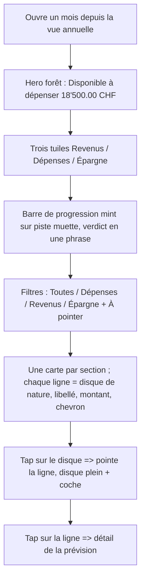
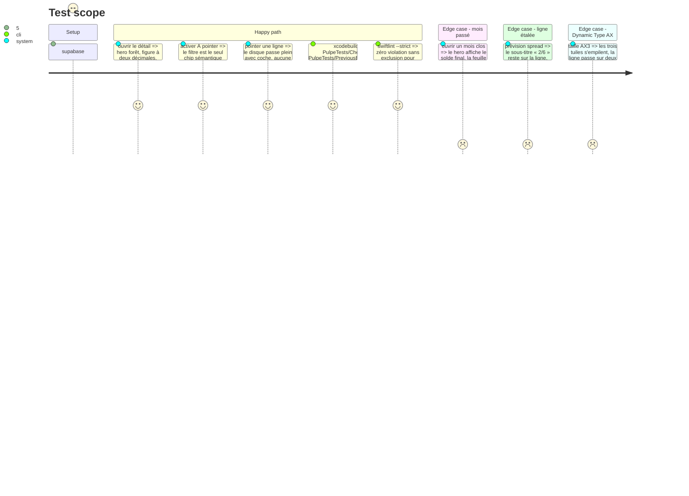

# Instruction: détail de budget sur la grammaire unique

## Architecture projection

> Tree of the final files. ✅ create · ✏️ modify · ❌ delete

```txt
.
└── ios/
    ├── .swiftlint.yml                                                    ✏️ retirer BudgetDetailHero.swift de l'exclusion no_adhoc_capsule_chip
    ├── Pulpe/Features/Budgets/BudgetDetails/
    │   ├── BudgetDetailHero.swift                                        ✏️ sur HeroZone : HeroFigure, 3 HeroMetricTile, barre de progression, HeroVerdictRow ; pilules Capsule locales supprimées
    │   ├── BudgetDetailsView.swift                                       ✏️ HeroZoneSurface + toolbarColorScheme(.dark)
    │   ├── BudgetTypeFilter.swift                                        ✏️ « À pointer » actif en .semantic(financialSavings) ; natures solid/outlined ; une seule famille visible
    │   ├── BudgetLineMixedRow.swift                                      ✏️ plus de pulpeRowCard ni de KindTagInline ; disque de nature 36pt ; chevron conservé
    │   ├── BudgetLineMixedRow+Amount.swift                               ✏️ colonne montant inchangée, police listRowTitle monospacedDigit
    │   ├── BudgetMixedSection.swift                                      ✏️ une pulpeCard par section, lignes séparées par hairline, en-tête SectionHeader avec compte
    │   ├── BudgetDetailsFreeTransactionsList.swift                       ✏️ même carte groupée
    │   ├── PointCircle.swift                                             ✏️ devient le disque de nature : non pointé = glyphe teinté, pointé = disque plein + coche
    │   └── PreviousBudgetSheet.swift                                     ✏️ HeroZone compact à la place de HeroBalanceCard
    ├── Pulpe/Features/CurrentMonth/Components/HeroBalanceCard.swift     ❌ dernier consommateur retiré
    ├── Pulpe/Shared/Components/KindTagInline.swift                       ❌ la nature vit dans le disque
    ├── Pulpe/Shared/Components/KindBadge.swift                           ❌ renommé
    ├── Pulpe/Shared/Components/RecurrenceBadge.swift                     ✅ ne garde que RecurrenceBadge (consommé par TemplateDetailsView jusqu'à la phase 7)
    ├── Pulpe/Shared/Extensions/Color+Pulpe.swift                         ✏️ supprimer heroTintComfortable, heroTintTight, heroTintDeficit, heroGradient(for:)
    ├── PulpeTests/Features/Budgets/CheckedFilterOptionTests.swift        ✏️ style attendu par état du filtre
    ├── PulpeTests/Features/Budgets/PreviousBudgetSheetViewModelTests.swift ✏️ suit le hero compact
    ├── PulpeTests/Architecture/BudgetDetailsArchitectureTests.swift      ✏️ plafond 350 lignes vérifié sur les fichiers touchés
    └── Pulpe/Shared/Styles/Typography.swift                               ✏️ supprimer kindTagInline (seul consommateur : KindTagInline)
```

## User Journey



## Test Scope



## Wireframe

```
┌─────────────────────────────────────┐
│ (1) ▓ <   Août 2026           + ▓▓ │
│ ▓▓ (2) Disponible à dépenser     ▓▓ │
│ ▓▓     18'500.00 CHF             ▓▓ │
│ ▓▓ (3) ┌──────┐┌──────┐┌──────┐  ▓▓ │
│ ▓▓     │Revenus││Dépens││Épargn│  ▓▓ │
│ ▓▓     │20'000││ 1'500││ 1'000│  ▓▓ │
│ ▓▓     └──────┘└──────┘└──────┘  ▓▓ │
│ ▓▓ (4) ▰▰▰▰▰▰▰▱▱▱▱▱▱▱▱▱▱▱▱  7 % ▓▓ │
│ ▓▓     Tu es large ce mois-ci.   ▓▓ │
│ ╰▓▓▓▓▓▓▓▓▓▓▓▓▓▓▓▓▓▓▓▓▓▓▓▓▓▓▓▓▓▓▓╯ │
│ (5) [Toutes][Dépenses][Revenus]     │
│     [Épargne]        [⦿ À pointer]  │
│ (6) Récurrent · 3                   │
│     ┌─────────────────────────────┐ │
│     │ (○) Loyer          1'500.00 >│ │
│     │ ────────────────────────────│ │
│     │ (●) Salaire       20'000.00 >│ │
│     │ ────────────────────────────│ │
│     │ (○) Épargne        1'000.00 >│ │
│     └─────────────────────────────┘ │
│ (7) Prévu · 0          Ajouter     │
└─────────────────────────────────────┘
```

1. Barre de navigation en encre claire sur le hero ; `+` inchangé.
2. `HeroFigure` : eyebrow « Disponible à dépenser », figure à deux décimales (règle Two-Decimals conservée).
3. Trois `HeroMetricTile` sans chevron, valeurs `labelLarge` `monospacedDigit`.
4. Barre de progression `heroInkSecondary` sur piste `heroInkMuted`, verdict en phrase.
5. Filtres : natures `.solid` / `.outlined`, « À pointer » en `.semantic(financialSavings)` seulement quand actif.
6. Une `pulpeCard` par section, lignes séparées par hairline ; disque de nature à gauche (vide = à pointer, plein = pointé).
7. En-tête `SectionHeader` avec compte et action de section.

## Tasks to do

### `1)` Poser le hero du détail sur `HeroZone`

> Le deuxième écran qui porte un état financier chargé adopte la famille de l'accueil.

1. `BudgetDetailsView` : `HeroZoneSurface(tracker:)` en fond du `ScrollView`, `.toolbarColorScheme(.dark, for: .navigationBar)`, `.toolbarBackground(.hidden, for: .navigationBar)` si nécessaire.
2. `BudgetDetailHero` : remplacer le corps par `HeroFigure(eyebrow: "Disponible à dépenser", amount:, currency:)` avec format à deux décimales, trois `HeroMetricTile` (Revenus, Dépenses, Épargne ; icônes `arrow.down.circle`, `arrow.up.circle`, `target`), `ProgressBar` en `heroInkSecondary` sur `heroInkMuted`, puis `HeroVerdictRow` alimenté par `HeroVerdictPresentation(metrics:)` depuis `BudgetDetailsScreenState`.
3. Supprimer les pilules `Capsule()` locales (lignes 292-322 actuelles) et l'ancien `displayYear` ; retirer l'exclusion dans `.swiftlint.yml`.
4. `PreviousBudgetSheet` : remplacer `HeroBalanceCard` par `HeroFigure` + deux tuiles (solde final, écart au plan) sur `HeroZoneSurface` ; supprimer `HeroBalanceCard.swift` et son modificateur glass local. Adapter `PreviousBudgetSheetViewModelTests`.
5. `Color+Pulpe.swift` : supprimer `heroTintComfortable`, `heroTintTight`, `heroTintDeficit`, `heroGradient(for:)` et leurs commentaires ; `grep -rn "heroTint\|heroGradient" ios/Pulpe` doit rendre zéro.

### `2)` Un seul ledger : carte groupée et disque de nature

> Même ligne que l'accueil : disque, libellé, montant, chevron. Plus de carte par ligne.

1. `PointCircle` → disque `IconSize.badge` (36pt) bâti sur `RowIcon` : non pointé = `RowIcon(systemName: kind.icon, tint: kind.color)` ; pointé = disque plein `kind.color` + `checkmark` en `textOnPrimary`. Tap = pointage, `sensoryFeedback(.impact)`, animation `DesignTokens.Animation.fast`. Conserver l'identifiant d'accessibilité et le label « Pointé / À pointer ».
2. `BudgetLineMixedRow` : retirer `.pulpeRowCard(...)` et `KindTagInline` ; structure `HStack { disque, VStack(titre listRowTitle, sous-titre listRowSubtitle optionnel : spread « 2/6 », échéance), Spacer, montant, chevron }`, hauteur minimale `ListRow.minHeight`, padding `Spacing.md`. `+Amount.swift` inchangé hors police.
3. `BudgetMixedSection` et `BudgetDetailsFreeTransactionsList` : envelopper le `ForEach` dans un `VStack(spacing: 0)` avec `Divider().padding(.leading, IconSize.badge + Spacing.md)` entre les lignes (ajouter `ListRow.dividerInset` à `DesignTokens` si la somme apparaît plus d'une fois), puis `.pulpeCard()` ; en-tête via `SectionHeader(title:count:action:)`.
4. `KindTagInline.swift` : supprimer ; `KindBadge.swift` → `RecurrenceBadge.swift` en ne gardant que `RecurrenceBadge` et sa preview.
5. Vérifier `BudgetDetailsArchitectureTests` : chaque fichier touché reste sous 350 lignes ; si `BudgetLineMixedRow` dépasse, déplacer le sous-titre dans `BudgetLineMixedRow+Subtitle.swift`.

### `3)` Mettre les filtres dans les Trois Familles

> Un seul état « actif » visible à la fois par famille.

1. `BudgetTypeFilter` : natures → `PulpeChip(label:, style: isSelected ? .solid : .outlined)` ; « À pointer » → `isActive ? .semantic(.financialSavings) : .outlined`, avec icône `checkmark.circle` ; supprimer la logique `checked == .all ? .outlined : .solid` (ligne 165).
2. `CheckedFilterOptionTests` : ajouter un cas par combinaison (nature active / À pointer actif / les deux) qui vérifie le style rendu.
3. Accessibilité : chaque chip garde `isSelected` trait ; le filtre « À pointer » annonce « Filtre À pointer, activé ».

## Test acceptance criteria

| Task | Acceptance criteria |
| ---- | ------------------- |
| 1 | `BudgetDetailHero` ne contient ni `Capsule()`, ni `heroTint`, ni `displayYear` ; `swiftlint --strict` passe sans l'exclusion. |
| 1 | `HeroBalanceCard.swift` n'existe plus ; `grep -rn "HeroBalanceCard\|heroTint\|heroGradient(" ios/Pulpe` rend zéro ; `PreviousBudgetSheetViewModelTests` passe. |
| 1 | Sur simulateur, la figure du détail affiche deux décimales, le hero est forêt en light et dark, le titre de navigation est lisible. |
| 2 | `grep -rn "KindTagInline\|pulpeRowCard" ios/Pulpe/Features/Budgets` rend zéro ; `KindBadge.swift` n'existe plus ; `RecurrenceBadge.swift` compile avec `TemplateDetailsView`. |
| 2 | Pointer une ligne anime le disque seul ; les sections sont des cartes uniques avec hairlines ; `BudgetDetailsArchitectureTests` passe. |
| 3 | `CheckedFilterOptionTests` couvre les trois combinaisons ; à l'écran, jamais deux chips « pleins » de familles différentes en même temps. |
