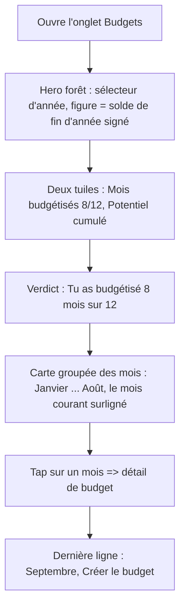
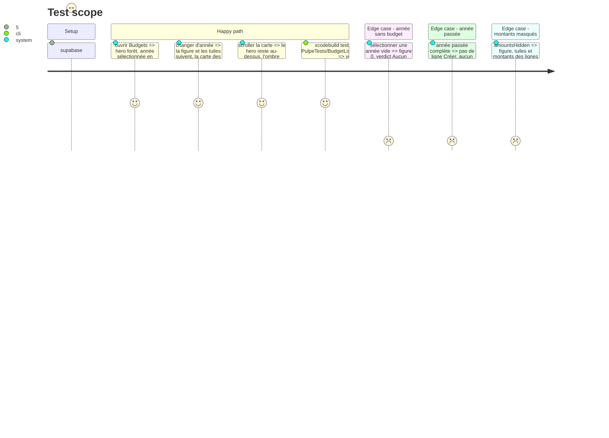

# Instruction: vue annuelle, hero et ledger des mois

## Architecture projection

> Tree of the final files. ✅ create · ✏️ modify · ❌ delete

```txt
.
└── ios/
    ├── Pulpe/Features/Budgets/BudgetList/
    │   ├── BudgetListView.swift                                   ✏️ HeroZoneSurface + toolbarColorScheme(.dark) ; YearPicker déplacé dans la zone hero ; mois rendus dans une carte groupée
    │   ├── BudgetListView+YearComponents.swift                    ✏️ YearRecapCard sur HeroZone ; YearPicker en encre hero, sélection = tuile heroTile
    │   └── BudgetListView+Subviews.swift                          ✏️ CurrentMonthHeroCard, BudgetMonthCard, NextMonthPlaceholder → BudgetMonthRow unique + NextMonthRow ; BudgetAmountBlock conservé
    └── PulpeTests/Features/Budgets/BudgetListAccessibilityTests.swift ✏️ identifiants et labels suivent les lignes
```

## User Journey



## Test Scope



## Wireframe

```
┌─────────────────────────────────────┐
│ (1) ▓▓ Budgets                    ▓▓ │
│ ▓▓ (2)   2024   2025  [ 2026 ]   ▓▓ │
│ ▓▓ (3) solde fin d'année         ▓▓ │
│ ▓▓     +12'400 CHF               ▓▓ │
│ ▓▓ (4) ┌───────────┐ ┌─────────┐ ▓▓ │
│ ▓▓     │ 8 / 12    │ │ +1'550  │ ▓▓ │
│ ▓▓     │ mois      │ │potentiel│ ▓▓ │
│ ▓▓     └───────────┘ └─────────┘ ▓▓ │
│ ▓▓ (5) Tu as budgétisé 8 mois    ▓▓ │
│ ▓▓     sur 12.                   ▓▓ │
│ ╰▓▓▓▓▓▓▓▓▓▓▓▓▓▓▓▓▓▓▓▓▓▓▓▓▓▓▓▓▓▓▓╯ │
│ (6) Mois · 8                        │
│     ┌─────────────────────────────┐ │
│     │ Janvier    clos    +1'200 > │ │
│     │ ────────────────────────── │ │
│     │ ...                         │ │
│     │ ────────────────────────── │ │
│ (7) │ Août  en cours   +3'300  > │ │
│     │ ────────────────────────── │ │
│ (8) │ Septembre   Créer le budget │ │
│     └─────────────────────────────┘ │
└─────────────────────────────────────┘
```

1. Titre de navigation en encre claire sur le hero.
2. `YearPicker` dans la zone hero : années en `heroInkSecondary`, sélection en tuile `heroTile` avec encre `heroInk`.
3. `HeroFigure` : eyebrow « solde fin d'année », figure signée (`asArithmeticSignedCompactCurrency`).
4. Deux `HeroMetricTile` : mois budgétisés, potentiel cumulé ; accent `heroAccentDeficit` sur la valeur si négatif.
5. `HeroVerdictRow` sans lien : la phrase existante de `subtitle`.
6. Une `pulpeCard` avec `SectionHeader(title: "Mois", count:)`.
7. Ligne du mois courant : libellé `listRowTitle` en `pulpePrimary`, caption « en cours » ; pas de chip « Mois actuel ».
8. Ligne placeholder : mois suivant + lien texte « Créer le budget ».

## Tasks to do

### `1)` Poser le hero annuel

> Troisième écran sur `HeroZone` ; rien n'est inventé, les données de `YearRecapCard` sont reprises.

1. `BudgetListView` : `HeroZoneSurface(tracker:)` en fond, `.toolbarColorScheme(.dark, for: .navigationBar)` ; déplacer l'appel `YearPicker` (ligne 217 actuelle) à l'intérieur de la zone suivie par le tracker, au-dessus de `YearRecapCard`.
2. `YearRecapCard` : corps recomposé en `HeroFigure(eyebrow: "Solde fin d'année", amount: closingBalance, signed: true)`, deux `HeroMetricTile` (« \(count) / 12 » libellé « mois », potentiel cumulé `BudgetFormulas` existant si disponible, sinon la somme des `remaining` positifs des mois à venir), `HeroVerdictRow(sentence: subtitle)`. Supprimer `emotionColor` et `monthProgress` si plus consommés.
3. `YearPicker` : garder le `ScrollViewReader` horizontal ; bouton = `Text(year)` `labelLargeBold`, encre `heroInk` si sélectionné sinon `heroInkSecondary`, fond `heroTile` en `RoundedRectangle(CornerRadius.button)` si sélectionné. Retirer le `Capsule` ad hoc actuel.

### `2)` Un ledger pour les mois

> Trois cartes différentes disaient la même chose ; une ligne suffit.

1. `BudgetListView+Subviews.swift` : créer `BudgetMonthRow(budget:periodLabel:isCurrent:isPast:action:)` : `HStack { VStack(titre mois listRowTitle, caption « en cours » / « clos » / échéance) ; Spacer ; BudgetAmountBlock ; chevron }`, hauteur `ListRow.minHeight`. `isCurrent` colore le titre en `pulpePrimary` et pose `accessibilityAddTraits(.isSelected)`. Supprimer `CurrentMonthHeroCard` et `BudgetMonthCard` ; remplacer `NextMonthPlaceholder` par `NextMonthRow(month:action:)` (libellé + `TextLinkButtonStyle` « Créer le budget »).
2. `BudgetListView` : rendre les mois dans un `VStack(spacing: 0)` avec `Divider` entre les lignes, enveloppé par `.pulpeCard()` ; en-tête `SectionHeader(title: "Mois", count: yearBudgets.count)`. Supprimer les `pulpeCardBackground(cornerRadius: .xl)` par carte.
3. `BudgetAmountBlock` : conserver tel quel (libellé Potentiel / Ajustement + montant) ; passer le libellé en `caption` `textSecondary`, montant `listRowTitle` `monospacedDigit`.
4. `BudgetListAccessibilityTests` : mettre à jour les identifiants (`budgetMonthRow_<id>`, `nextMonthRow`) et vérifier que la ligne courante porte le trait `isSelected`.

## Test acceptance criteria

| Task | Acceptance criteria |
| ---- | ------------------- |
| 1 | `YearRecapCard` ne contient ni `pulpeCard` ni `emotionColor` ; `YearPicker` ne contient plus `Capsule` ; le sélecteur vit sous le titre, sur la forêt, lisible en light et dark. |
| 1 | Sur simulateur, changer d'année met à jour figure, tuiles et verdict ; une année vide affiche « Aucun mois budgétisé ». |
| 2 | `grep -n "CurrentMonthHeroCard\|BudgetMonthCard\|NextMonthPlaceholder" ios/Pulpe` rend zéro ; une seule carte groupée contient tous les mois ; le mois courant n'a plus de chip. |
| 2 | `BudgetListAccessibilityTests` passe ; VoiceOver lit « Août, en cours, potentiel 3'300 francs, sélectionné ». |
