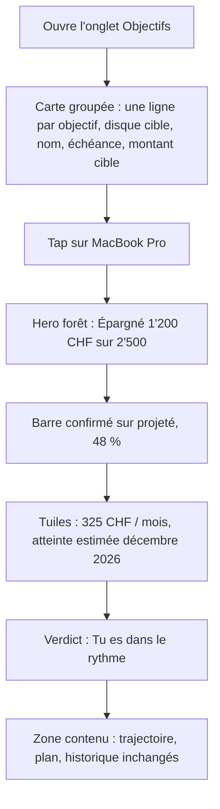
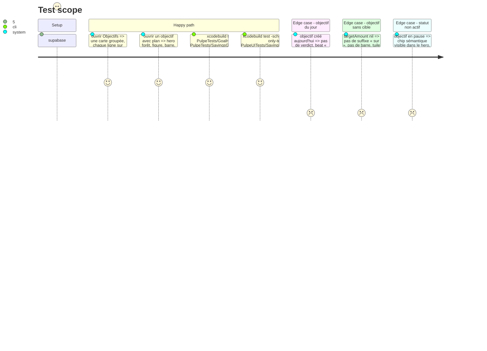

# Instruction: objectifs d'épargne, liste en ledger et détail sur hero

## Architecture projection

> Tree of the final files. ✅ create · ✏️ modify · ❌ delete

```txt
.
└── ios/
    ├── Pulpe/Features/SavingsGoals/
    │   ├── SavingsGoalsListView.swift                              ✏️ SavingsGoalRow en ligne de ledger dans une carte groupée ; pas de hero
    │   ├── SavingsGoalDetailView.swift                             ✏️ HeroZoneSurface + toolbarColorScheme(.dark) ; hero extrait pour rester sous 500 lignes
    │   ├── SavingsGoalDetailView+Hero.swift                        ✅ composition du hero de détail (extraction, pas de logique nouvelle)
    │   ├── Components/GoalProgressHero.swift                       ✏️ sur HeroZone : HeroFigure épargné « sur cible », barre confirmé/projeté, tuiles rythme / date, HeroVerdictRow
    │   ├── Components/GoalHeroPresentation.swift                   ✏️ ajoute `tiles` (rythme requis, date d'atteinte) et `accent` dérivé de paceStatus
    │   └── Components/SavingsGoalStatusBadge.swift                 ✏️ rendu en PulpeChip.semantic ; inchangé sinon
    └── PulpeTests/Features/SavingsGoals/GoalHeroPresentationTests.swift ✏️ couvre tiles et accent
```

## User Journey



## Test Scope



## Wireframe

```
┌─────────────────────────────────────┐
│ Objectifs                         + │
│ (1) Objectifs · 2                   │
│     ┌─────────────────────────────┐ │
│ (2) │ (◎) MacBook Pro             │ │
│     │     Échéance décembre 2026  │ │
│     │                   2'500 CHF >│ │
│     │ ────────────────────────── │ │
│     │ (◎) Vacances                │ │
│     │     Sans échéance   1'000 > │ │
│     └─────────────────────────────┘ │
├─────────────────────────────────────┤
│ (3) ▓▓ <  MacBook Pro         ✎ ▓▓ │
│ ▓▓ (4) épargné                   ▓▓ │
│ ▓▓     1'200 CHF  sur 2'500      ▓▓ │
│ ▓▓ (5) ▰▰▰▰▰▰▰▰▰▱▱▱▱▱▱▱▱▱  48 % ▓▓ │
│ ▓▓ (6) ┌──────────┐ ┌──────────┐ ▓▓ │
│ ▓▓     │ 325 CHF  │ │ déc. 2026│ ▓▓ │
│ ▓▓     │ par mois │ │ atteinte │ ▓▓ │
│ ▓▓     └──────────┘ └──────────┘ ▓▓ │
│ ▓▓ (7) Tu es dans le rythme.     ▓▓ │
│ ╰▓▓▓▓▓▓▓▓▓▓▓▓▓▓▓▓▓▓▓▓▓▓▓▓▓▓▓▓▓▓▓╯ │
│ (8) Trajectoire ...                 │
└─────────────────────────────────────┘
```

1. Liste : `SectionHeader` avec compte, une `pulpeCard` groupée, pas de hero (aucun état financier chargé).
2. Ligne : `RowIcon("target", tint: financialSavings)`, nom `listRowTitle`, échéance `listRowSubtitle` sur sa propre ligne, montant cible aligné à droite, chevron ; statut non actif = `SavingsGoalStatusBadge` à la place du montant.
3. Détail : hero forêt sous la barre ; titre et bouton d'édition en encre claire.
4. `HeroFigure` : eyebrow « épargné », figure confirmée, suffixe « sur 2'500 » en `heroInkSecondary`.
5. Barre à deux couches : projeté `heroInkMuted`, confirmé `heroInkSecondary`, pourcentage à droite.
6. Deux `HeroMetricTile` : rythme requis, date d'atteinte estimée.
7. `HeroVerdictRow` : verdict ou beat du jour 1 ; accent `heroAccentCaution` si en retard.
8. Zone contenu inchangée.

## Tasks to do

### `1)` Liste : une ligne de ledger par objectif

> Le retour à la ligne sur trois niveaux disparaît parce que l'échéance a sa propre ligne.

1. `SavingsGoalRow` : `HStack(alignment: .top) { RowIcon(systemName: "target", tint: .financialSavings) ; VStack(nom listRowTitle, periodLabel listRowSubtitle) ; Spacer ; trailing }` où `trailing` = montant cible `listRowTitle` `monospacedDigit` `sensitiveAmount`, ou `SavingsGoalStatusBadge` si `status != .active` ; chevron. Supprimer `.pulpeCard()` par ligne et `statusLine`.
2. `SavingsGoalsListView` : `ForEach` dans `VStack(spacing: 0)` + `Divider`, enveloppé par `.pulpeCard()` ; `SectionHeader(title: "Objectifs", count:)`. L'état vide existant reste tel quel.
3. `SavingsGoalStatusBadge` : s'assurer qu'il rend un `PulpeChip(style: .semantic(...))` et rien d'ad hoc.

### `2)` Détail : hero sur `HeroZone`

> Quatrième et dernier écran de la famille ; la présentation pure absorbe ce que le hero montre.

1. `GoalHeroPresentation` : ajouter `struct Tile { label, value, identifier }` et `tiles: [Tile]` (rythme requis depuis `requiredPace`, date estimée depuis `projection` quand elles existent), et `accent: HeroAccent` (`.positive` dans le rythme, `.caution` en retard, `.neutral` sinon). `verdict`/`dayOneBeat` deviennent la phrase de `HeroVerdictRow`. Tests dans `GoalHeroPresentationTests` : objectif du jour 1, sans cible, en retard.
2. `GoalProgressHero` : `HeroFigure(eyebrow: "Épargné", amount:, suffix: targetLine)`, `SavingsGoalStatusBadge` à droite de l'eyebrow quand `showsStatusChip`, barre deux couches en `heroInkMuted` / `heroInkSecondary` (même `ProgressBarShape`), `HStack` de `HeroMetricTile` depuis `tiles`, `HeroVerdictRow`. Conserver `accessibilityIdentifier("savingsGoalProgressCard")` et les identifiants de `DateLine`.
3. `SavingsGoalDetailView` : `HeroZoneSurface(tracker:)`, `.toolbarColorScheme(.dark, for: .navigationBar)` ; déplacer la composition du hero (ligne ~200) dans `SavingsGoalDetailView+Hero.swift` pour passer sous le plafond 500 du linter.

## Test acceptance criteria

| Task | Acceptance criteria |
| ---- | ------------------- |
| 1 | Sur simulateur, chaque ligne d'objectif tient sur deux lignes de texte à la taille par défaut ; une seule carte groupe les objectifs ; `grep -n "pulpeCard()" SavingsGoalsListView.swift` rend une occurrence. |
| 1 | `SavingsGoalStatusBadge` rend un `PulpeChip` ; `grep -n "Capsule()" ios/Pulpe/Features/SavingsGoals` rend zéro. |
| 2 | `GoalHeroPresentationTests` couvre `tiles` et `accent` pour : jour 1 (pas de verdict, beat présent, tuile date absente), sans cible (pas de barre ni de tuile rythme), en retard (`accent == .caution`). |
| 2 | Le détail affiche la forêt en light et dark, l'identifiant `savingsGoalProgressCard` et les identifiants de date restent présents ; `SavingsGoalIntervalUITests` vert à vide ; `SavingsGoalDetailView.swift` < 500 lignes. |
