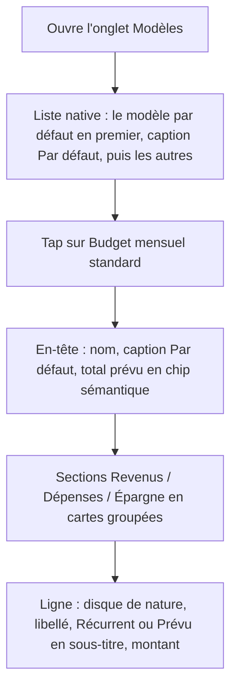
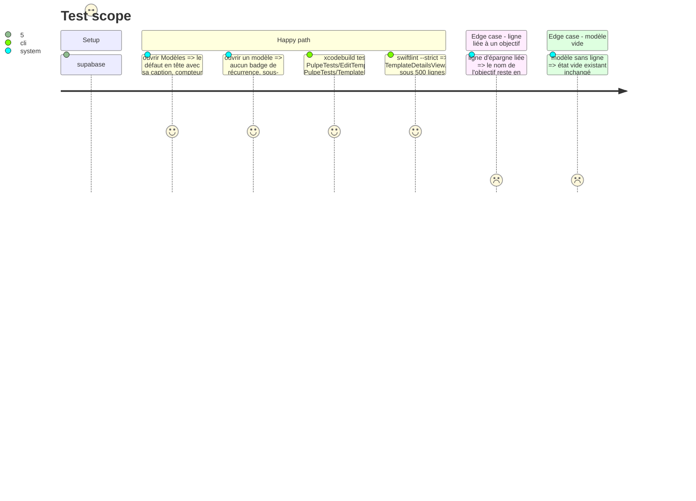

# Instruction: modèles, liste et détail sans badge

## Architecture projection

> Tree of the final files. ✅ create · ✏️ modify · ❌ delete

```txt
.
└── ios/
    ├── Pulpe/Features/Templates/
    │   ├── TemplateList/TemplateListView.swift                     ✏️ TemplateRow avec RowIcon ; le modèle par défaut en tête avec caption « Par défaut » ; pas de hero
    │   ├── TemplateDetails/TemplateDetailsView.swift               ✏️ capsule ad hoc (ligne 108) → PulpeChip.semantic ; TemplateLineRow extrait
    │   └── TemplateDetails/TemplateDetailsView+Rows.swift          ✅ TemplateLineRow : disque de nature, libellé, sous-titre « Récurrent » / « Prévu », montant
    ├── Pulpe/Shared/Components/RecurrenceBadge.swift               ❌ dernier consommateur retiré
    ├── PulpeTests/Features/Templates/EditTemplateLineSheetTests.swift ✏️ inchangé sauf identifiants
    └── PulpeTests/Features/Templates/TemplateDetailsGoalLinkTests.swift ✏️ suit l'extraction
```

## User Journey



## Test Scope



## Wireframe

```
┌─────────────────────────────────────┐
│ <  Budget mensuel standard       ✎  │
│ (1) Budget mensuel standard         │
│     Par défaut · [ 18'500 CHF prévu]│
│ (2) Revenus · 1                     │
│     ┌─────────────────────────────┐ │
│     │ (◉) Salaire       20'000   >│ │
│     │     Récurrent               │ │
│     └─────────────────────────────┘ │
│     Dépenses · 1                    │
│     ┌─────────────────────────────┐ │
│ (3) │ (◉) Loyer          1'500   >│ │
│     │     Récurrent               │ │
│     └─────────────────────────────┘ │
└─────────────────────────────────────┘
```

1. En-tête : nom `title`, caption « Par défaut », total en `PulpeChip(style: .semantic(.financialSavings))`.
2. Sections en `SectionHeader` + carte groupée.
3. Ligne : `RowIcon` de nature, libellé, sous-titre « Récurrent » / « Prévu » (+ nom d'objectif), montant, chevron.

## Tasks to do

### `1)` Liste des modèles

> Un seul changement : la ligne commence par une forme.

1. `TemplateRow` : ajouter `RowIcon(systemName: "doc.text", tint: .pulpePrimary)` en tête ; la caption « Par défaut » remplace tout badge si un chip existe sur la ligne. Le `List` natif, le compteur « N/5 modèles » et les actions de balayage restent.

### `2)` Détail d'un modèle

> Le badge de récurrence disait en capsule ce que le sous-titre dit en mots.

1. `TemplateDetailsView` ligne 108 : remplacer `.background(Color.financialSavings.opacity(...), in: Capsule())` par `PulpeChip(label:, style: .semantic(.financialSavings))`.
2. Extraire `TemplateLineRow` dans `TemplateDetailsView+Rows.swift` : `HStack { RowIcon(kind) ; VStack(nom listRowTitle, sous-titre listRowSubtitle = recurrence.label + objectif lié) ; Spacer ; montant listRowTitle monospacedDigit ; chevron }`. Remplacer `RecurrenceBadge(line.recurrence, style: .compact)` par le texte.
3. Grouper les lignes de chaque section dans une `pulpeCard` avec `Divider`, en-tête `SectionHeader(title:count:)`.
4. Supprimer `RecurrenceBadge.swift` ; `grep -rn "RecurrenceBadge" ios/Pulpe` rend zéro.

## Test acceptance criteria

| Task | Acceptance criteria |
| ---- | ------------------- |
| 1 | Chaque ligne de la liste commence par un `RowIcon` ; le compteur « N/5 modèles » et la suppression par balayage fonctionnent comme avant. |
| 2 | `grep -rn "RecurrenceBadge\|Capsule()" ios/Pulpe/Features/Templates ios/Pulpe/Shared/Components/RecurrenceBadge.swift` rend zéro ; `TemplateDetailsView.swift` < 500 lignes ; `EditTemplateLineSheetTests` et `TemplateDetailsGoalLinkTests` passent. |
