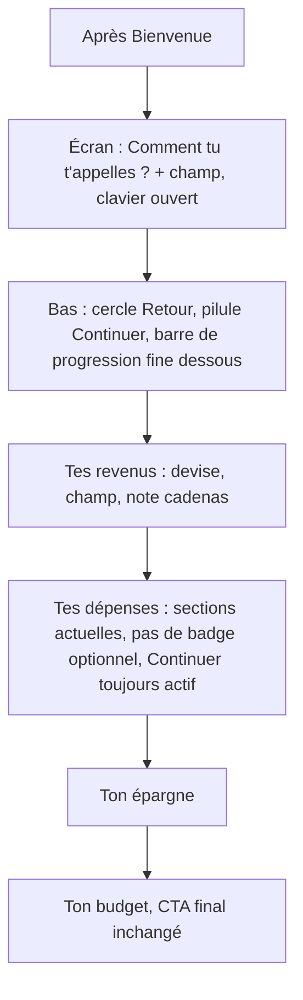
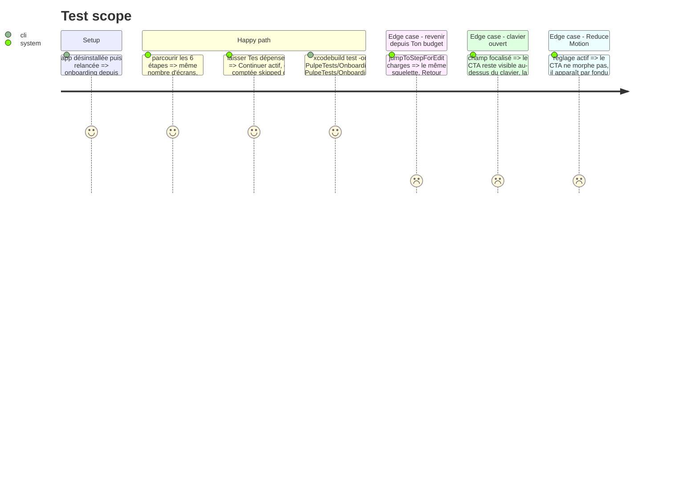

# Instruction: onboarding, squelette d'écran à une question

## Architecture projection

> Tree of the final files. ✅ create · ✏️ modify · ❌ delete

```txt
.
└── ios/
    ├── Pulpe/Features/Onboarding/
    │   ├── OnboardingStepView.swift                                ✏️ barre de progression en bas, CTA plat (plus d'onboardingGradient), bouton Retour en cercle à gauche du CTA
    │   ├── OnboardingStep.swift                                    ✏️ supprimer subtitle et iconName ; titres reformulés en question
    │   ├── Components/OnboardingStepHeader.swift                   ✏️ titre seul ; OptionalBadge et « Passer cette étape » supprimés
    │   ├── Components/OnboardingProgressIndicator.swift            ✏️ barre fine, rendue dans la zone basse
    │   ├── Steps/IncomeStep.swift                                  ✏️ garder le sélecteur de devise, le champ et la note de confidentialité ; supprimer la caption « Tu pourras changer plus tard »
    │   ├── Steps/ChargesStep.swift                                 ✏️ plus de caption ni de badge optionnel (le découpage vient en phase 9)
    │   ├── Steps/SavingsStep.swift                                 ✏️ idem
    │   ├── Steps/FirstNameStep.swift                               ✏️ idem
    │   └── Steps/RegistrationStep.swift                            ✏️ idem
    ├── Pulpe/Shared/Extensions/Color+Pulpe.swift                   ✏️ supprimer onboardingGradient (dernier consommateur retiré)
    └── PulpeTests/Features/Onboarding/OnboardingFlowTests.swift   ✏️ « Passer » = Continuer avec champs vides ; l'étape optionnelle reste franchissable
```

## User Journey



## Test Scope



## Wireframe

```
┌─────────────────────────────────────┐
│                                     │
│ (1) Tes revenus                     │
│                                     │
│ (2) [ 🇨🇭 CHF | 🇫🇷 EUR ]            │
│                                     │
│ (3) Revenu mensuel net              │
│     ┌─────────────────────────────┐ │
│     │ 5'000                  CHF  │ │
│     └─────────────────────────────┘ │
│ (4) 🔒 Personne d'autre ne voit     │
│        ces montants.                │
│                                     │
│                                     │
│ (5) ( ← )   [     Continuer     ]   │
│ (6) ▰▰▰▰▰▰▰▰▱▱▱▱▱▱▱▱▱▱▱▱▱▱▱▱▱▱▱▱   │
│ ┌─────────────────────────────────┐ │
│ │ 1  2  3      clavier      ⌫     │ │
└─────────────────────────────────────┘
```

1. Titre seul en `onboardingTitle` ; pas de sous-titre, pas d'icône.
2. Sélecteur de devise existant (`SegmentedPicker`).
3. `CurrencyField` focalisé à l'arrivée (comportement existant).
4. Note de confidentialité, conservée sur cette seule étape.
5. Zone basse : `IconButtonStyle` Retour en cercle `surfaceContainerLow`, CTA `PrimaryButtonStyle` plat ; le morph FAB ↔ pilule existant est conservé.
6. `OnboardingProgressIndicator` fine sous le CTA, au-dessus du clavier.

## Tasks to do

### `1)` Retirer ce qui n'est pas la question

> Un écran = un titre, un champ, un bouton. Le reste se lit ailleurs.

1. `OnboardingStep` : supprimer `subtitle` et `iconName` ; reformuler `title` en question là où ce n'est pas déjà le cas (« Tes revenus » → « Combien gagnes-tu par mois ? », « Tes dépenses » → « Quelles sont tes charges fixes ? », « Ton épargne » → « Combien mets-tu de côté ? »). `isOptional` reste pour l'analytics `skipped`.
2. `OnboardingStepHeader` : ne rend que le titre ; supprimer `OptionalBadge` et le bouton « Passer cette étape » et le paramètre `onSkip`. Le « skip » = `Continuer` avec des champs vides ; `canProceed` est déjà `true` sur les étapes optionnelles.
3. Étapes : retirer les captions secondaires (`IncomeStep` « Tu pourras changer plus tard », équivalents dans `ChargesStep`, `SavingsStep`, `FirstNameStep`, `RegistrationStep`) ; garder la note cadenas de `IncomeStep` seule.
4. `OnboardingFlowTests` : remplacer les tests de « Passer » par « Continuer avec champs vides » ; vérifier que `onboarding_step_completed` porte `skipped: true` quand l'étape optionnelle est franchie sans saisie (propriété déjà au contrat).

### `2)` Zone basse : Retour, CTA plat, progression

> La progression se lit là où le pouce est.

1. `OnboardingStepView` : retirer `Color.onboardingGradient` de `ctaBackground` au profit de `Color.pulpePrimary` (aligné sur `PrimaryButtonStyle` plat de la phase 1) ; bouton Retour en `IconButtonStyle` cercle 44pt à gauche du CTA dans le même `HStack`, visible dès la deuxième étape ; `OnboardingProgressIndicator` sous cet `HStack`, dans l'overlay bas, au-dessus de la zone clavier. Supprimer l'instance de la barre en haut.
2. `OnboardingProgressIndicator` : hauteur `FrameHeight.progressBar` divisée par deux via un nouveau token `FrameHeight.progressBarThin` (4pt), piste `outlineVariant`, remplissage `pulpePrimary`, animation `DesignTokens.Animation.fast`, Reduce Motion respecté.
3. `Color+Pulpe.swift` : supprimer `onboardingGradient` ; `grep -rn onboardingGradient ios/Pulpe` rend zéro.

## Test acceptance criteria

| Task | Acceptance criteria |
| ---- | ------------------- |
| 1 | `grep -n "subtitle\|iconName\|OptionalBadge\|Passer cette étape" ios/Pulpe/Features/Onboarding` rend zéro ; chaque étape affiche un titre en question et aucun sous-titre. |
| 1 | `OnboardingFlowTests` et `OnboardingStateTests` passent ; franchir Tes dépenses vide émet `onboarding_step_completed` avec `skipped: true`. |
| 2 | Sur simulateur, la barre de progression est sous le CTA, visible clavier ouvert ; le CTA est plat `pulpePrimary` ; `grep -rn onboardingGradient ios/Pulpe` rend zéro. |
| 2 | Reduce Motion actif : le CTA apparaît sans morph ; `swiftlint --strict` passe. |
