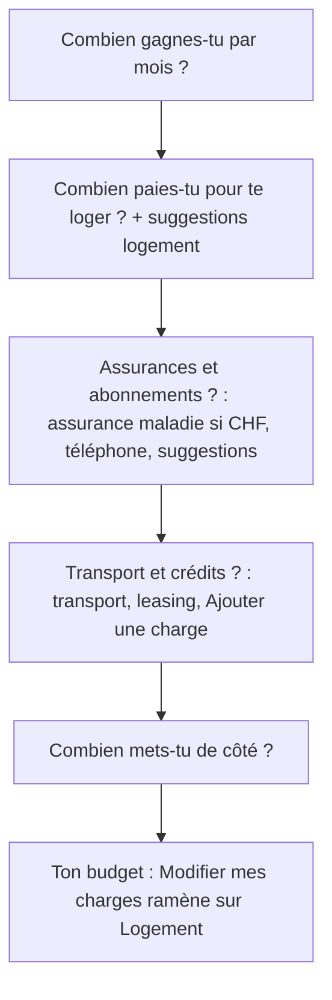
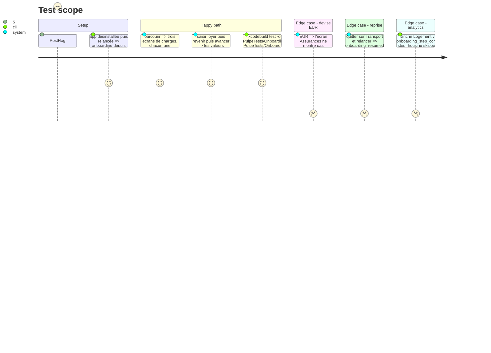

# Instruction: onboarding, une question par écran pour les charges

## Architecture projection

> Tree of the final files. ✅ create · ✏️ modify · ❌ delete

```txt
.
└── ios/
    ├── Pulpe/Features/Onboarding/
    │   ├── OnboardingStep.swift                                    ✏️ charges → housing, insurance, transport ; analyticsName par étape ; isOptional pour les trois
    │   ├── OnboardingState.swift                                   ✏️ barre de progression et navigation sur les nouvelles étapes ; totalCharges inchangé
    │   ├── Steps/ChargesStep.swift                                 ❌ éclaté
    │   ├── Steps/HousingStep.swift                                 ✅ Loyer mensuel + suggestions Logement
    │   ├── Steps/InsuranceStep.swift                               ✅ Assurance maladie (CHF seulement) + Forfait téléphone + suggestions abonnements
    │   ├── Steps/TransportStep.swift                               ✅ Transport + Leasing / crédit + prévisions personnalisées + Ajouter une charge
    │   └── Components/OnboardingSuggestionGrid.swift               ✏️ accepte une liste filtrée par étape
    ├── Pulpe/Core/Analytics/AnalyticsEvent.swift                   ✏️ aucun nouvel événement ; la propriété step gagne trois valeurs
    ├── PulpeTests/Features/Onboarding/OnboardingStateTests.swift  ✏️ step_index / step_total sur 8 étapes visibles ; skipped par étape
    └── PulpeTests/Features/Onboarding/OnboardingFlowTests.swift   ✏️ aller-retour sur les trois étapes, retour d'édition depuis Ton budget
```

## User Journey



## Test Scope



## Wireframe

```
┌─────────────────────────────────────┐
│                                     │
│ (1) Combien paies-tu pour           │
│     te loger ?                      │
│                                     │
│ (2) Loyer mensuel                   │
│     ┌─────────────────────────────┐ │
│     │ 1'500                  CHF  │ │
│     └─────────────────────────────┘ │
│ (3) Suggestions                     │
│     ┌───────────┐ ┌───────────┐    │
│     │ Charges   │ │ Électricité│    │
│     │ 200 CHF ○ │ │ 80 CHF  ○ │    │
│     └───────────┘ └───────────┘    │
│                                     │
│ (4) ( ← )   [     Continuer     ]   │
│     ▰▰▰▰▰▰▰▰▰▰▰▰▱▱▱▱▱▱▱▱▱▱▱▱▱▱▱▱   │
└─────────────────────────────────────┘
```

1. Titre en question, seul.
2. Un `CurrencyField` principal, focalisé à l'arrivée.
3. `OnboardingSuggestionGrid` réduit aux suggestions de la catégorie.
4. Zone basse de la phase 8.

## Tasks to do

### `0)` Mesurer avant de découper

> Le funnel répare le mur budget → transaction, pas l'onboarding ; on vérifie que l'onboarding n'est pas le mur avant d'y investir.

1. PostHog : funnel `onboarding_started` → `onboarding_step_completed` par `step` sur 30 jours ; noter le taux d'abandon sur `charges`. Si `charges` n'abandonne pas plus que `income`, cette phase s'arrête ici et le plan se clôt après la phase 8.

### `1)` Découper l'étape charges

> Trois questions courtes remplacent trois sections repliables.

1. `OnboardingStep` : remplacer `charges` par `housing`, `insurance`, `transport` ; `analyticsName` = `housing`, `insurance`, `transport` ; `title` = « Combien paies-tu pour te loger ? », « Assurances et abonnements ? », « Transport et crédits ? » ; `isOptional` vrai pour les trois ; `showProgressBar` vrai.
2. `OnboardingState` : `progressBarSteps`, `isStepNavigable`, `nextVisibleStep`, `previousVisibleStep`, `jumpToStepForEdit(.charges)` → `.housing` ; les propriétés `housingCosts`, `healthInsurance`, `phonePlan`, `transportCosts`, `leasingCredit`, `totalCharges` et `createTemplateData()` ne changent pas.
3. `HousingStep` : `CurrencyField` loyer + `OnboardingSuggestionGrid` filtré sur les suggestions logement. `InsuranceStep` : assurance maladie si `currency == .chf`, forfait téléphone, suggestions abonnements. `TransportStep` : transport, leasing / crédit, `customChargesSection`, `addChargeButton`, `OnboardingRunningTotal` « Total charges ». Supprimer `ChargesStep.swift` et les états `isInsuranceExpanded` / `isMobilityExpanded`.
4. `OnboardingState.chargeSuggestions` : ajouter une catégorie (`housing`, `subscription`, `transport`) à `OnboardingTransaction` ou un tableau par étape ; `OnboardingSuggestionGrid` reçoit la liste déjà filtrée, aucun changement de rendu.
5. `.trackScreen("Onboarding_Housing")`, `"Onboarding_Insurance"`, `"Onboarding_Transport"`.

### `2)` Analytics et tests

> Un découpage d'étape est un changement de contrat, pas un nouvel événement.

1. Aucun nouvel événement : `onboarding_step_completed.step` gagne les valeurs `housing`, `insurance`, `transport` ; `charges` n'est plus émis. Mettre à jour la JSDoc de `ONBOARDING_STEP_COMPLETED` dans `shared/src/feature-flags.ts` pour nommer les valeurs, et `AnalyticsEvent.swift` si une énumération de valeurs y vit. `step_total` passe de 6 à 8 pour le chemin e-mail ; noter la date de bascule dans la JSDoc pour lire les dashboards.
2. `OnboardingStateTests` : `step_index` / `step_total` pour chaque nouvelle étape, `skipped` par étape, `selectCurrency(.eur)` remet `healthInsurance` à nil (comportement existant) ; `OnboardingFlowTests` : aller-retour sur les trois étapes et `jumpToStepForEdit` ; reprise sur `transport` couverte dans `OnboardingStateTests` (cas `onboarding_resumed` existants).

## Test acceptance criteria

| Task | Acceptance criteria |
| ---- | ------------------- |
| 0 | Le taux d'abandon par étape est noté dans la réponse de l'exécuteur avant le premier commit de la phase ; la décision d'arrêter ou de continuer est explicite. |
| 1 | `ChargesStep.swift` n'existe plus ; trois fichiers d'étape existent ; `createTemplateData()` produit la même `BudgetTemplateCreateFromOnboarding` qu'avant pour les mêmes saisies (test existant inchangé). |
| 1 | Sur simulateur en EUR, l'écran Assurances ne propose pas d'assurance maladie ; en CHF il la propose. |
| 2 | `OnboardingStateTests`, `OnboardingFlowTests` passent ; `pnpm test --filter shared` passe après la mise à jour de la JSDoc ; `grep -rn '"charges"' ios/Pulpe` rend zéro. |
