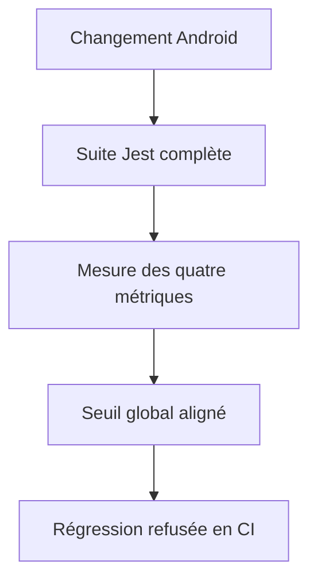
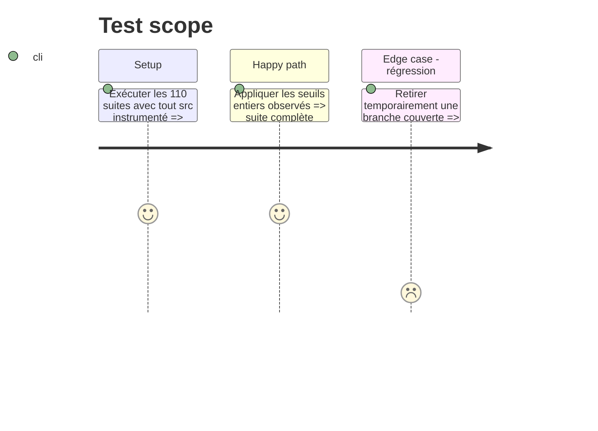

# Instruction: Verrouiller immédiatement le baseline réel

## Architecture projection

> Tree of the final files. ✅ create · ✏️ modify · ❌ delete

```txt
android/
└── jest.config.js ✏️ aligner les seuils globaux sur la mesure complète actuelle
```

## User Journey



## Test Scope



## Tasks to do

### `1)` Fermer l’écart entre mesure et seuil

1. Garder le dénominateur `src/**/*.{ts,tsx}` et ses exclusions actuelles.
2. Passer le global à statements 36, branches 32, functions 30 et lines 35.
3. Ne pas modifier les seuils ciblés de `session-store`, `vault-store` et `api-client`.

### `2)` Définir la règle de ratchet des phases suivantes

1. Après chaque phase, exécuter la suite complète et relever chaque seuil à `floor(mesure)` seulement si la valeur augmente.
2. Refuser toute baisse de métrique, exclusion de production ou test source ajouté pour atteindre le seuil.

## Test acceptance criteria

| Task | Acceptance criteria                                                                                                            |
| ---- | ------------------------------------------------------------------------------------------------------------------------------ |
| 1    | Le seuil global correspond au plancher entier du baseline 36,33/32,90/30,13/35,99 et la suite complète reste verte.            |
| 2    | Une couverture sous 36/32/30/35 échoue, tandis que les trois seuils ciblés critiques conservent leurs valeurs plus exigeantes. |
