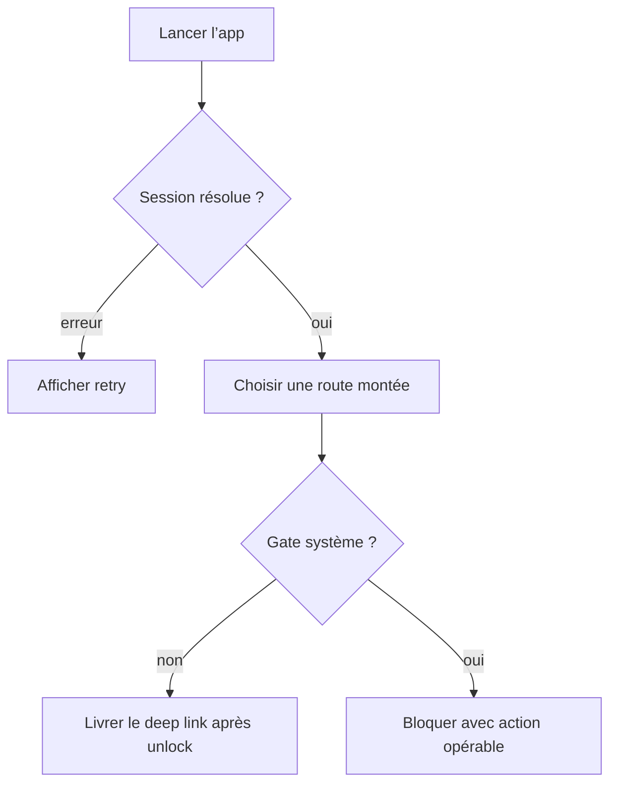
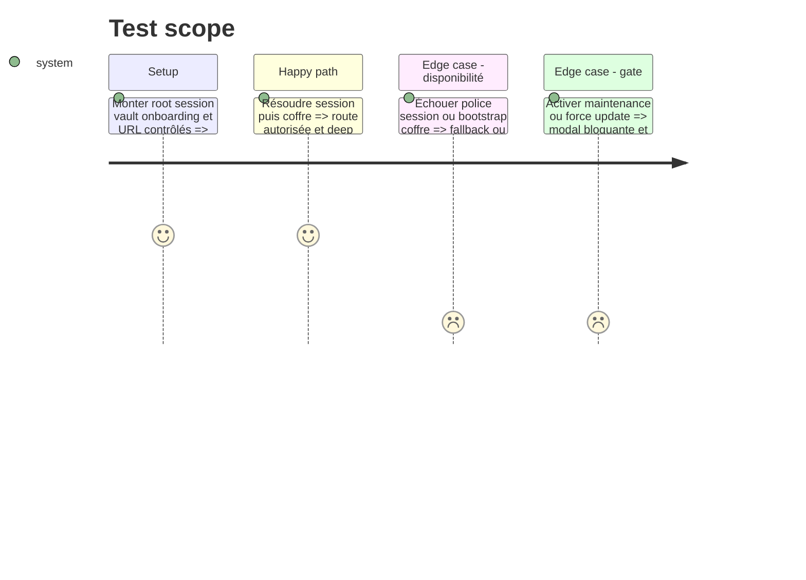

# Instruction: Couvrir l’entrée applicative et les gates système

## Architecture projection

> Tree of the final files. ✅ create · ✏️ modify · ❌ delete

```txt
android/
├── jest.config.js                                      ✏️ ratcheter la mesure complète
└── src/core/
    ├── navigation/app-entry.spec.tsx                  ✅ rendre le root et la route d’entrée
    ├── system/system-gate-screen.spec.tsx             ✅ exécuter maintenance et mise à jour forcée
    └── linking/deep-link-router.spec.tsx              ✅ exécuter l’attente puis la navigation d’un lien
```

## User Journey



## Test Scope



## Tasks to do

### `1)` Exécuter le shell au lieu de relire son source

1. Rendre `RootLayout` avec fonts, session, coffre et groupes contrôlés.
2. Vérifier le fallback de police, l’erreur de restauration, le retry et le bootstrap coffre de `IndexRoute`.
3. Garder les providers enfants lourds mockés à leur frontière sans reproduire leur implémentation.

### `2)` Exécuter les deux gates au-dessus du routeur

1. Vérifier maintenance, réduction de mouvement, mise à jour forcée, URL store et fallback retry.
2. Conserver un deep link pendant sign-out ou coffre verrouillé, le livrer après unlock et empêcher une seconde navigation.

### `3)` Ratcheter la couverture complète

1. Relever uniquement les quatre seuils globaux gagnés par la suite complète.

## Test acceptance criteria

| Task | Acceptance criteria                                                                                                                  |
| ---- | ------------------------------------------------------------------------------------------------------------------------------------ |
| 1    | Les états prêt, loading, restauration échouée et bootstrap coffre rendent chacun une issue observable, sans assertion sur le source. |
| 2    | Aucun lien protégé n’est perdu ou livré deux fois et chaque gate système expose l’action correspondant à son état.                   |
| 3    | Au moins un seuil global monte d’un point entier et aucun seuil existant ne baisse.                                                  |
