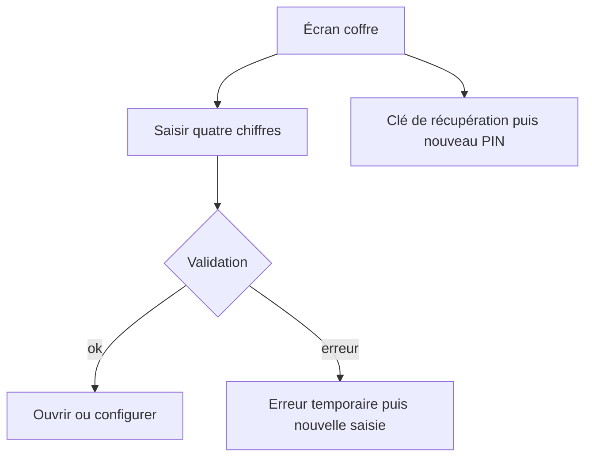
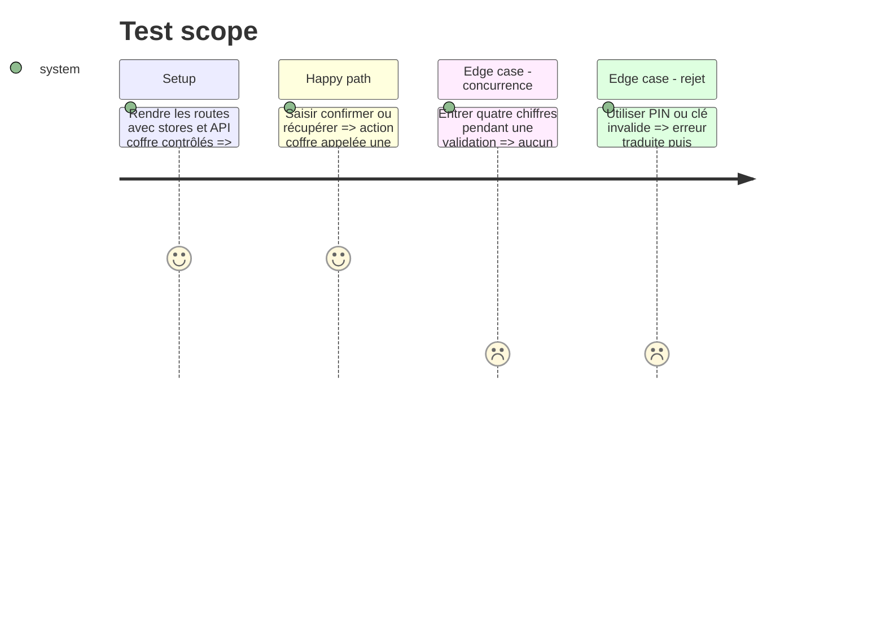

# Instruction: Couvrir les écrans du coffre et la saisie du PIN

## Architecture projection

> Tree of the final files. ✅ create · ✏️ modify · ❌ delete

```txt
android/
├── jest.config.js                              ✏️ ratcheter la mesure complète
└── src/
    ├── core/vault/vault-routes.spec.tsx       ✅ rendre setup unlock et recovery
    └── ui/use-pin-entry.spec.ts               ✅ exécuter concurrence erreur et nettoyage du PIN
```

## User Journey



## Test Scope



## Tasks to do

### `1)` Verrouiller la machine de saisie partagée

1. Tester quatrième chiffre, prévention du double-submit, remise à zéro, timeout d’erreur et démontage.
2. Utiliser les timers Jest et le hook réel, sans recopier sa logique dans le test.

### `2)` Rendre les trois routes du coffre

1. Couvrir unlock PIN et biométrie, setup avec confirmation identique ou différente, et recovery clé puis nouveau PIN.
2. Vérifier les échecs API, le retour vers la clé et la sortie de session depuis une erreur bloquante.

### `3)` Ratcheter la couverture complète

1. Relever uniquement les seuils globaux gagnés sans toucher aux seuils ciblés du coffre.

## Test acceptance criteria

| Task | Acceptance criteria                                                                                               |
| ---- | ----------------------------------------------------------------------------------------------------------------- |
| 1    | Une saisie ne peut produire qu’une validation en vol et redevient utilisable après succès, erreur ou timeout.     |
| 2    | Setup, unlock et recovery prouvent leurs transitions heureuses et leurs rejets par rendu et événements.           |
| 3    | Au moins un seuil global monte d’un point entier, aucun ne baisse et le seuil ciblé `vault-store` reste respecté. |
