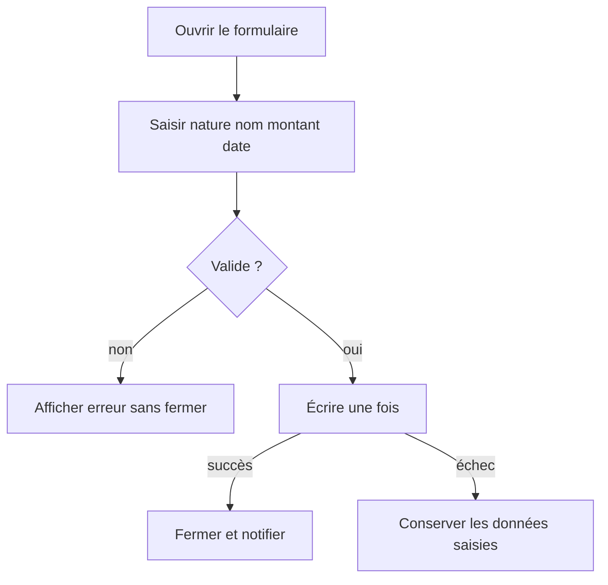
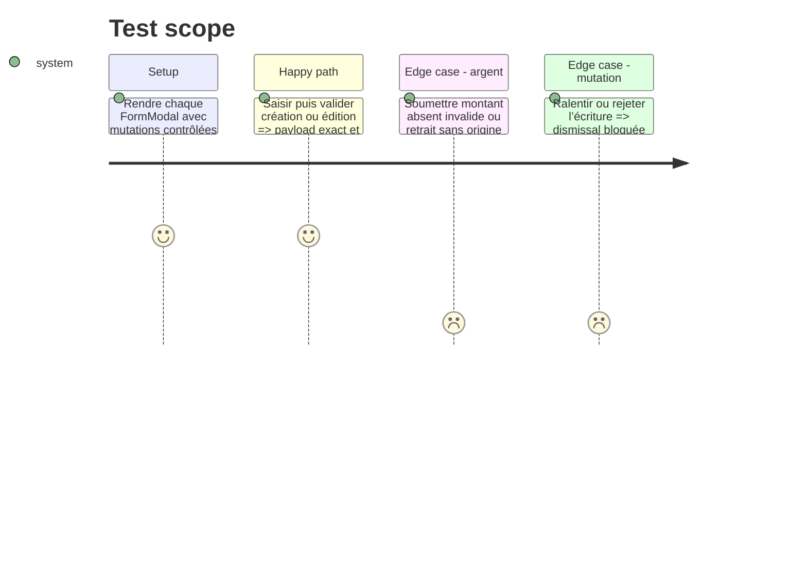

# Instruction: Couvrir les deux formulaires d’écriture financière

## Architecture projection

> Tree of the final files. ✅ create · ✏️ modify · ❌ delete

```txt
android/
├── jest.config.js                                                        ✏️ ratcheter la mesure complète
└── src/features/
    ├── transactions/components/transaction-sheet.spec.tsx              ✅ exécuter création édition et retrait épargne
    └── budget-details/components/budget-line-sheet.spec.tsx            ✅ exécuter création édition et lissage
```

## User Journey



## Test Scope



## Tasks to do

### `1)` Exécuter le formulaire de mouvement

1. Couvrir création, édition, changement de nature, date, tags et retrait depuis un objectif d’épargne.
2. Vérifier le payload de mutation et les validations à la frontière, pas les détails de composants Paper.

### `2)` Exécuter le formulaire de prévision

1. Couvrir création, édition, récurrence, rattachement épargne et lissage total ou occurrence.
2. Vérifier qu’une mutation en vol bloque toutes les fermetures et qu’un rejet laisse le formulaire corrigeable.

### `3)` Ratcheter la couverture complète

1. Relever les quatre seuils globaux au plancher entier mesuré.

## Test acceptance criteria

| Task | Acceptance criteria                                                                                                               |
| ---- | --------------------------------------------------------------------------------------------------------------------------------- |
| 1    | Les payloads create, update et retrait épargne reflètent les champs visibles et aucune donnée invalide ne déclenche une mutation. |
| 2    | Les branches create, update et spread écrivent une seule fois; busy et erreur conservent l’état utilisateur.                      |
| 3    | Au moins un seuil global monte d’un point entier et aucun seuil existant ne baisse.                                               |
