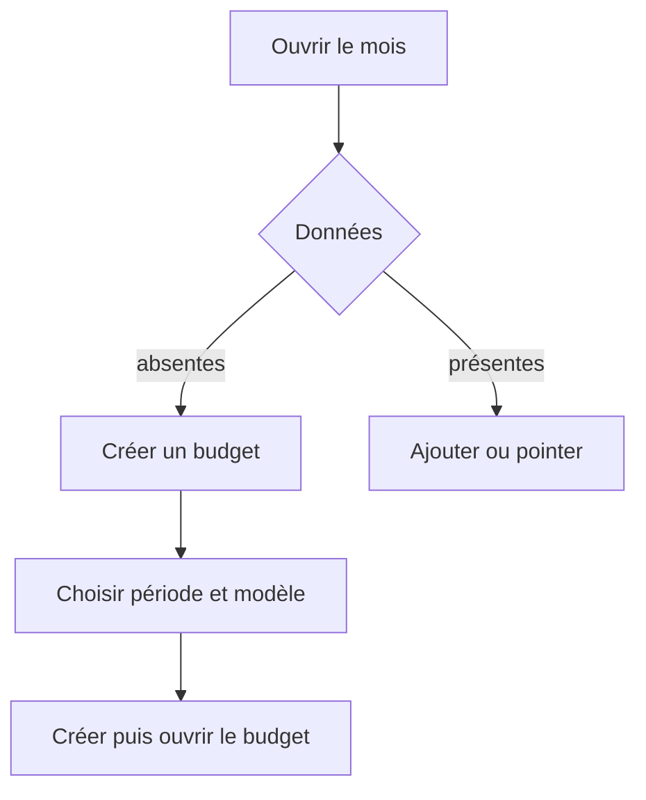
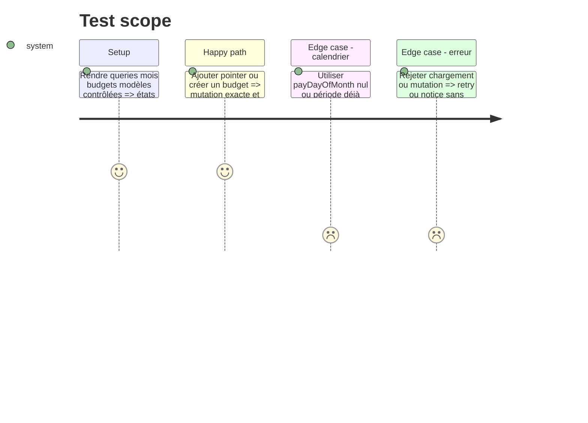

# Instruction: Couvrir le mois courant et la création d’un budget

## Architecture projection

> Tree of the final files. ✅ create · ✏️ modify · ❌ delete

```txt
android/
├── jest.config.js                                         ✏️ ratcheter la mesure complète
└── src/features/
    ├── current-month/home-screen.spec.tsx                ✅ rendre états du mois ajout et pointage
    └── budgets/create-budget-screen.spec.tsx             ✅ rendre sélection période modèle et création
```

## User Journey



## Test Scope



## Tasks to do

### `1)` Rendre la route d’accueil avec son vrai view model

1. Couvrir loading, erreur, mois absent et mois disponible avec `payDayOfMonth: null`.
2. Exécuter ouverture du formulaire, deep link d’ajout, pointage, undo et rollback d’erreur.

### `2)` Rendre la création de budget

1. Couvrir périodes offertes, exclusion d’un mois existant, modèle par défaut et soumission.
2. Vérifier erreur de query, mutation en vol, double-submit et navigation après succès.

### `3)` Ratcheter la couverture complète

1. Relever les quatre seuils globaux au plancher entier mesuré.

## Test acceptance criteria

| Task | Acceptance criteria                                                                                       |
| ---- | --------------------------------------------------------------------------------------------------------- |
| 1    | L’accueil affiche une issue pour chaque état de données et un pointage rejeté revient à son état serveur. |
| 2    | Seule une période disponible peut être créée et le succès ouvre exactement le budget retourné.            |
| 3    | Au moins un seuil global monte d’un point entier et aucun seuil existant ne baisse.                       |
