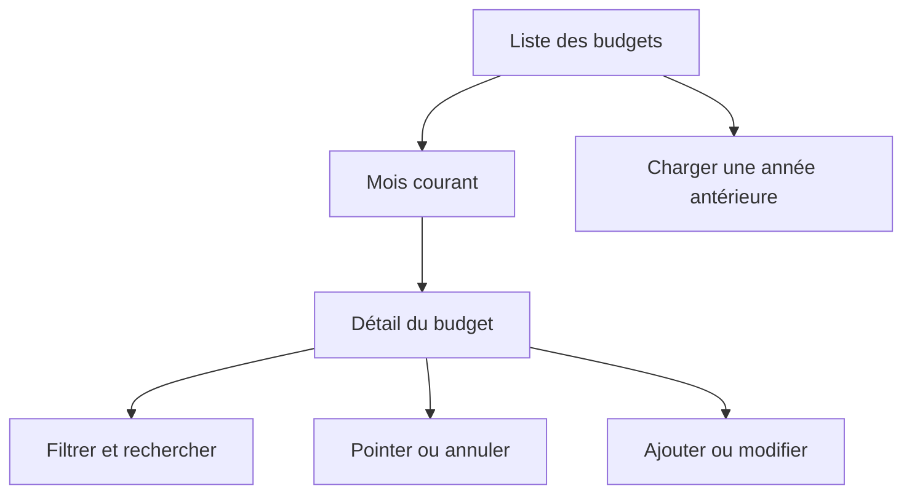
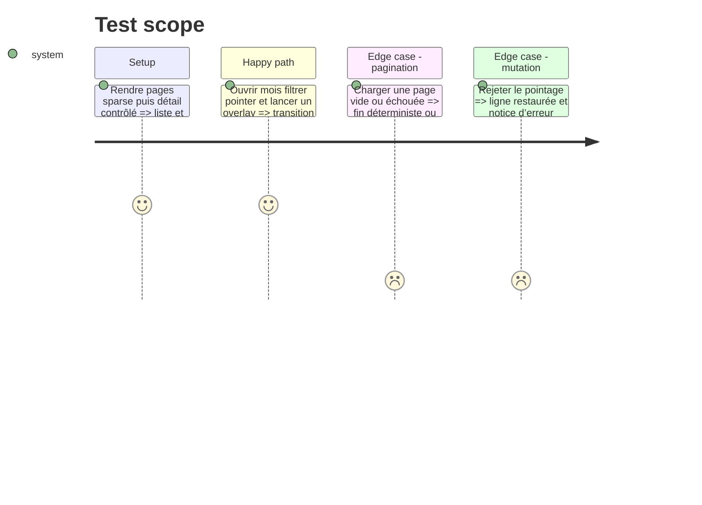

# Instruction: Couvrir la liste et le détail d’un budget

## Architecture projection

> Tree of the final files. ✅ create · ✏️ modify · ❌ delete

```txt
android/
├── jest.config.js                                          ✏️ ratcheter la mesure complète
└── src/features/
    ├── budgets/budgets-screen.spec.tsx                    ✅ rendre années pagination et navigation
    └── budget-details/budget-detail-screen.spec.tsx       ✅ rendre filtres pointage et overlays
```

## User Journey



## Test Scope



## Tasks to do

### `1)` Intégrer les sélecteurs à la liste rendue

1. Couvrir loading, erreur, liste vide, ancrage courant, années et chargement suivant.
2. Vérifier navigation vers le budget choisi et création depuis le FAB.

### `2)` Intégrer le view model au détail rendu

1. Couvrir erreur, budget absent, filtres, recherche, mois adjacent et sections de lignes.
2. Exécuter pointage/undo et l’ouverture des overlays via leur poignée publique.

### `3)` Ratcheter la couverture complète

1. Relever les quatre seuils globaux au plancher entier mesuré.

## Test acceptance criteria

| Task | Acceptance criteria                                                                                     |
| ---- | ------------------------------------------------------------------------------------------------------- |
| 1    | La liste rend chaque état de pagination sans doublon et navigue vers l’identifiant sélectionné.         |
| 2    | Le détail distingue erreur et absence, applique ses filtres et restaure une mutation optimiste rejetée. |
| 3    | Au moins un seuil global monte d’un point entier et aucun seuil existant ne baisse.                     |
