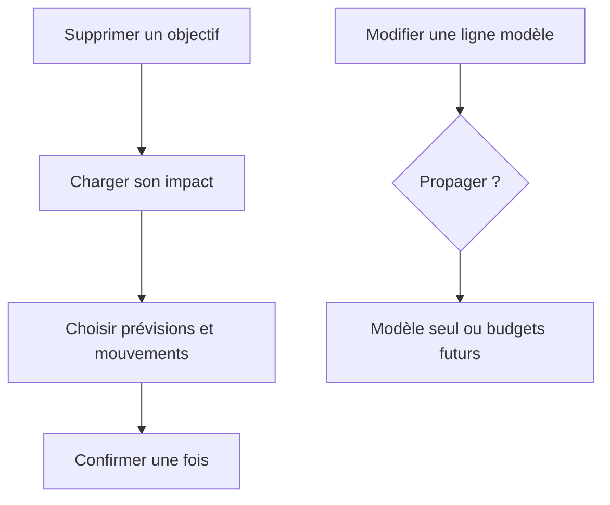
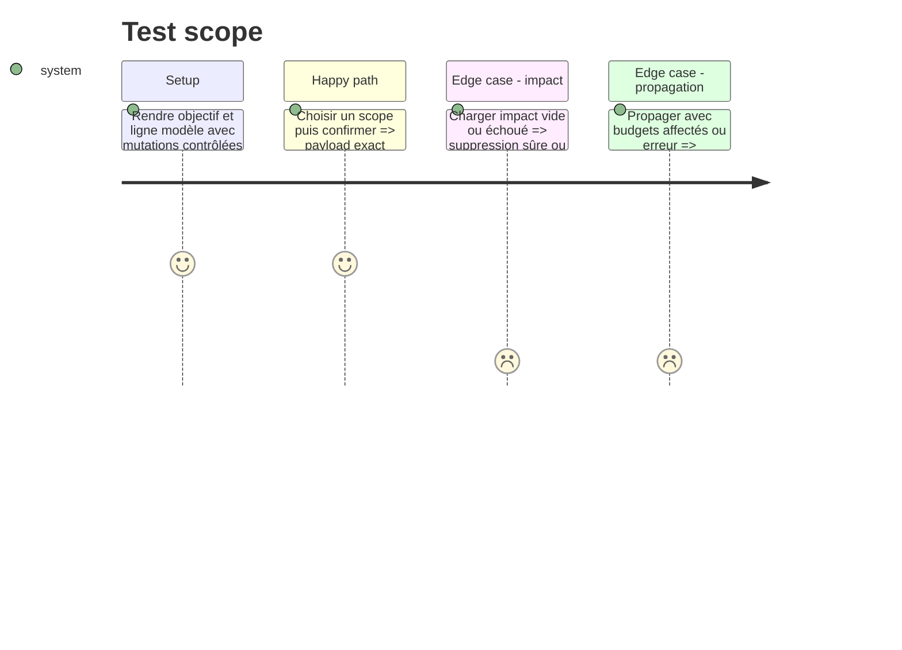

# Instruction: Couvrir les mutations sensibles des objectifs et modèles

## Architecture projection

> Tree of the final files. ✅ create · ✏️ modify · ❌ delete

```txt
android/
├── jest.config.js                                                        ✏️ ratcheter la mesure complète
└── src/features/
    ├── savings-goals/components/goal-deletion-sheet.spec.tsx           ✅ exécuter impact et scopes de suppression
    └── templates/components/template-line-sheet.spec.tsx               ✅ exécuter édition et propagation
```

## User Journey



## Test Scope



## Tasks to do

### `1)` Exécuter la suppression d’objectif

1. Couvrir loading, erreur, impact nul et impact avec prévisions ou mouvements liés.
2. Vérifier chaque combinaison de scopes transmise à la mutation et le blocage pendant écriture.

### `2)` Exécuter l’édition d’une ligne modèle

1. Couvrir validation, sauvegarde du modèle seul et propagation aux budgets futurs.
2. Vérifier les confirmations, succès, erreur et conservation de saisie.

### `3)` Ratcheter la couverture complète

1. Relever les quatre seuils globaux au plancher entier mesuré.

## Test acceptance criteria

| Task | Acceptance criteria                                                                             |
| ---- | ----------------------------------------------------------------------------------------------- |
| 1    | La suppression transmet exactement les scopes visibles et ne peut pas être confirmée deux fois. |
| 2    | Une propagation n’a lieu qu’après choix explicite; un échec garde les valeurs modifiables.      |
| 3    | Au moins un seuil global monte d’un point entier et aucun seuil existant ne baisse.             |
