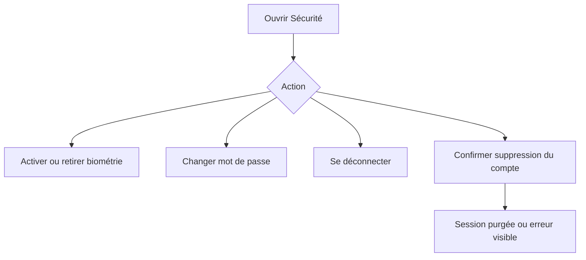
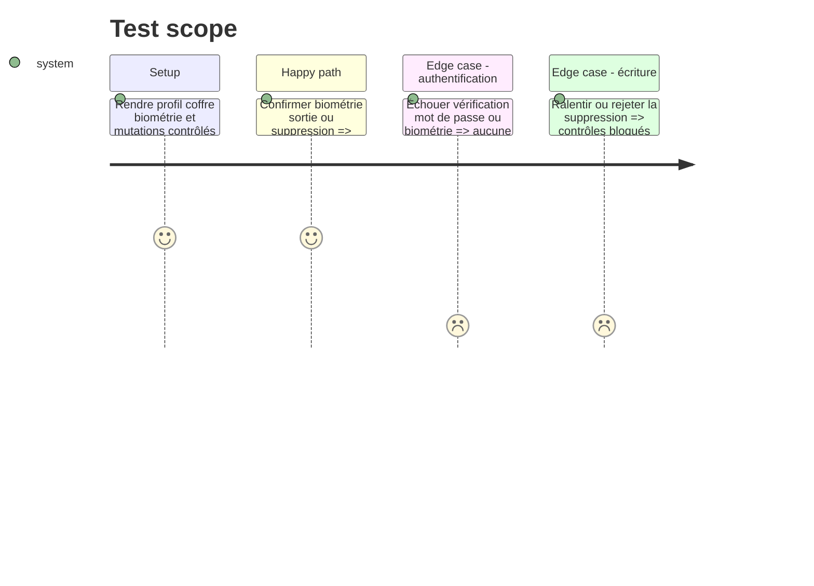

# Instruction: Couvrir la sécurité du compte et poser le plancher de sortie

## Architecture projection

> Tree of the final files. ✅ create · ✏️ modify · ❌ delete

```txt
android/
├── jest.config.js                                           ✏️ poser le dernier plancher mesuré
└── src/features/account/security-settings-screen.spec.tsx  ✅ rendre biométrie sortie et suppression de compte
```

## User Journey



## Test Scope



## Tasks to do

### `1)` Rendre les actions sensibles de sécurité

1. Couvrir disponibilité biométrique, activation, désactivation, changement de mot de passe et déconnexion.
2. Couvrir confirmation mot de passe, suppression de compte, succès, rejet et prévention du double-submit.

### `2)` Poser le plancher de sortie

1. Exécuter la suite complète, relever chaque métrique globale à son plancher entier final et conserver tous les seuils ciblés.
2. Vérifier qu’aucune exclusion de production, snapshot ou lecture de source n’a été ajoutée dans les nouvelles specs.
3. Conserver la couverture comme sortie du test CI existant, sans nouveau job ni reporter.

## Test acceptance criteria

| Task | Acceptance criteria                                                                                                                    |
| ---- | -------------------------------------------------------------------------------------------------------------------------------------- |
| 1    | Une action sensible exige sa confirmation, ne part qu’une fois et laisse une issue récupérable après rejet.                            |
| 2    | Les quatre seuils globaux finaux sont supérieurs à 36/32/30/35, aucun seuil ciblé ne baisse et `pnpm test:unit` les impose dans la CI. |
