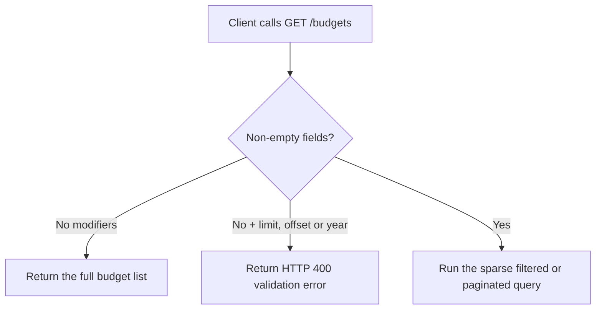
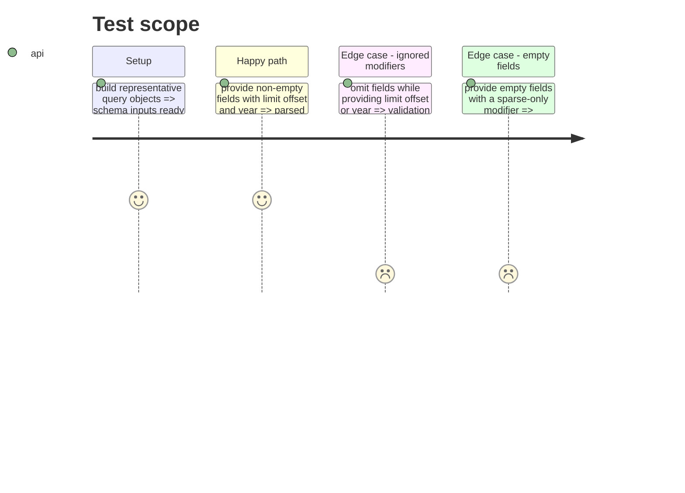

# Instruction: Align validation, regression tests and Swagger

## Architecture projection

> Tree of the final files. ✅ create · ✏️ modify · ❌ delete

```txt
.
├── shared
│   ├── schemas.ts                                      ✏️ reject sparse-only modifiers without non-empty fields
│   └── src/list-budgets-query.spec.ts                  ✏️ pin valid and invalid parameter combinations
└── backend-nest/src/modules/budget/infrastructure/http
    └── budget.controller.ts                            ✏️ document the parameter dependency in Swagger
```

## User Journey



## Test Scope



## Tasks to do

### `1)` Enforce the shared query contract

> Prevent accepted parameters from being silently ignored by the full-list path.

1. Reject an empty `fields` value instead of treating it as a valid sparse selection.
2. Require `fields` whenever `limit`, `offset`, or `year` is present.
3. Preserve the existing rule that `offset` also requires `limit`.

### `2)` Pin the contract with focused tests

> Cover every modifier that previously reached the wrong use-case path.

1. Keep the unfiltered full-list query valid.
2. Make the bounded-page success case include sparse fields.
3. Reject `limit`, `offset`, and `year` without fields, including empty fields.

### `3)` Align the generated API documentation

> Make client developers see the same dependency enforced at runtime.

1. State that `limit`, `offset`, and `year` apply to sparse fieldsets and require `fields`.
2. Keep the existing `offset` dependency on `limit` explicit.

## Test acceptance criteria

| Task | Acceptance criteria                                                                                               |
| ---- | ----------------------------------------------------------------------------------------------------------------- |
| 1    | `{}` and a non-empty `fields` query still parse, while any sparse-only modifier without non-empty `fields` fails  |
| 1    | `offset` continues to fail without `limit`, even when `fields` is present                                         |
| 2    | The focused shared schema suite covers all valid and invalid combinations and passes                              |
| 3    | Swagger descriptions no longer present `limit`, `offset`, or `year` as effective independently from sparse fields |
