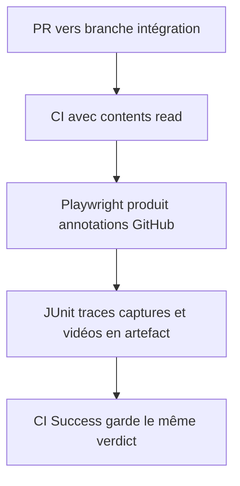
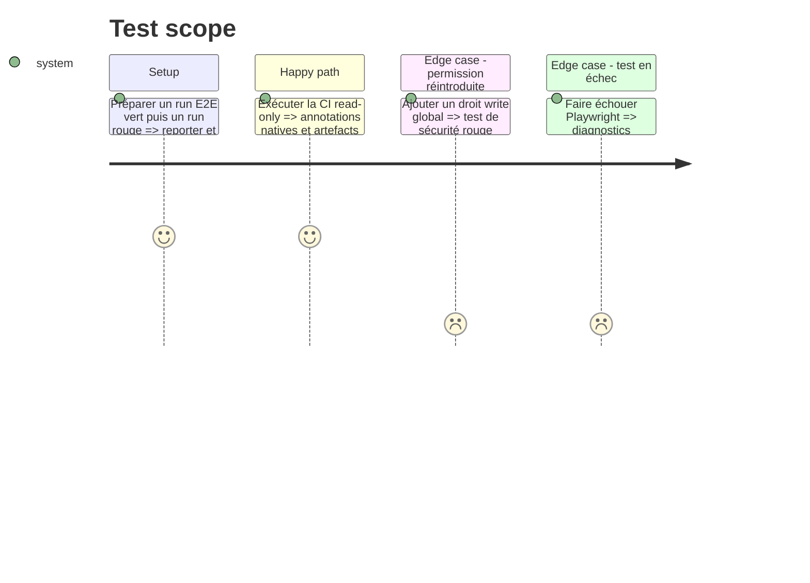

# Instruction: Réduire les permissions de la CI principale

## Architecture projection

> Tree of the final files. ✅ create · ✏️ modify · ❌ delete

```txt
.
├── .github/
│   ├── scripts/ci-security.test.mjs                ✏️ verrouille les permissions minimales
│   └── workflows/ci.yml                            ✏️ retire le publisher tiers et les droits d’écriture globaux
└── docs/CI.md                                       ✏️ documente les diagnostics E2E natifs et le token read-only
```

Aucun fichier n’est créé ou supprimé.

## User Journey



## Test Scope



## Tasks to do

### `1)` Retirer le publisher JUnit tiers

> Les reporters Playwright déjà configurés couvrent le diagnostic sans API d’écriture.

1. Supprimer `EnricoMi/publish-unit-test-result-action` de `ci.yml`.
2. Conserver les reporters `github`, `junit` et `blob` ainsi que l’upload des résultats, traces, captures et vidéos.
3. Vérifier un run vert et un run rouge avant de conclure que les commentaires PR ne manquent pas au diagnostic.

### `2)` Appliquer le moindre privilège

> La CI principale reste en lecture; les workflows de publication conservent leurs frontières séparées.

1. Garder seulement `contents: read` au niveau du workflow.
2. Vérifier chaque action restante et n’ajouter une permission au niveau d’un job que si un appel prouvé l’exige.
3. Ne modifier ni les tokens App de release ni les workflows privilégiés hors de cette phase.

### `3)` Verrouiller le contrat

> Une future action ne peut pas réintroduire silencieusement des droits globaux.

1. Étendre `ci-security.test.mjs` pour refuser `checks: write`, `pull-requests: write` et tout wildcard global.
2. Exiger la présence des reporters Playwright et de l’artefact en cas d’échec.
3. Mettre `docs/CI.md` en accord avec le workflow exécutable.

## Test acceptance criteria

| Task | Acceptance criteria                                                                                                  |
| ---- | -------------------------------------------------------------------------------------------------------------------- |
| 1    | Un échec E2E reste diagnostiquable via annotations natives, JUnit et artefacts après suppression du publisher tiers. |
| 2    | `ci.yml` n’accorde globalement que `contents: read` et `✅ CI Success` garde son nom et sa sémantique.               |
| 3    | Le test de sécurité échoue si une permission write globale revient ou si les diagnostics requis disparaissent.       |
