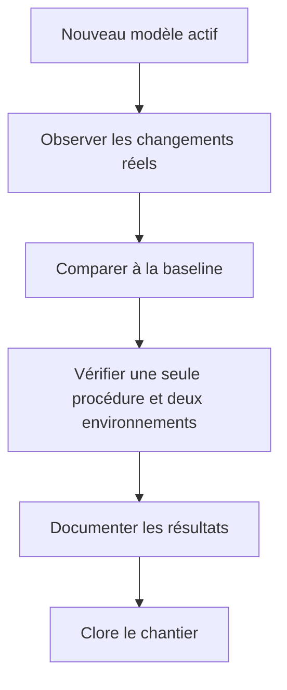
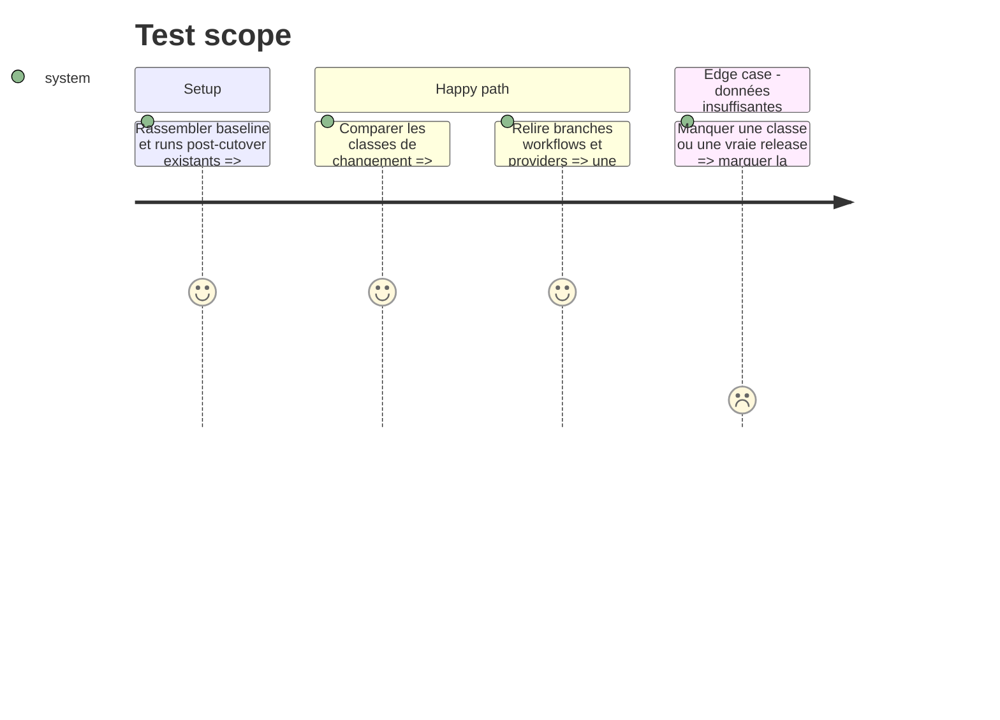

# Instruction: Mesurer et documenter le modèle final

## Architecture projection

> Tree of the final files. ✅ create · ✏️ modify · ❌ delete

```txt
.
├── CONTRIBUTING.md                                  ✏️ confirme le parcours opérateur observé
├── docs/
│   ├── CI.md                                        ✏️ publie les métriques finales
│   ├── DEPLOYMENT.md                                ✏️ documente reprise et incidents observés
│   └── POSTHOG_RELEASES.md                          ✏️ confirme la preuve iOS réellement utilisée
└── aidd_docs/memory/
    ├── deployment.md                                ✏️ enregistre le modèle final
    └── vcs.md                                       ✏️ conserve seulement main et production
```

Aucun fichier n’est créé ou supprimé. Cette phase ne change aucun workflow, provider, environnement ou branche et ne déclenche aucune production de test. Elle mesure le modèle final puis s’arrête : Vercel/Railway path-aware et le cache Turbo distant ne font pas partie de ce plan.

## User Journey



## Test Scope



## Tasks to do

### `1)` Vérifier l’état final

> Mesurer seulement après avoir confirmé que le cutover est terminé.

1. Vérifier que `main` est le trunk et le staging, que `production` est le seul pointeur production et que la branche Git `preview` n’existe plus.
2. Vérifier qu’aucun workflow, ruleset, provider, skill ou documentation active ne dépend de l’ancienne procédure.
3. Confirmer que les trois providers staging produisent encore un déploiement exact pour chaque merge `main`.

### `2)` Comparer les gains à la baseline

> Les événements réels suffisent; ne fabriquer ni release ni distribution pour compléter un tableau.

1. Mesurer runs, jobs, skipped, installations pnpm, démarrages Supabase, macOS minutes, durée et taux d’échec externe.
2. Séparer si disponibles GitHub-only, frontend-only, backend/DB, iOS-only, shared et release complète.
3. Comparer p50, p95 et coût d’un rerun à la baseline de 129 runs, 16 jobs et 36,9 runner-minutes par CI complète.
4. Marquer explicitement toute classe absente comme non mesurée.

### `3)` Figer la documentation et clore

1. Documenter uniquement le parcours réellement actif et les résultats observés.
2. Retirer toute instruction de transition, variante Hermes-only ou promesse de nettoyage ultérieur.
3. Clore le chantier sans ajouter de skip Vercel/Railway, de résolution par ancêtre ou de cache distant.

## Test acceptance criteria

| Task | Acceptance criteria                                                                                                                                 |
| ---- | --------------------------------------------------------------------------------------------------------------------------------------------------- |
| 1    | Le dépôt et les providers exposent uniquement `main` staging, `production` production et la procédure manuelle plan/apply.                          |
| 2    | Les gains sont comparés à la baseline avec des runs existants; aucune production ou distribution artificielle n’est créée pour compléter la mesure. |
| 3    | La documentation décrit le modèle final sans transition restante et le plan se termine sans optimisation provider spéculative.                      |
