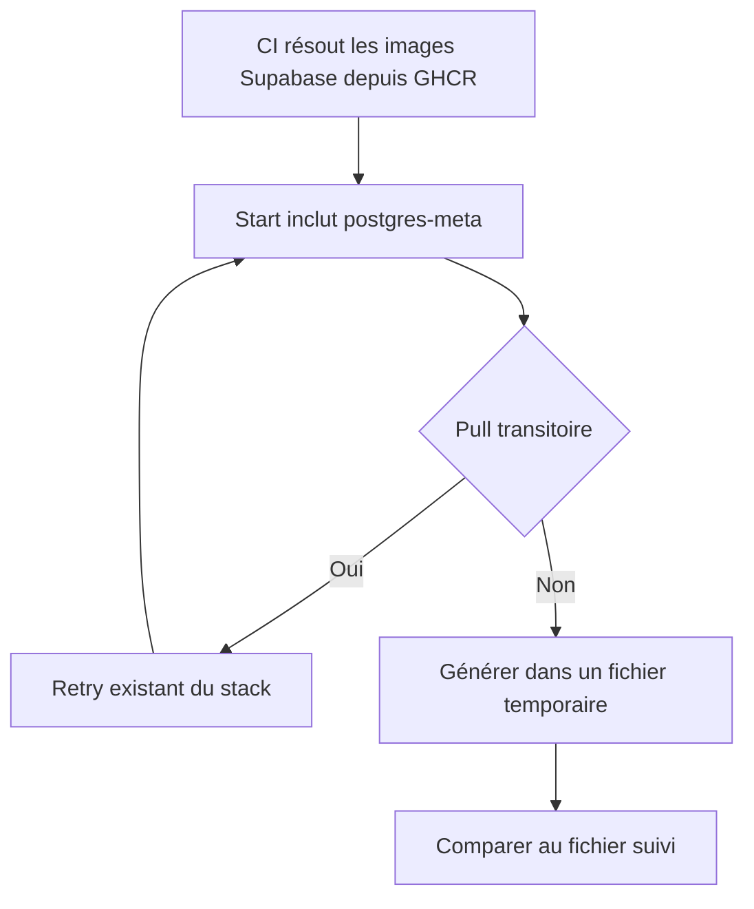
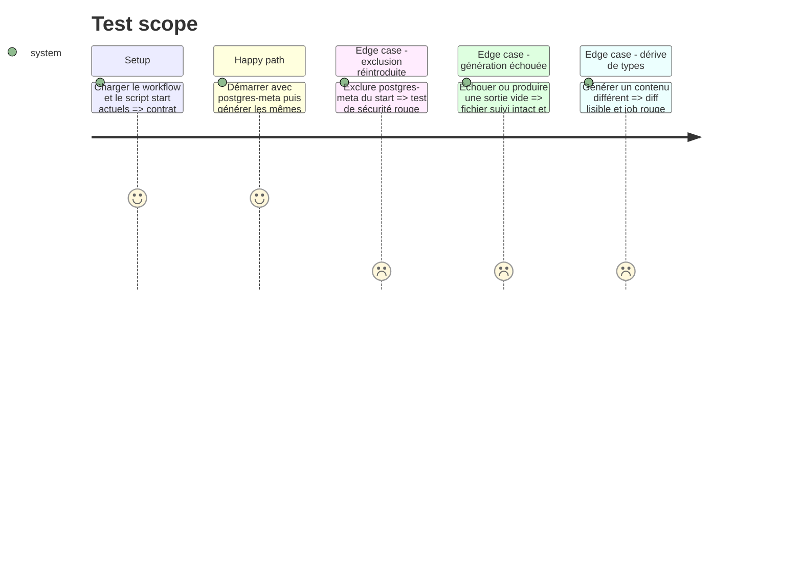

# Instruction: Sortir Public ECR du chemin critique Supabase

## Architecture projection

> Tree of the final files. ✅ create · ✏️ modify · ❌ delete

```txt
.
├── .github/
│   ├── actions/setup-supabase-cli/action.yml       ✏️ exporte le registre GHCR
│   ├── scripts/ci-security.test.mjs                ✏️ verrouille registre retry et génération sûre
│   └── workflows/ci.yml                            ✏️ compare les types sans réécrire le fichier suivi
└── docs/CI.md                                       ✏️ documente registre et frontière de retry
```

Aucun fichier n’est supprimé.

## User Journey



## Test Scope



## Tasks to do

### `1)` Utiliser le miroir GHCR

> Toute commande locale Supabase lancée après l’action composite évite Public ECR.

1. Exporter `SUPABASE_INTERNAL_IMAGE_REGISTRY=ghcr.io` pour la CLI épinglée 2.113.0.
2. Conserver l’archive et les checksums existants; ne pas ajouter de dépendance.
3. Faire échouer le test de sécurité si la variable disparaît ou revient à Public ECR.

### `2)` Conserver le retry déjà corrigé

> Le correctif #675 a déjà placé le pull `postgres-meta` dans la frontière de retry de `supabase start`.

1. Garder `postgres-meta` hors de `EXCLUDE` dans `start-supabase.sh`.
2. Conserver les trois tentatives et le nettoyage `supabase stop --no-backup` entre tentatives du stack.
3. Ne pas ajouter un second mécanisme de retry autour de `supabase gen types`; le service est déjà démarré et son image déjà résolue.
4. Étendre le test existant qui refuse l’exclusion de `postgres-meta` au lieu de créer un nouveau wrapper ou une nouvelle suite shell.

### `3)` Comparer les types sans les écraser

> Une redirection directe ne doit pas tronquer le fichier suivi avant que la commande ait réussi.

1. Générer vers un fichier de `RUNNER_TEMP`, refuser une sortie vide et nettoyer avec `trap`.
2. Comparer au fichier suivi et afficher un diff lisible en cas de dérive; ne jamais le remplacer dans le checkout CI.
3. Cesser d’inclure un fichier de types réécrit dans `supabase-state`; les jobs suivants utilisent le fichier versionné déjà vérifié.
4. Laisser toute erreur SQL, configuration ou TypeScript échouer immédiatement sans retry supplémentaire.

### `4)` Verrouiller et documenter

> Le contrat reste couvert par le test de sécurité existant.

1. Étendre `ci-security.test.mjs` pour exiger GHCR, `postgres-meta` dans le start, génération temporaire, contrôle non vide et comparaison.
2. Vérifier qu’une régression de chaque invariant rend `pnpm test:ci-security` rouge.
3. Mettre `docs/CI.md` à jour sans ajouter de dépendance ou de nouveau script racine.

## Test acceptance criteria

| Task | Acceptance criteria                                                                                                                  |
| ---- | ------------------------------------------------------------------------------------------------------------------------------------ |
| 1    | Toutes les images Supabase, dont `postgres-meta`, sont résolues depuis GHCR.                                                         |
| 2    | Le retry existant conserve `postgres-meta` dans sa frontière et aucun second retry de génération n’est ajouté.                       |
| 3    | Échec, sortie vide ou dérive ne tronquent jamais le fichier suivi; seuls les types versionnés et vérifiés passent aux jobs suivants. |
| 4    | Le test de sécurité existant couvre chaque invariant et `pnpm quality` reste son unique gate.                                        |
