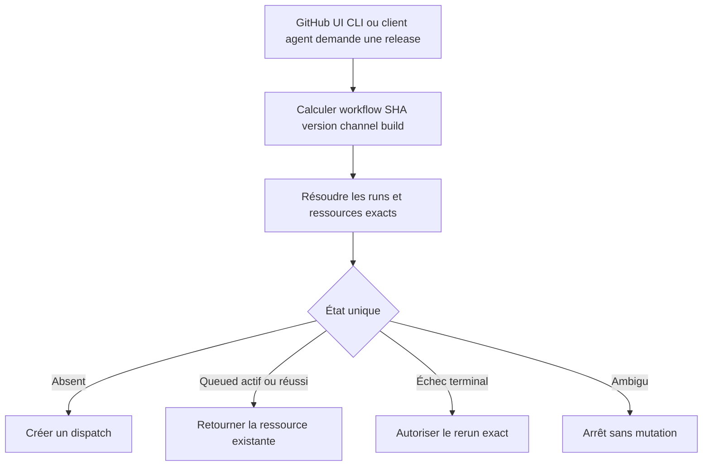
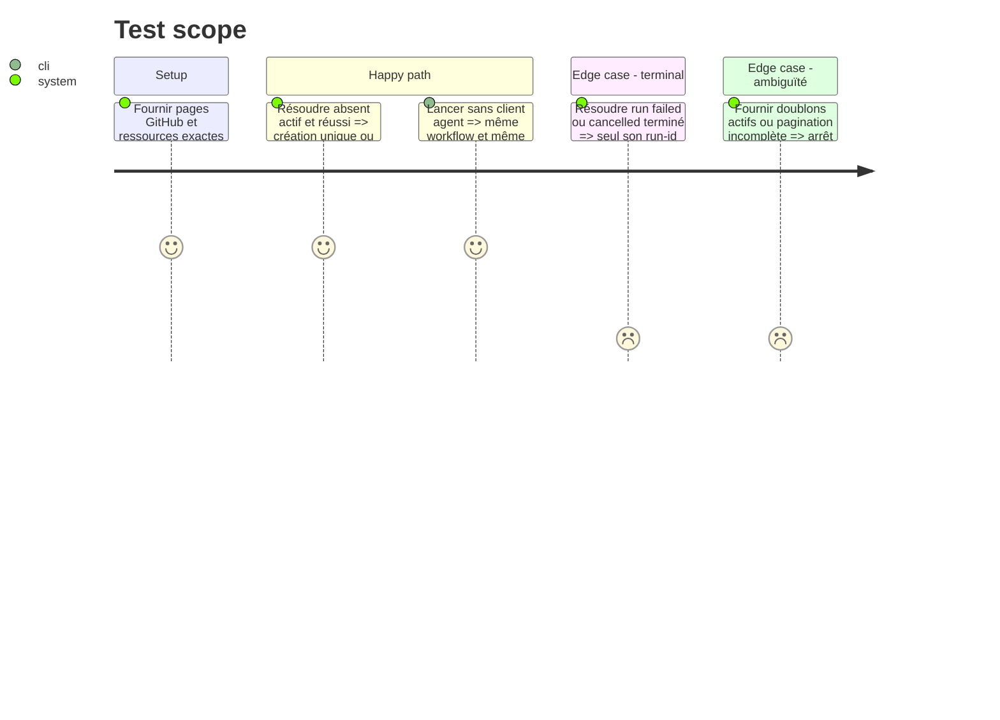

# Instruction: Rendre l’intention de release idempotente et indépendante du client

## Architecture projection

> Tree of the final files. ✅ create · ✏️ modify · ❌ delete

```txt
.
├── .claude/skills/release/
│   ├── SKILL.md                                      ✏️ devient un client des workflows GitHub
│   └── references/ios-release.md                    ✏️ applique la même identité à iOS
├── .github/
│   ├── scripts/
│   │   ├── resolve-release-state.mjs                ✅ valide identité et état distant
│   │   ├── resolve-release-state.test.mjs           ✅ couvre doublons reprise et ambiguïtés
│   │   └── ci-security.test.mjs                     ✏️ verrouille idempotence et absence d’état agent
│   └── workflows/
│       ├── ios-distribute.yml                       ✏️ expose SHA version channel build
│       └── release-promotion.yml                    ✏️ expose SHA version et intention
├── docs/DEPLOYMENT.md                                ✏️ définit sources de vérité et reprise
└── package.json                                      ✏️ ajoute le resolver au gate quality
```

Aucun fichier n’est supprimé.

## User Journey



## Test Scope



## Tasks to do

### `1)` Définir une identité de release visible

> Les listes GitHub exposent une clé stable sans interpréter les logs.

1. Valider repository, workflow, SHA complet, version, channel et build quand le canal iOS l’exige.
2. Définir les `run-name` avec ces champs selon le workflow.
3. Conserver une concurrence globale par mutation; l’identité déduplique l’intention.
4. Réutiliser cette identité dans le futur manifeste de candidat plutôt que créer un second format.

### `2)` Résoudre l’état avant dispatch

> Le resolver pur distingue absence, activité, succès et échec terminal.

1. Lister et paginer les runs `workflow_dispatch` puis filtrer l’identité déterministe.
2. Vérifier aussi PR, branche, tag annoté, GitHub Release et build iOS exacts lorsqu’ils existent.
3. Refuser doublon, pagination incomplète ou dérive et retourner URL/run-id sur un état unique.
4. Autoriser un nouveau dispatch uniquement en absence; exiger `--retry <run-id>` pour un échec terminal.

### `3)` Garder tous les clients stateless

> Aucune procédure ne dépend de la mémoire d’Hermes ou d’un autre agent.

1. Faire du bouton GitHub `workflow_dispatch` et de GitHub CLI les interfaces de référence.
2. Limiter les skills release à préparer les inputs, invoquer le workflow et afficher l’état dérivé.
3. Modifier seulement la source suivie `.claude/skills/release`; `.agents/skills/release` reste son symlink existant, sans copie à synchroniser.
4. Préserver le lockstep de version Android (`package.json`, `android/package.json`, `android/app.json`) et la reprise iOS par tag annoté exact introduits par #675 et #674.
5. N’écrire aucun état local durable, verrou agent, manifeste mutable ou mapping caché.
6. Vérifier qu’une release peut être préparée, reprise et auditée sans charger une skill.

### `4)` Prouver le no-op

> Deux invocations identiques créent une seule intention distante.

1. Tester états, pagination, doublons, SHA et identités invalides.
2. Invoquer deux fois la même préparation sur une branche témoin.
3. Vérifier qu’un nouveau SHA, version, channel ou build produit une nouvelle identité.

## Test acceptance criteria

| Task | Acceptance criteria                                                                                                                                  |
| ---- | ---------------------------------------------------------------------------------------------------------------------------------------------------- |
| 1    | Les workflows affichent une identité stable contenant tous les champs requis et réutilisable par le manifeste.                                       |
| 2    | Le resolver retourne un état unique et échoue sur ambiguïté, pagination incomplète ou dérive.                                                        |
| 3    | La procédure complète reste exécutable depuis GitHub sans Hermes, skill ou état local, sans régresser les contrats Android ou la reprise iOS taguée. |
| 4    | Deux invocations identiques produisent un seul run ou une seule ressource; changer la clé autorise une nouvelle intention.                           |
