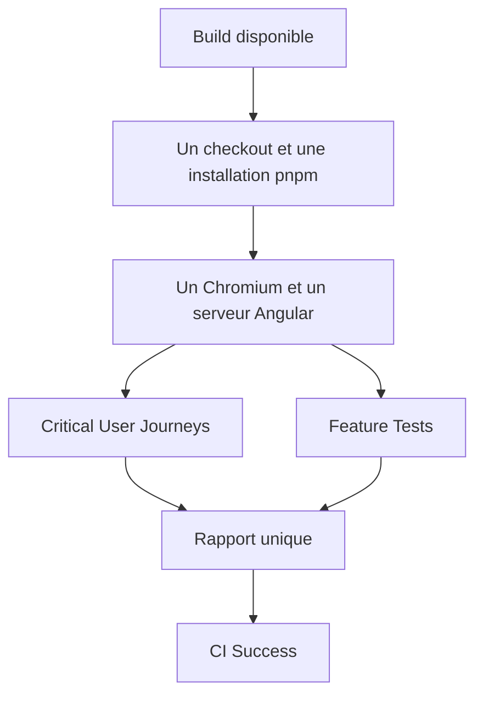
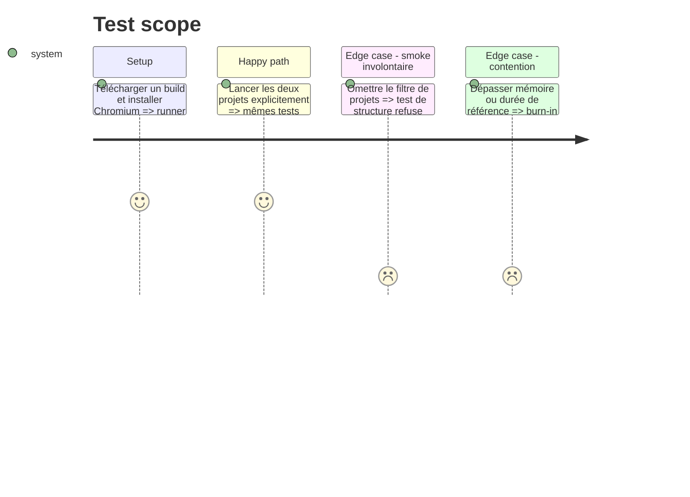

# Instruction: Consolider les E2E Playwright

## Architecture projection

> Tree of the final files. ✅ create · ✏️ modify · ❌ delete

```txt
.
├── .github/
│   ├── scripts/ci-security.test.mjs                ✏️ verrouille les deux projets et le job unique
│   └── workflows/ci.yml                            ✏️ remplace la matrice E2E par une invocation explicite
└── docs/CI.md                                       ✏️ documente le parallélisme et les artefacts
```

Aucun fichier n’est créé ou supprimé.

## User Journey



## Test Scope



## Tasks to do

### `1)` Remplacer la matrice par une invocation explicite

> Playwright parallélise les tests sans dupliquer le runner.

1. Supprimer la matrice GitHub E2E.
2. Sélectionner explicitement `Critical User Journeys (Mocked)` et `Feature Tests (Mocked)` dans une seule commande.
3. Garantir que `Chromium - Smoke` et tout futur projet ne s’ajoutent pas implicitement.

### `2)` Mutualiser l’environnement

> Checkout, installation, artefacts, Chromium et serveur ne sont exécutés qu’une fois.

1. Conserver le build téléchargé et une installation pnpm.
2. Installer Chromium une fois et laisser Playwright gérer un seul `webServer`.
3. Uploader un rapport unique avec JUnit, blob, traces, captures et vidéos, même en échec.

### `3)` Comparer avant de fusionner

> La consolidation est retenue seulement si elle ne dégrade pas la stabilité.

1. Exécuter les mêmes suites sur une PR témoin avec un succès et un échec volontaire.
2. Comparer temps mural, CPU/mémoire, retries, flakiness et qualité des artefacts à la matrice.
3. Conserver la matrice si la contention annule le gain d’installation; ne pas poursuivre pour atteindre un nombre de jobs arbitraire.

## Test acceptance criteria

| Task | Acceptance criteria                                                                                               |
| ---- | ----------------------------------------------------------------------------------------------------------------- |
| 1    | Une seule invocation exécute exactement les deux projets actuels et jamais `Chromium - Smoke`.                    |
| 2    | Le run ne réalise qu’un checkout, une installation pnpm, une installation Chromium et un serveur Angular.         |
| 3    | Le burn-in conserve ou améliore stabilité et durée utile; sinon la phase s’arrête sans sacrifier les diagnostics. |
