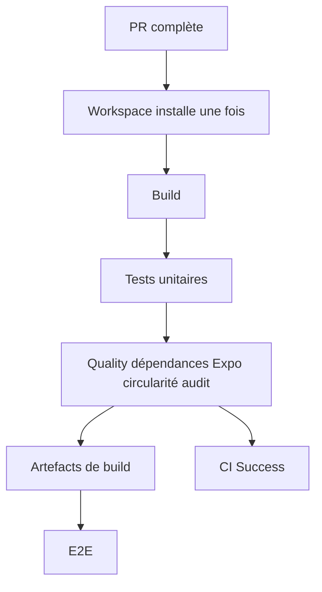
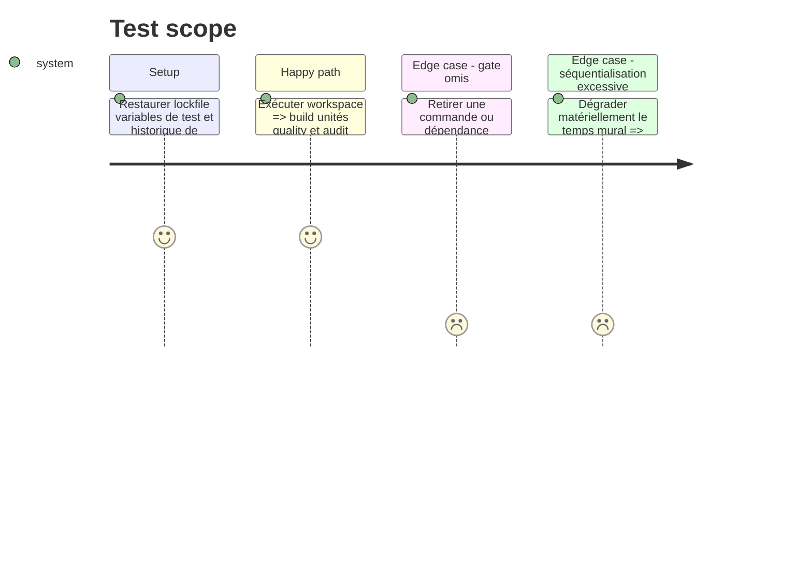

# Instruction: Consolider le workspace et retirer le préchauffage

## Architecture projection

> Tree of the final files. ✅ create · ✏️ modify · ❌ delete

```txt
.
├── .github/
│   ├── scripts/ci-security.test.mjs                ✏️ verrouille les commandes et l’agrégation
│   └── workflows/ci.yml                            ✏️ crée l’unité workspace et retire install
└── docs/CI.md                                       ✏️ documente le nouveau DAG
```

Aucun fichier n’est créé ou supprimé.

## User Journey



## Test Scope



## Tasks to do

### `1)` Créer une unité workspace lisible

> Build, unités et quality réutilisent le cache Turbo local d’un même runner.

1. Remplacer `build`, `test-unit` et la matrice `quality` par un job `workspace`.
2. Exécuter une seule fois `pnpm quality`, `pnpm deps:check` et `pnpm audit:critical`; `deps:check` conserve Expo compatibility ainsi que les graphes circulaires frontend et Android ajoutés par #675.
3. Ordonner les commandes pour réutiliser les outputs Turbo puis uploader une fois les artefacts nécessaires à E2E.
4. Garder actionlint et le contrat de migrations séparés s’ils fournissent un verdict rapide utile.

### `2)` Supprimer le job `install`

> Aucun job vert ne sert seulement à préchauffer un store que les consommateurs réinstallent.

1. Supprimer `install` et toutes ses dépendances `needs`.
2. Garder le cache pnpm dans chaque unité Node qui installe réellement.
3. Rendre chaque job autonome et refuser toute dépendance implicite à `node_modules`.

### `3)` Préserver l’agrégateur

> Le nom protégé reste stable malgré le nouveau DAG.

1. Faire dépendre `ci-success` des unités consolidées et des gates encore séparés.
2. Afficher chaque résultat dans le diagnostic d’échec.
3. Étendre `ci-security.test.mjs` pour refuser le retour du préchauffage et la disparition d’une commande.

### `4)` Mesurer le gain réel

> Le critère est le travail évité, pas un nombre exact de rectangles.

1. Comparer installations pnpm, runner-minutes, durée murale et lisibilité à la baseline de l’audit.
2. Vérifier un échec build, unité et quality.
3. Si le chemin critique se dégrade matériellement, scinder workspace en deux unités cohérentes sans restaurer les anciennes matrices.

## Test acceptance criteria

| Task | Acceptance criteria                                                                                                                                               |
| ---- | ----------------------------------------------------------------------------------------------------------------------------------------------------------------- |
| 1    | Les mêmes gates workspace, dont Expo et les circularités frontend/Android, passent après une installation et les artefacts E2E restent identiques.                |
| 2    | `install` n’existe plus et chaque consommateur déclare sa propre installation/cache.                                                                              |
| 3    | Tout gate manquant ou rouge rend `✅ CI Success` rouge sans changer le nom protégé.                                                                               |
| 4    | Le burn-in montre moins d’installations et de runner-minutes sans régression matérielle de durée ou de diagnostic; aucun objectif exact de six jobs n’est imposé. |
