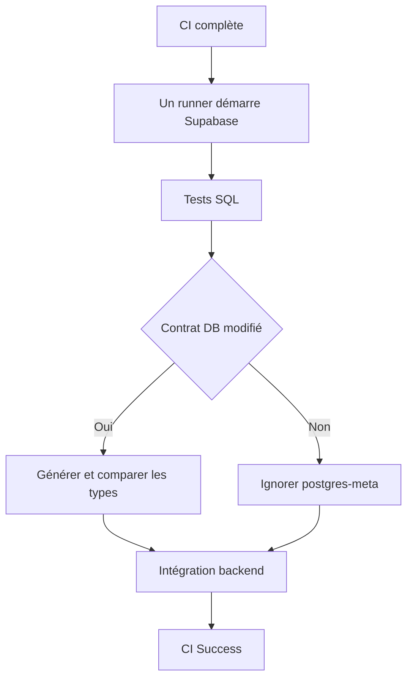
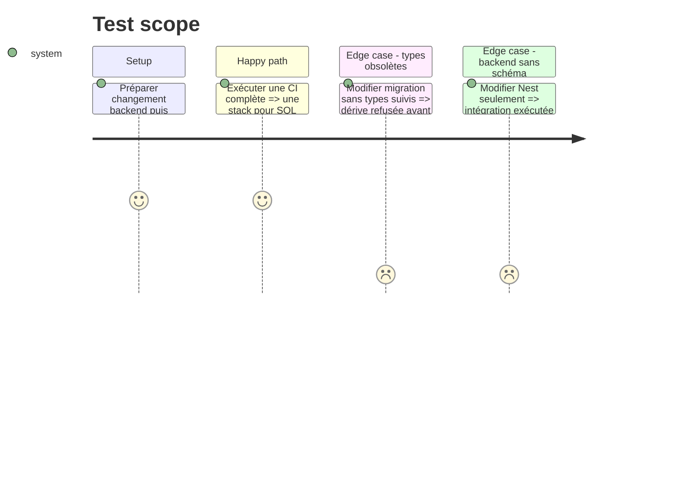

# Instruction: Réunir Supabase et l’intégration backend sur un runner

## Architecture projection

> Tree of the final files. ✅ create · ✏️ modify · ❌ delete

```txt
.
├── .github/
│   ├── scripts/ci-security.test.mjs                ✏️ verrouille le runner DB unique
│   └── workflows/ci.yml                            ✏️ fusionne SQL types et intégration backend
└── docs/CI.md                                       ✏️ documente le runner et le parallélisme
```

Aucun fichier n’est créé ou supprimé; les anciens jobs et `supabase-state` disparaissent de `ci.yml`.

## User Journey



## Test Scope



## Tasks to do

### `1)` Créer le job `backend-db` unique

> SQL et intégration partagent les mêmes conteneurs.

1. Remplacer `supabase-setup` et `test-backend-integration` par un runner qui installe puis démarre la stack réduite une fois.
2. Attendre REST et Auth, exécuter les suites SQL avec `ON_ERROR_STOP` puis les specs backend.
3. Nettoyer une fois et conserver diagnostics Docker en échec.
4. Supprimer upload/download `supabase-state` et la seconde installation CLI.

### `2)` Découpler workspace et types

> Le workspace compile le fichier suivi pendant que la DB prouve sa fidélité.

1. Garder `workspace` parallèle et sans artefact Supabase.
2. Appeler le wrapper de phase 2 seulement pour migrations, `supabase/config.toml` ou `database.types.ts`.
3. Ne jamais substituer le temporaire généré au fichier du commit.

### `3)` Vérifier coût et couverture

> La réduction de pulls ne doit ni dupliquer les gates workspace ni rallonger inutilement le chemin critique.

1. Exécuter un run full, un changement backend et un changement migration.
2. Confirmer un seul `supabase start` et aucun `postgres-meta` hors contrat DB.
3. Comparer runner-minutes et durée en gardant workspace parallèle.

## Test acceptance criteria

| Task | Acceptance criteria                                                                                                                       |
| ---- | ----------------------------------------------------------------------------------------------------------------------------------------- |
| 1    | Un run DB démarre exactement une stack puis exécute SQL et intégration sur ce runner.                                                     |
| 2    | Workspace n’attend aucun artefact Supabase; une migration avec types obsolètes échoue et un changement Nest ne lance pas `postgres-meta`. |
| 3    | Le run ne contient plus `supabase-state` ni second démarrage et conserve toutes les suites DB/backend.                                    |
