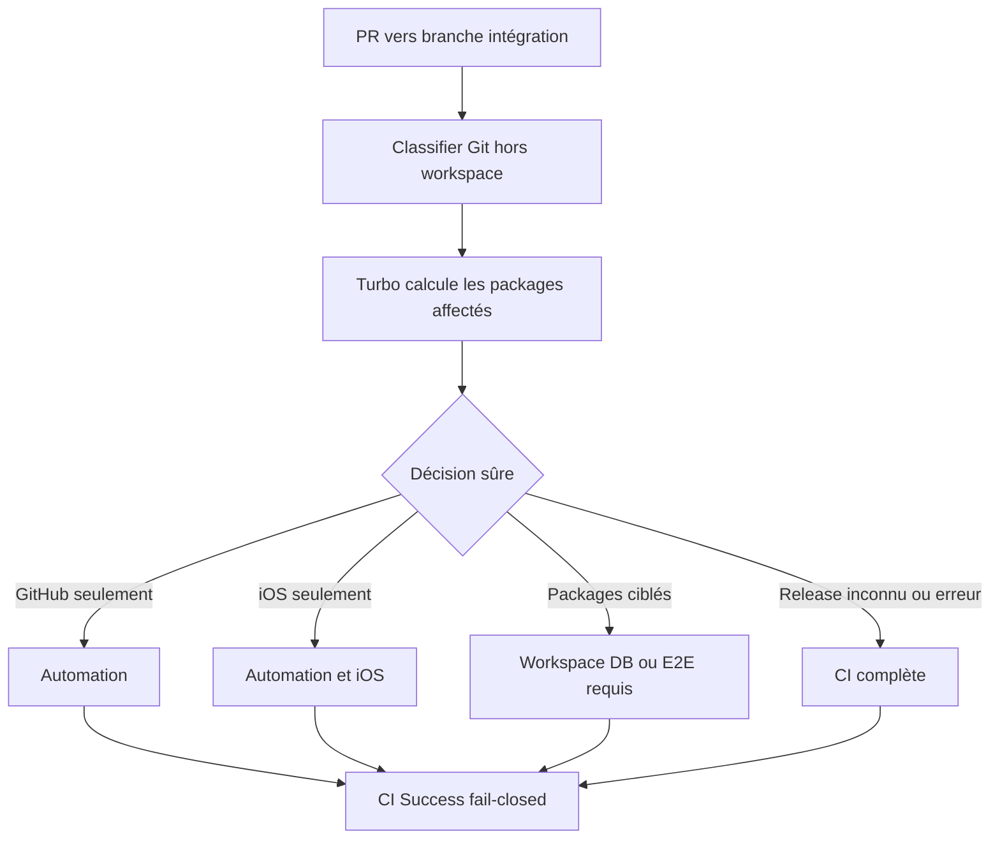
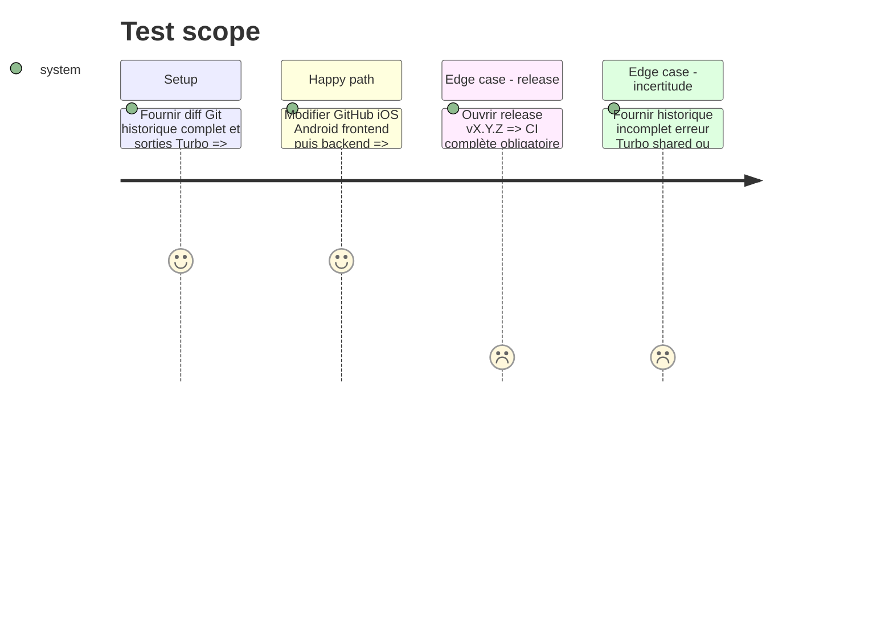

# Instruction: Router la CI avec Git et le graphe Turborepo

## Architecture projection

> Tree of the final files. ✅ create · ✏️ modify · ❌ delete

```txt
.
├── .github/
│   ├── scripts/
│   │   ├── classify-ci-changes.mjs                 ✅ classe hors workspace et normalise Turbo
│   │   ├── classify-ci-changes.test.mjs            ✅ couvre classes graphe et fallback
│   │   └── ci-security.test.mjs                    ✏️ verrouille classifier et agrégateur
│   └── workflows/ci.yml                            ✏️ route les unités stabilisées
├── docs/CI.md                                       ✏️ publie la table de routage
└── package.json                                     ✏️ ajoute le test au gate racine
```

Aucun fichier n’est supprimé.

## User Journey



## Test Scope



## Tasks to do

### `1)` Garder le classifier Git petit

> Il possède seulement les frontières que Turbo ne connaît pas.

1. Classer `.github`, iOS, migrations/config/types DB, release, contrats et racine sensible, dont `.changeset/config.json` et `android/app.json`.
2. Autoriser GitHub-only seulement hors `ci.yml`, classifier et test de sécurité.
3. Conserver iOS-only pour iOS dédié; toute modification `shared` ou formule miroir devient full.
4. Forcer full sur release, inconnu, mixte sensible, suppression ambiguë ou auto-modification.

### `2)` Déléguer le workspace à Turbo

> Le graphe pnpm existant reste l’unique source des dépendances packages.

1. Checkout l’historique requis et valider les SHA base/head.
2. Utiliser `turbo query affected` pour calculer les packages puis `turbo run --affected` dans workspace.
3. Normaliser vers automation, workspace, `backend-db`, E2E et iOS.
4. En cas de base absente, historique superficiel, erreur ou package inconnu, produire full avec la raison.

### `3)` Router sans filtrer le workflow required

> `✅ CI Success` existe pour chaque PR et juge les jobs attendus.

1. Ne pas ajouter de `paths` à `on.pull_request`.
2. GitHub-only exécute format automation, sécurité et actionlint; iOS-only ajoute iOS.
3. Frontend ajoute workspace et E2E; backend/DB ajoute workspace et `backend-db`; landing utilise workspace; Android ajoute workspace, tests, contrôle Expo et circularité Android.
4. Release, shared, racine sensible et full exécutent toutes les unités.
5. N’accepter `skipped` que si une sortie valide déclare le job non requis et inscrire la décision dans `ci-evidence`.

### `4)` Brûler le routage

> Les expressions GitHub et la base Turbo sont vérifiées sur de vrais runs.

1. Tester renommages, suppressions, mélanges, historique incomplet et auto-modification.
2. Observer GitHub-only, iOS-only, Android-only, frontend-only, backend-only et release.
3. Mesurer le coût du classifier et documenter les unités réellement évitées.

## Test acceptance criteria

| Task | Acceptance criteria                                                                                   |
| ---- | ----------------------------------------------------------------------------------------------------- |
| 1    | Le classifier Git ne duplique aucun graphe package et toute surface non prouvée devient full.         |
| 2    | Packages et dépendants viennent de Turbo; toute erreur de base/graphe devient full.                   |
| 3    | Une PR légère omet les unités prévues sans laisser le check required Pending; une release reste full. |
| 4    | Les six burn-ins suivent la table et `ci-evidence` explique chaque décision.                          |
