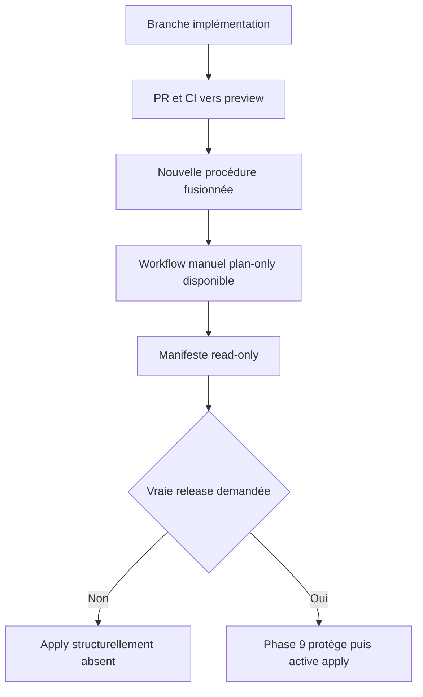
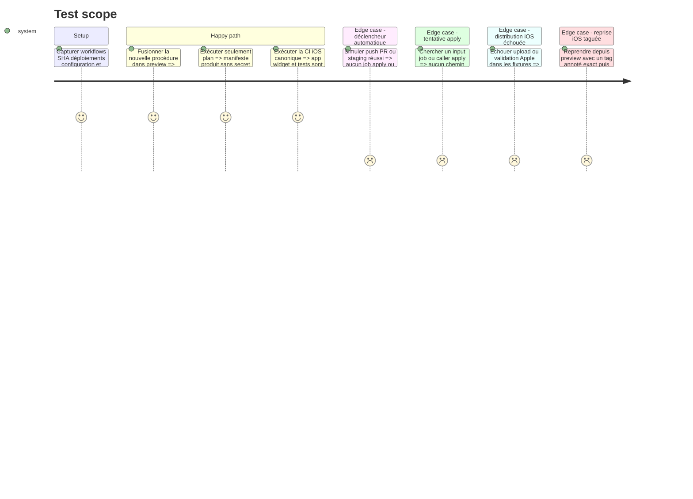

# Instruction: Préparer la nouvelle procédure en lecture seule

## Architecture projection

> Tree of the final files. ✅ create · ✏️ modify · ❌ delete

```txt
.
├── .claude/skills/release/
│   ├── SKILL.md                                      ✏️ utilise seulement la préparation read-only
│   └── references/jsts-release.md                   ✏️ décrit plan puis activation au cutover
├── .github/
│   ├── scripts/
│   │   ├── check-release-lineage.mjs                ✏️ calcule le plan sans mutation
│   │   ├── check-release-lineage.test.mjs           ✏️ couvre divergence et no-op
│   │   ├── resolve-workflow-proof.test.mjs          ✏️ retire les fixtures Release Gate historiques
│   │   └── ci-security.test.mjs                     ✏️ interdit ancien flux et accès production automatique
│   └── workflows/
│       ├── ci.yml                                   ✏️ couvre app widget et tests dans l’unique job iOS
│       ├── ios-distribute.yml                       ✏️ publie PostHog seulement après preuve Apple release
│       ├── ios.yml                                  ❌ retire le build macOS redondant
│       ├── release-promotion.yml                    ✏️ devient l’unique workflow manuel plan-only
│       ├── production.yml                           ✏️ devient réutilisable sans trigger ni caller actif
│       └── release-gate.yml                         ❌ disparaît dans le nouvel arbre
├── docs/
│   ├── CI.md                                        ✏️ documente l’unique entrée manuelle
│   ├── DEPLOYMENT.md                                ✏️ documente plan apply et rollback
│   └── POSTHOG_RELEASES.md                          ✏️ rattache iOS à la distribution valide
└── aidd_docs/memory/
    ├── deployment.md                                ✏️ retire l’ancienne procédure à deux PR
    └── vcs.md                                       ✏️ retire le Release Gate du modèle futur
```

Aucun fichier n’est créé; `release-gate.yml` et `ios.yml` sont supprimés dans le nouvel arbre. La fusion dans `preview` remplace l’ancienne automatisation par un plan read-only et peut exercer le staging existant, mais aucun input, job ou caller `apply` n’existe encore. Elle ne crée ni branche distante, ruleset, tag, release, distribution ou déploiement production et ne modifie aucun réglage GitHub, Vercel, Railway, Supabase, Apple ou PostHog. Les releases restent volontairement gelées jusqu’à la phase 9; le staging quotidien continue.

## User Journey



## Test Scope



## Tasks to do

### `1)` Remplacer l’ancien flux en une fois

> Après le merge, il n’existe qu’une procédure de release à comprendre.

1. Retirer le trigger `workflow_run` et les deux PR de `release-promotion.yml`; garder seulement `workflow_dispatch`.
2. Retirer `push: main` de `production.yml` et l’exposer uniquement en `workflow_call`, sans caller actif.
3. Supprimer `release-gate.yml` du nouvel arbre et toutes ses références dans scripts, tests, documentation et mémoire.
4. Conserver le gate de la branche de base `main` uniquement pour la première PR de cutover; son propre merge supprime le fichier, puis la phase 9 retire le check du ruleset.
5. N’ajouter aucun feature flag, mode legacy, branche de compatibilité ou tâche de nettoyage ultérieure.

### `2)` Exposer seulement le plan

> L’implémentation ne peut pas invoquer une mutation, même par erreur manuelle.

1. Garder un unique `workflow_dispatch` qui lance seulement `plan`, sans option `apply`.
2. Faire de `plan` un job sans environnement ni secret production, avec permissions en lecture.
3. Résoudre candidat staging, production live, lignée, migrations et IDs providers puis produire le manifeste et le rollback prévu.
4. Garder `production.yml` uniquement en `workflow_call`, sans caller actif depuis aucun workflow dispatchable ou automatique.
5. Faire échouer `ci-security.test.mjs` si un input, job ou caller `apply`, une référence à l’environnement `production` ou un secret production devient joignable depuis `release-promotion.yml`.
6. Documenter que la phase 9 installe d’abord la protection GitHub puis active apply dans sa PR de préparation; ne jamais utiliser de flag temporaire.

### `3)` Réutiliser les garde-fous existants

> Le cutover ne crée pas un second système de migration ou de preuve.

1. Réutiliser `check-migration-contract.cjs`, ses phases `expand/contract` et son replay avant `db push`.
2. Réutiliser les résolveurs de preuves, le manifeste staging et les identités idempotentes déjà introduits.
3. Si une migration ne satisfait pas le contrat existant, bloquer la release et la traiter séparément; ne pas ajouter d’exception ou de cleanup temporaire.
4. Réserver tout secret DB au futur job `apply` de phase 9; aucun job actif de cette phase ne le déclare ni ne le reçoit.

### `4)` Retirer le doublon iOS avant le cutover

> Un seul runner CI prouve le code; seul le distributeur prouve une version livrée.

1. Remplacer l’invocation actuelle par un unique `xcodebuild test -scheme PulpeLocal`; le scheme existant compile `Pulpe` et `PulpeWidget` puis exécute `PulpeTests`, sans second build.
2. Conserver le routage de phase 7 : `ios/**` exécute iOS et toute modification `shared` ou formule miroir déclenche la CI complète.
3. Déplacer la création de release et d’annotation PostHog dans `ios-distribute.yml`, après la preuve Apple valide et seulement pour `channel=release`; réutiliser l’identité version/build/SHA de la phase 3.
4. Préserver la reprise `channel=release` depuis `preview` introduite par #674, uniquement lorsqu’un tag annoté `vX.Y.Z` résout exactement vers le `source_sha`; refuser un lightweight tag ou toute divergence.
5. Faire échouer `ci-security.test.mjs` si la CI cesse d’utiliser `PulpeLocal`, si le classifier omet iOS pour `ios/**`, `shared`, les formules miroir ou une release, si la reprise taguée disparaît, ou si un second workflow de build iOS réapparaît.
6. Tester avec fixtures internal, release valide, reprise taguée, build Apple déjà valide et échec d’upload; aucun test ne contacte Apple ou PostHog.
7. Supprimer `ios.yml` après cette équivalence; le run réel `1.4.2` build `17` complète la preuve de faisabilité sans déclencher une nouvelle distribution.

### `5)` Prouver le zéro-effet avant release

> L’installation du nouveau bouton ne constitue pas une publication.

1. Tester les chemins avec fixtures provider et faux secrets.
2. Vérifier statiquement l’absence totale d’input, job ou caller `apply`, de `push: main` production et de référence au flux legacy.
3. Comparer avant et après les SHA et IDs de déploiement production, configurations, migrations, tags, releases et builds Apple.
4. Exiger zéro nouvel événement production et documenter que seule une vraie release manuelle peut poursuivre en phase 9.

## Test acceptance criteria

| Task | Acceptance criteria                                                                                                                                                              |
| ---- | -------------------------------------------------------------------------------------------------------------------------------------------------------------------------------- |
| 1    | Le nouvel arbre contient une seule entrée manuelle plan-only; l’ancien workflow automatique, le mode legacy et le nettoyage différé n’existent pas.                              |
| 2    | Aucun input, job ou caller `apply` n’est actif; `production.yml` est injoignable et aucun secret ou environnement production n’est référencé par l’entrée manuelle.              |
| 3    | Les contrats migration, preuve et idempotence existants sont réutilisés sans seconde abstraction ou exception de cutover.                                                        |
| 4    | Une invocation `PulpeLocal` compile app et widget puis teste Swift; `ios.yml` disparaît, la reprise par tag annoté exact reste couverte et PostHog suit une preuve Apple valide. |
| 5    | Fusion et tests laissent déploiements, DB, configurations, tags, releases et distributions production strictement inchangés.                                                     |
