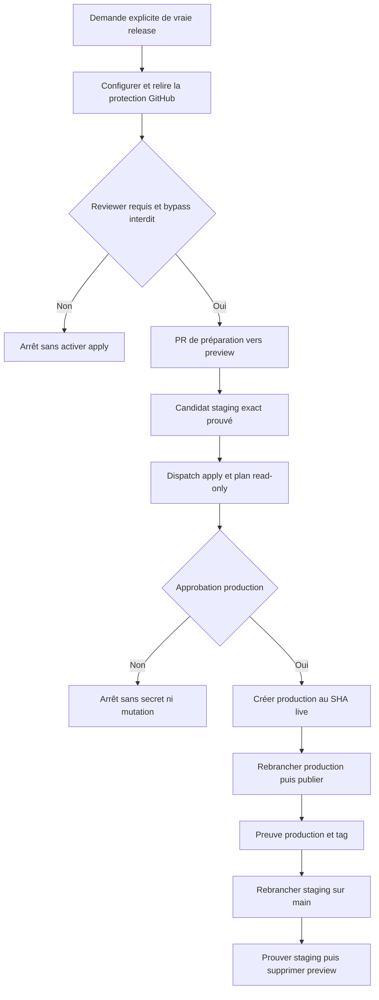
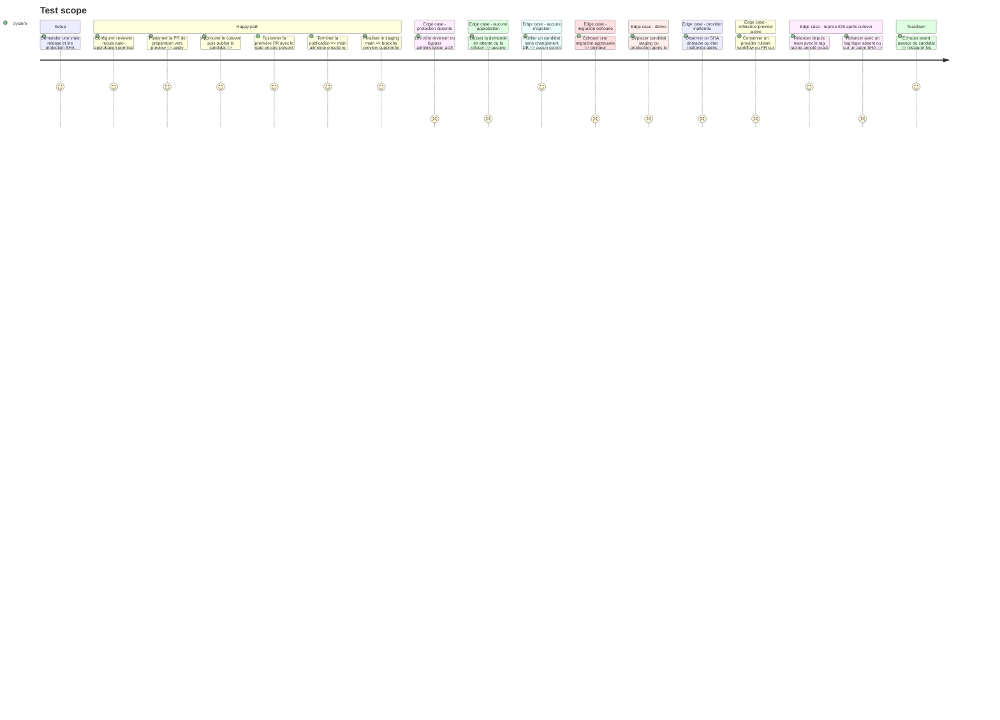

# Instruction: Exécuter la première vraie release et le cutover

## Architecture projection

> Tree of the final files. ✅ create · ✏️ modify · ❌ delete

```txt
.
├── .claude/skills/release/
│   ├── SKILL.md                                      ✏️ exécute la release native après approbation
│   └── references/jsts-release.md                   ✏️ décrit cutover reprise et finalisation
├── .github/
│   ├── scripts/
│   │   ├── ci-security.test.mjs                     ✏️ verrouille ordre et frontière release
│   │   ├── resolve-release-state.mjs                ✏️ résout le candidat et la reprise
│   │   ├── resolve-release-state.test.mjs           ✏️ couvre approbation dérive et idempotence
│   │   ├── resolve-ios-distribution-intent.mjs      ✏️ autorise internal depuis le nouveau trunk main
│   │   └── resolve-ios-distribution-intent.test.mjs ✏️ couvre les canaux après cutover
│   └── workflows/
│       ├── ci.yml                                   ✏️ cible les futures PR vers main
│       ├── staging-proof.yml                        ✏️ démarre ensuite une fois sur push main
│       ├── release-promotion.yml                    ✏️ active apply après protection puis coordonne le cutover
│       ├── production.yml                           ✏️ migre puis avance production pendant la release
│       ├── production-finalize.yml                  ✏️ exige les providers issus de production
│       ├── ios-distribute.yml                       ✏️ route internal sur main et release sur production
│       ├── android-e2e.yml                          ✏️ suit ensuite les PR vers main
│       └── claude-code-review.yml                   ✏️ suit ensuite les PR vers main
├── CONTRIBUTING.md                                  ✏️ documente le workflow après cutover
├── docs/
│   ├── CI.md                                        ✏️ documente le nouveau DAG actif
│   ├── DEPLOYMENT.md                                ✏️ documente release cutover et incidents
│   └── VERSIONING.md                                ✏️ rattache la version au candidat publié
└── aidd_docs/memory/
    ├── deployment.md                                ✏️ enregistre les nouveaux invariants actifs
    └── vcs.md                                       ✏️ fait de main le trunk après succès
```

Cette phase active puis utilise l’unique procédure préparée en phase 8. Elle ne commence qu’après une demande explicite de publication. Avant que le caller `apply` rejoigne `preview`, elle configure puis relit l’environnement GitHub `production` avec au moins un reviewer requis, l’auto-approbation compatible avec l’exploitation solo et le bypass administrateur désactivé. Une PR de préparation produit ensuite le candidat staging exact et active apply sans réactiver l’ancien workflow. Toute autre mutation, dont la branche distante `production`, son ruleset et les branchements providers, attend encore l’approbation de ce job.

## User Journey



## Test Scope



## Tasks to do

### `1)` Ouvrir explicitement la fenêtre de release

> La fin de la phase 8 n’autorise rien par elle-même.

1. Exiger une nouvelle invocation de release avec version, head `preview` et manifeste `plan` courant.
2. Geler temporairement les merges et capturer `preview`, `main`, production live, déploiements, configurations provider et head de migrations.
3. Configurer l’environnement GitHub `production` avec au moins un reviewer requis, `prevent_self_review: false` pour l’exploitation solo et `can_admins_bypass: false`.
4. Relire la configuration via API et arrêter avant toute activation si le reviewer manque, si l’auto-approbation est interdite ou si le bypass administrateur reste possible.
5. Créer la PR de préparation `release/vX.Y.Z` vers `preview` avec le commit de version, l’input `mode=apply`, le job protégé et l’unique appel à `production.yml`; exiger CI complète puis staging exact avant de figer le candidat.
6. Vérifier que le workflow fusionné ne rend apply joignable que par sélection explicite et que le job privilégié référence exactement l’environnement protégé.
7. Dispatcher apply sur le candidat prouvé, afficher toutes les mutations et leur rollback dans `plan`, puis attendre l’approbation GitHub Environment sans charger de token ou secret d’écriture.
8. Après approbation, recalculer le plan et refuser toute mutation si candidat, branches, migrations, providers ou production ont dérivé.

### `2)` Détacher la production avant de changer le rôle de `main`

> Toute configuration potentiellement déclenchante est déjà dans la vraie release approuvée.

1. Après approbation, créer `production` exactement sur le SHA servi en production et ajouter son ruleset bot-only sans force-push.
2. Rebrancher Railway production de `main` vers `production` et conserver `Wait for CI`.
3. Configurer la Production Branch des deux projets Vercel sur `production`.
4. Traiter tout redéploiement éventuel du SHA déjà live comme une opération production de la release et attendre son succès; arrêter avant le merge `main` si SHA, domaine ou santé diffèrent du plan.
5. Laisser Supabase `Deploy to production` désactivé et vérifier que domaines, contenu et santé restent sur le SHA capturé.

### `3)` Publier le candidat exact

> Une fois les providers détachés, la fusion dans `main` ne peut plus les publier directement.

1. Avancer avec `force=false` la branche éphémère `release/vX.Y.Z` sur le merge SHA prouvé de `preview`, puis ouvrir son unique PR de production vers `main` avec CI complète et comparaison de tree.
2. Laisser `✅ Release Gate`, encore présent dans la base `main`, prouver cette première PR une dernière fois.
3. Fusionner seulement si `preview`, le candidat, le manifeste et le gate n’ont pas bougé; ce merge installe la nouvelle procédure dans `main` et supprime `release-gate.yml`.
4. Retirer immédiatement `✅ Release Gate` des checks requis de `main`; les PR suivantes utilisent uniquement les checks du nouveau modèle.
5. Si les migrations ont changé, rejouer le contrôle expand/contract existant, puis exécuter dry-run et `db push` dans le job approuvé; sinon sauter tout le job sans lier la production Supabase.
6. Sur échec du contrat ou de la migration, arrêter sans avance de branche, tag ou rollback DB automatique; ne prévoir aucune exception de cutover.
7. Avancer `production` vers le merge SHA avec `force=false` et exiger que le candidat descende du SHA production courant.
8. Attendre Vercel frontend, Vercel landing et Railway production exacts, puis vérifier domaines, santé et éventuelle migration.
9. Créer le tag et la GitHub Release seulement après la preuve complète; rendre toute reprise idempotente.

### `4)` Activer `main` comme staging après la publication

> Le changement quotidien arrive après, jamais avant, la première production prouvée.

1. Rebrancher Railway preview de `preview` vers `main`.
2. Vérifier que Vercel traite `main` comme branche Preview stable maintenant que Production suit `production`.
3. Comparer le tree de `main` au candidat publié, l’historique des migrations distantes et l’absence de migration staging en attente.
4. Réassocier la branche Supabase persistante existante à Git `main` sans recréer son project ref ni ses données.
5. Changer la branche GitHub par défaut pour `main`, les bases de PR, Dependabot, rulesets et workflows requis.
6. Faire suivre le canal iOS `internal` par `main` et vérifier avec fixtures que le canal `release` reste lié au SHA publié.
7. Faire du canal iOS `release` le canal canonique de `production`; conserver depuis `main` une reprise uniquement pour un tag annoté exact afin qu’une correction de workflow postérieure puisse reprendre un build déjà publié sans déplacer `production`.
8. Adapter `resolve-ios-distribution-intent.mjs` et ses tests : `internal` accepte `main`; `release` accepte `production` ou la reprise taguée depuis `main`, et la provenance garde la branche d’automatisation réelle.
9. Déclencher et prouver les déploiements staging exacts frontend, landing et Railway du SHA `main`; vérifier que les IDs production restent ceux de la release.
10. Enregistrer le dernier SHA de `preview`, vérifier l’absence de provider, workflow, ruleset ou PR active qui en dépend, puis supprimer son ruleset et la branche distante exacte; si une référence subsiste, refuser la suppression et laisser la finalisation incomplète jusqu’à sa résolution.
11. Documenter la commande de recréation depuis le SHA enregistré; ne laisser aucun composant actif dépendre de cette possibilité de rollback.

### `5)` Vérifier le nouveau parcours sans agent

> GitHub et les providers restent les sources de vérité.

1. Fusionner une feature témoin vers `main` et vérifier ses seuls déploiements staging.
2. Prouver qu’aucun push `main` ordinaire ne déclenche Vercel, Railway, Supabase ou distribution production.
3. Vérifier reprise et audit depuis GitHub UI et CLI sans mémoire d’Hermes.

## Test acceptance criteria

| Task | Acceptance criteria                                                                                                                                                                                                             |
| ---- | ------------------------------------------------------------------------------------------------------------------------------------------------------------------------------------------------------------------------------- |
| 1    | Apply reste absent jusqu’à la vraie release; une protection avec reviewer requis et sans bypass est relue avant sa PR d’activation, puis toute dérive après approbation invalide le plan avant le premier write.                |
| 2    | `production` naît sur le SHA déjà live; un SHA, domaine ou état provider inattendu arrête le cutover avant le merge dans `main`.                                                                                                |
| 3    | La première PR utilise une dernière fois le gate de sa base, puis son merge le supprime; la release réutilise le contrat DB existant et publie un unique SHA prouvé.                                                            |
| 4    | `main` devient le staging après succès production; iOS internal/release suit main/production avec reprise taguée sûre, les trois déploiements exacts sont prouvés et toute référence active bloque la suppression de `preview`. |
| 5    | Une feature ordinaire fusionnée dans `main` atteint seulement le staging et le processus reste opérable sans agent.                                                                                                             |
