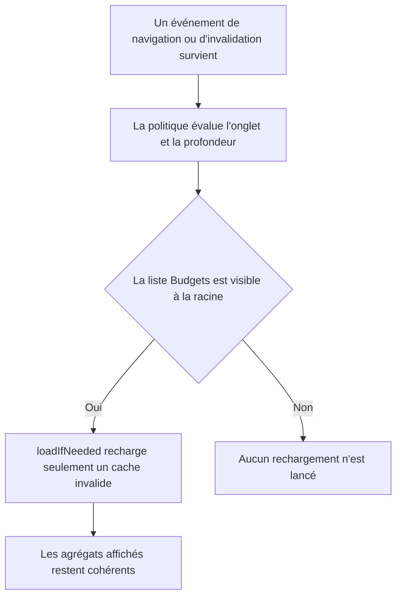
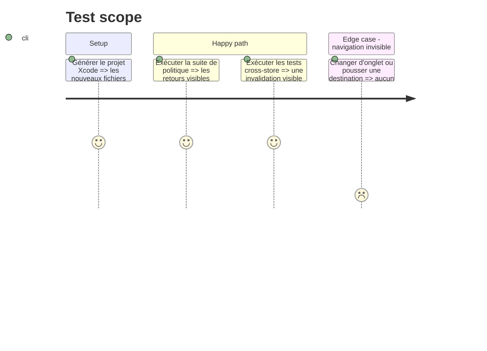

# Instruction: Extraire la politique et réaligner sa couverture

## Architecture projection

> Tree of the final files. ✅ create · ✏️ modify · ❌ delete

```txt
ios/
├── Pulpe/
│   └── Features/Budgets/BudgetList/
│       ├── BudgetListRefreshPolicy.swift               ✅ create
│       └── BudgetListView.swift                        ✏️ modify
└── PulpeTests/
    ├── Domain/Store/CrossStoreSyncTests.swift           ✏️ modify
    └── Features/Budgets/BudgetListRefreshPolicyTests.swift ✅ create
```

## User Journey



## Test Scope



## Tasks to do

### `1)` Relocaliser la politique dans la feature

> Séparer la règle de navigation de la vue sans la transformer en logique de domaine.

1. Créer `BudgetListRefreshPolicy.swift` dans `Features/Budgets/BudgetList/`.
2. Y déplacer l'enum et ses trois prédicats sans modifier leur signature ni leur logique.
3. Retirer uniquement cette définition de `BudgetListView.swift` et conserver les appels existants.
4. Ne rien ajouter dans `Domain/Store` et ne pas introduire de dépendance SwiftUI dans la politique.

### `2)` Réaligner le test unitaire

> Faire correspondre l'emplacement du test de politique à la couche de production qu'il couvre.

1. Créer `BudgetListRefreshPolicyTests.swift` sous `PulpeTests/Features/Budgets/`.
2. Déplacer le cas `navigationRefreshPolicy_onlyAcceptsVisibleReturnsToRoot` dans une suite dédiée.
3. Retirer ce cas de `BudgetListStoreCacheInvalidationTests` sans dupliquer ses assertions.
4. Conserver dans `CrossStoreSyncTests.swift` les usages de la politique qui pilotent les scénarios d'intégration.

### `3)` Vérifier le déplacement sans changement fonctionnel

> Prouver que XcodeGen, SwiftLint et les tests voient la nouvelle structure et le même comportement.

1. Régénérer le projet avec `xcodegen generate --use-cache`.
2. Exécuter `BudgetListRefreshPolicyTests` puis `BudgetListStoreCacheInvalidationTests` et confirmer respectivement 1 et 4 tests exécutés.
3. Exécuter SwiftLint sur les fichiers Swift touchés puis la commande qualité racine filtrée sur le diff.
4. Vérifier qu'une seule définition de `BudgetListRefreshPolicy` subsiste et qu'aucun fichier de `Domain/` ne référence `Tab`.

## Test acceptance criteria

| Task | Acceptance criteria |
| ---- | ------------------- |
| 1 | `BudgetListRefreshPolicy` n'est défini que dans le fichier dédié de la feature, les trois appels de la vue compilent sans changement et `BudgetListView.swift` repasse sous sa taille actuelle de 489 lignes. |
| 2 | La suite dédiée exécute les cas positifs et négatifs existants ; `CrossStoreSyncTests.swift` conserve seulement les usages nécessaires aux comportements cross-store, sans test unitaire dupliqué. |
| 3 | XcodeGen inclut les deux nouveaux fichiers, les suites ciblées exécutent exactement 1 puis 4 tests et passent, SwiftLint et la qualité filtrée ne signalent aucune erreur, et `Domain/` reste sans référence à `Tab`. |
