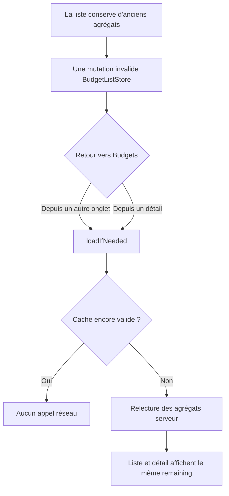
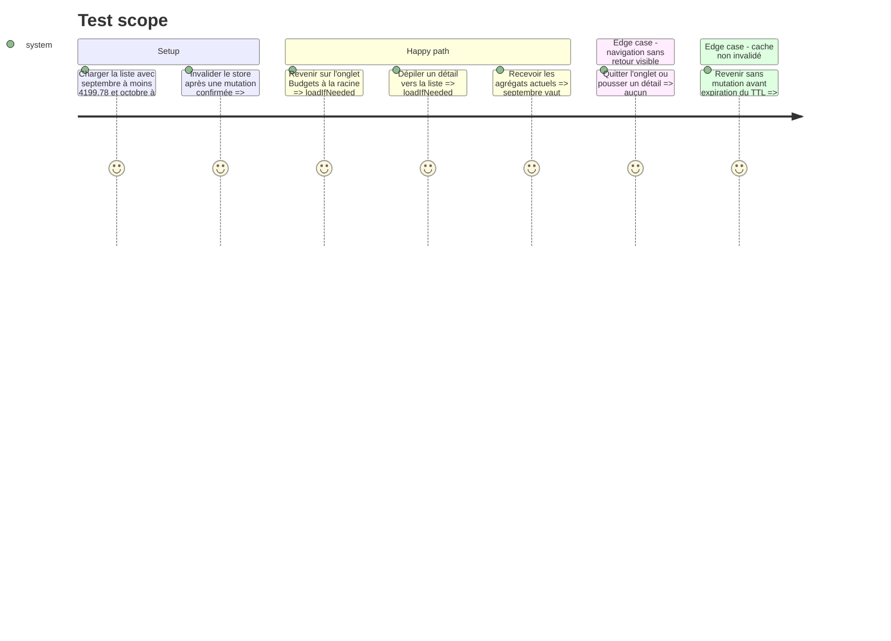

# Instruction: Relier les retours de navigation au cache invalidé

## Architecture projection

> Tree of the final files. ✅ create · ✏️ modify · ❌ delete

```txt
ios/
├── Pulpe/Features/Budgets/BudgetList/
│   └── BudgetListView.swift                    ✏️ recharger intelligemment au retour sur l'onglet ou à la racine de la pile
└── PulpeTests/Domain/Store/
    └── CrossStoreSyncTests.swift               ✏️ verrouiller les décisions de rafraîchissement et le refetch après invalidation
```

## User Journey



## Test Scope



## Tasks to do

### `1)` Verrouiller la politique de retour

> Reproduire l'hypothèse erronée du précédent correctif : invalider ne suffit pas si aucun événement visible ne rappelle `loadIfNeeded()`.

1. Couvrir le retour d'un autre onglet vers Budgets uniquement lorsque la pile Budgets est à sa racine.
2. Couvrir le dépilage d'un détail vers la racine, sans déclencher ce chemin lors d'un push ou d'une navigation plus profonde.
3. Réutiliser le test existant prouvant qu'un store invalidé refetch et qu'un TTL valide évite le réseau.

### `2)` Déclencher le rechargement intelligent

> Relier les deux événements de retour à `BudgetListStore.loadIfNeeded()` sans toucher aux formules ni ajouter de cache.

1. Observer les transitions de `appState.selectedTab` dans `BudgetListView` et charger au retour vers `.budgets` lorsque `budgetPath` est vide.
2. Observer `appState.budgetPath.count` et charger au dépilage vers zéro.
3. Conserver `invalidateCache()` comme signal de mutation et le TTL comme garde contre les fetchs inutiles.

### `3)` Valider le parcours et l'architecture

> Prouver le comportement ciblé puis vérifier que le changement respecte les règles SwiftUI/store du projet.

1. Générer le projet avec `xcodegen generate --use-cache`.
2. Exécuter les tests Swift ciblés avec un filtre dont le nombre de tests exécutés est vérifié, puis le target `PulpeTests` si le temps d'exécution le permet.
3. Vérifier qu'aucune formule, API ou dépendance inter-feature n'a changé et que le diff reste limité à la vue, au test et aux artefacts AIDD.

## Test acceptance criteria

| Task | Acceptance criteria |
| ---- | ------------------- |
| 1 | Les tests distinguent un vrai retour visible d'un départ d'onglet ou d'un push dans la pile. |
| 2 | Après invalidation, un retour vers la liste provoque un seul rechargement intelligent ; sans invalidation, le TTL évite le réseau. |
| 3 | Le test ciblé exécute réellement ses cas et la validation d'architecture ne relève aucune formule ou couche touchée hors périmètre. |
