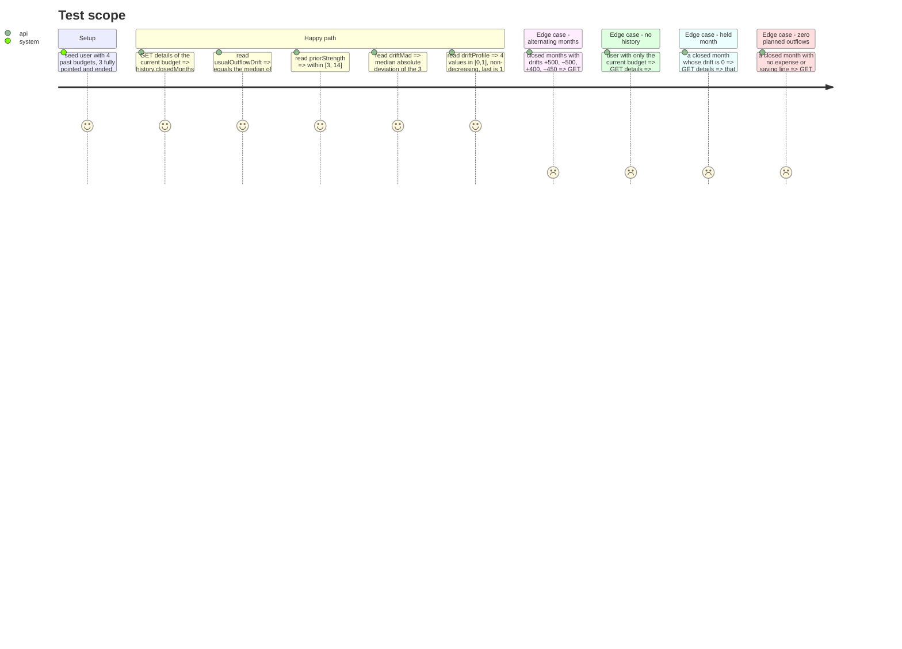

# Instruction: Backend drift history on the budget details response

## Architecture projection

```txt
.
├── shared/schemas.ts                                                        ✏️ `driftHistorySchema` {usualOutflowDrift, closedMonths, priorStrength, driftMad, driftProfile[4]}; optional `history` on budgetDetails response
├── backend-nest/src/modules/budget/domain/drift-history.ts                  ✅ pure: closed-month rule, per-month end drift + daily drift, sign-consistent median rate, K from variance ratio, MAD, profile (computed, unused by clients yet)
├── backend-nest/src/modules/budget/domain/drift-history.spec.ts             ✅ the formula, edge cases
├── backend-nest/src/modules/budget/domain/budget.repository.ts              ✏️ `fetchHistoryData(budgetIds)`: lines {kind, amount, checkedAt} + transactions {kind, amount, budgetLineId, transactionDate} decrypted
├── backend-nest/src/modules/budget/infrastructure/persistence/supabase-budget.repository.ts ✏️ implement it next to `fetchBudgetAggregates` (same decrypt helper)
├── backend-nest/src/modules/budget/application/find-budget-with-details.use-case.ts ✏️ pick the ≤12 budgets before this one, compute, attach `history`
├── backend-nest/src/modules/budget/infrastructure/mappers/budget.mapper.ts  ✏️ pass `history` through
└── backend-nest/src/modules/budget/application/find-budget-with-details.use-case.spec.ts ✅ attaches history; none when no closed month
```

## User Journey

```mermaid
flowchart TD
  A[iOS opens the home] --> B[GET /budgets/:id/details]
  B --> C{closed months before this one?}
  C -->|none| D[response.history = null]
  C -->|1..12| E[response.history = {usualOutflowDrift, closedMonths, priorStrength, driftMad, driftProfile}]
```

## Test Scope



## Tasks to do

### `1)` Formula

> One pure module, testable without Supabase.

1. `isClosedMonth(budget, lines, payDay, now)`: `getBudgetPeriodDates(month, year, payDay).end < now` AND every line has `checkedAt`.
2. `monthDrift(lines, transactions, period)`: for t in {25, 50, 75, 100 %} of the period, `remaining(calculateAllMetrics(lines, transactions with transactionDate ≤ t)) − plannedRemaining`; rate = `drift100 / plannedOutflows` (expense + saving lines); profile share_t = `drift_t / drift100` clamped to [0,1], `null` when drift100 is 0.
3. `driftHistory(months)`: take the ≤12 most recent closed months; `usualOutflowDrift` = median of rates, set to 0 when sign consistency `|Σ sign(drift_m)|/n < 0.5`; `driftMad` = median |drift_m − median|; `priorStrength` K = clamp(σ²_within / σ²_between, 3, 14) where σ²_within = pooled variance of daily drift increments over the closed months and σ²_between = max(Var(end drift/T) − σ²_within/T, 0.1·σ²_within/T) (Efron-Morris moment estimate); `driftProfile` = element-wise median of non-null profiles, forced non-decreasing, last = 1; `closedMonths` = n. Return `null` when n = 0.
4. Spec the three with hand-computed numbers; include the 3 edge cases above.

### `2)` Data

> Reuse the aggregates query, add the two date columns.

1. `fetchHistoryData(budgetIds)` in the repository port and Supabase impl: same two selects as `fetchBudgetAggregates` plus `checked_at` and `transaction_date`, same `decrypt`.
2. Return plain decrypted objects grouped by budget id.

### `3)` Wire

> Attach to the details response, behind the existing cache.

1. In `find-budget-with-details`: fetch the user's budgets, keep those strictly before the requested period (`compareBudgetPeriods`), most recent 12; call `fetchHistoryData`; compute; attach `history`.
2. `shared/schemas.ts`: `driftHistorySchema` + `history: driftHistorySchema.nullable()` on `budgetDetailsResponseSchema`; `pnpm build:shared`.
3. Mapper passes it through; use-case spec covers with/without history.

## Test acceptance criteria

| Task | Acceptance criteria                                                                                                   |
| ---- | --------------------------------------------------------------------------------------------------------------------- |
| 1    | `drift-history.spec.ts` green: rate, sign consistency, MAD, K bounds and moment estimate, profile, held month, zero outflows, unpointed month excluded.     |
| 2    | Repository returns decrypted amounts with `checkedAt` and `transactionDate`; no extra round-trip beyond the two selects. |
| 3    | `GET /budgets/:id/details` carries `history` (null or 5 fields); p95 latency on the demo account, cold cache, within +100 ms of before (measured, number pasted); `bun test` and `pnpm quality` green; iOS decoder untouched still decodes (field optional). |
