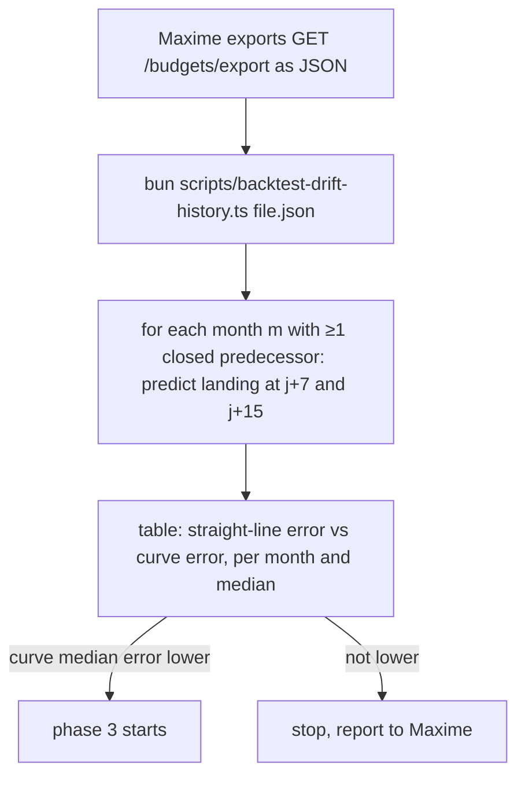
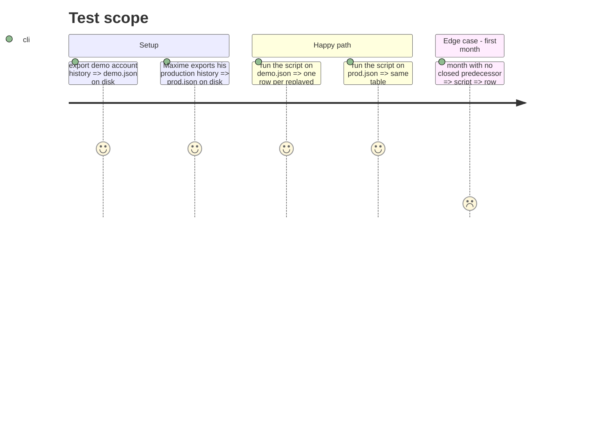

# Instruction: Backtest gate: curve vs straight line on real history

## Outcome (2026-08-22)

Gate passed on Maxime's export (payday 27, 7 closed months, 6 replayed, rolling origin). Median abs error CHF: straight 725 → prior 554 at j+7, 274 → 262 at j+15; tune/held-out split (02-04 / 05-07): straight 623 → prior 214 at j+7, 234 → 158 at j+15. Per-envelope model rejected (627 held-out). 'When' profile promising but unproven (94/114 held-out on 3 months) → phase 4. Scripts kept in `backend-nest/scripts/backtest-drift-history.ts` for replay; the export file stays out of git.

## Architecture projection

```txt
.
└── backend-nest/scripts/backtest-drift-history.ts   ✅ reads a `GET /budgets/export` JSON, replays every month m from its ≤12 predecessors, prints the error table
```

## User Journey



## Test Scope



## Tasks to do

### `1)` Script

> Pure replay of phase 1's formula; no DB, no server.

1. Parse the export (`budgetExportResponseSchema`), read `payDayOfMonth` from the export or a `--pay-day` flag.
2. For each month m in order: history = `driftHistory(closed predecessors of m)`; at j = 7 and 15 days into m's period, straight = today's `trendBalance` math (pace × weight, zero prior) on transactions dated ≤ j; curve = the phase 3 blend (profile × usualOutflowDrift × plannedOutflows, weights `j/(j+7)` and `n/(n+2)`); real = m's final landing.
3. Print `|month|n|straight j+7|curve j+7|straight j+15|curve j+15|` in CHF plus the median absolute error of each column.

### `2)` Run and decide

> The gate.

1. Run on the demo export (`demo@pulpe.test`, local).
2. Run on Maxime's production export (he runs the export himself; the file stays out of git).
3. Decision rule: curve median absolute error < straight median absolute error at both horizons on Maxime's data. Otherwise set the plan `blocked` with the table and stop.

## Test acceptance criteria

| Task | Acceptance criteria                                                                                           |
| ---- | ------------------------------------------------------------------------------------------------------------- |
| 1    | Script runs on a synthetic 3-month fixture and reproduces the hand-computed errors; months without history are skipped and counted. |
| 2    | The two tables are pasted in the response; phase 3 starts only if the decision rule holds, otherwise plan is `blocked` with the tables. |
