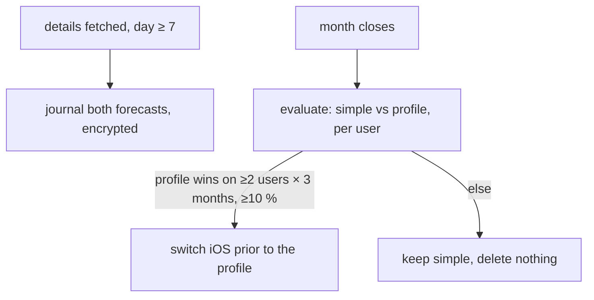
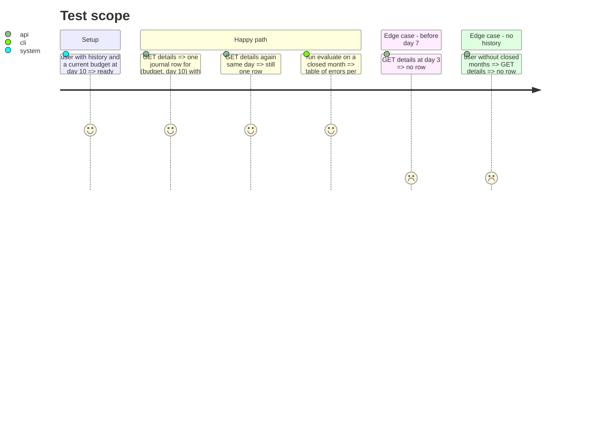

# Instruction: Forecast journal and the 'when' profile, conditional

## Architecture projection

```txt
.
├── backend-nest/supabase/migrations/<ts>_forecast_journal.sql            ✅ `forecast_journal(user_id, budget_id, day, estimate, trend_simple, trend_profile, created_at)`; amounts encrypted like every other amount column; RLS owner-only
├── backend-nest/src/modules/budget/application/record-forecast.use-case.ts ✅ on each details fetch past day 7, upsert one row per (budget, day) with both candidate forecasts
├── backend-nest/scripts/evaluate-forecast-journal.ts                    ✅ once a month closes: error of each candidate vs real landing; paired sign test across users
└── ios/Pulpe/Domain/Formulas/BalanceTrajectory.swift                    ✏️ ONLY if the journal says so: prior's remaining drift follows `driftProfile` instead of `remaining/totalDays`
```

## User Journey



## Test Scope



## Tasks to do

### `1)` Journal

> Minimum to decide later; nothing shown to users.

1. Migration + types (`bun run generate-types:local`, then `bun run format`), amounts through `ENCRYPTION_PORT`.
2. Use-case called from `find-budget-with-details` after the cache, day ≥ 7, history present; idempotent per (budget, day).

### `2)` Evaluate and decide

> The second gate, across users.

1. Script computes, per closed month and user, |forecast − real| for both candidates at j+7/+15/+22 and a paired sign test.
2. Switch rule: profile wins on ≥ 2 users × 3 months with ≥ 10 % lower median error. Else this phase ends here, journal stays for the next question.

### `3)` Switch (conditional)

> One line in `trendBalance`.

1. `priorTerm` uses `1 − profile(today/totalDays)` instead of `remaining/totalDays`; tests updated; screenshots.

## Test acceptance criteria

| Task | Acceptance criteria                                                                                   |
| ---- | ----------------------------------------------------------------------------------------------------- |
| 1    | One encrypted row per (budget, day ≥ 7) when history exists; none otherwise; RLS blocks other users.  |
| 2    | Evaluation table printed with the sign test; decision recorded in this file's status.                 |
| 3    | Only if switched: trend tests green with the profile; no-history numbers unchanged.                   |
