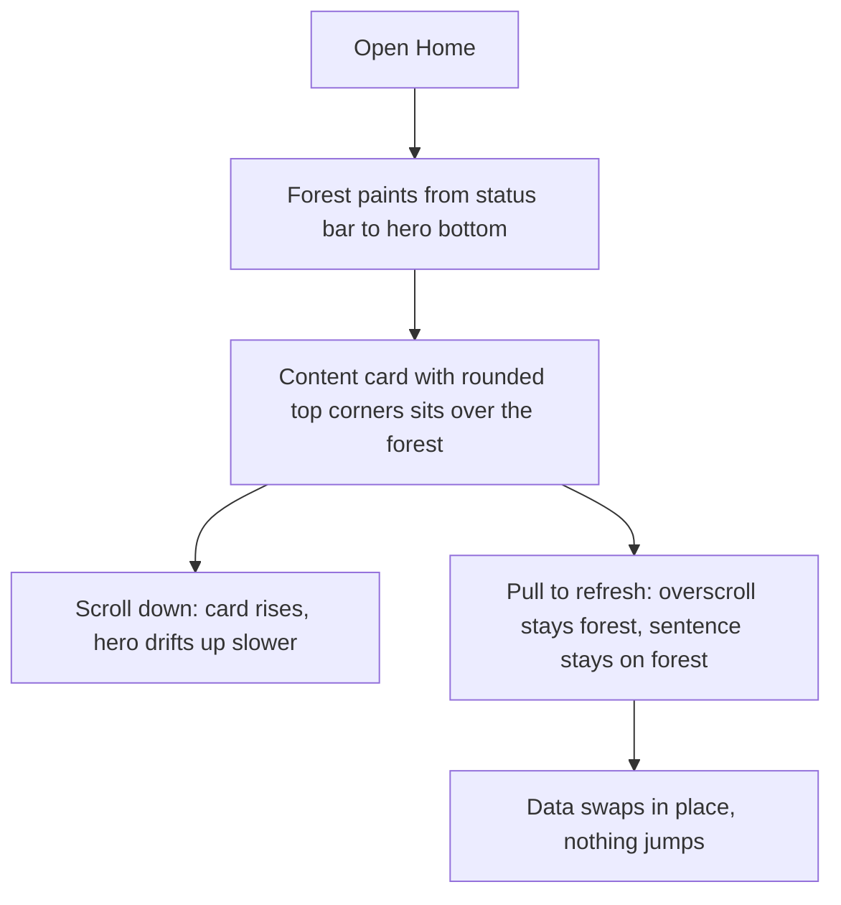
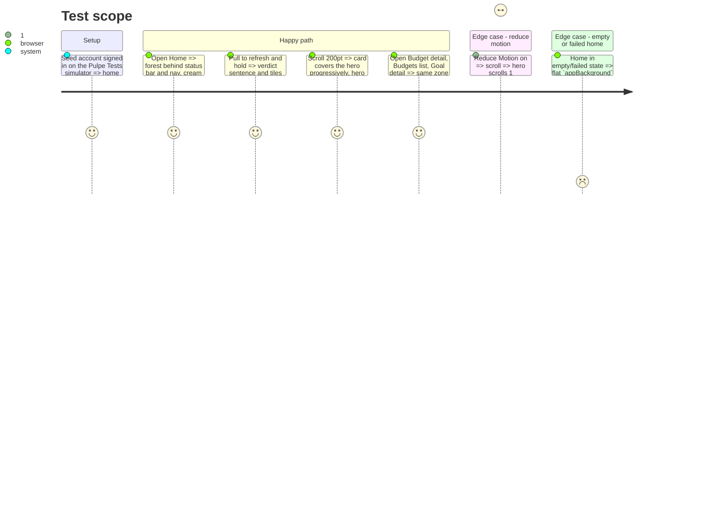

# Instruction: Hero zone lives in the scroll — overlapping content card, parallax, refresh-proof

## Architecture projection

> Tree of the final files. ✅ create · ✏️ modify · ❌ delete

```txt
ios/Pulpe
├── Shared/Components/HeroZone
│   ├── HeroZoneSurface.swift                      ✏️ becomes `View.heroZone()` / `View.contentZone()` modifiers: forest gradient as the hero's own background extended above the viewport, content card with `CornerRadius.zone` top corners + `Shadow.zoneBoundary`, optional parallax
│   └── HeroZoneTracker.swift                      ❌ no geometry loop left
├── Features/CurrentMonth
│   ├── CurrentMonthView.swift                     ✏️ drop tracker/`dashboardBackground`; hero `.heroZone(parallax: true)`, `dashboardDetails` `.contentZone()`
│   └── Components/CurrentMonthSkeletonView.swift  ✏️ same two modifiers, drop `onHeroSurfaceBottomChange`
├── Features/Budgets
│   ├── BudgetDetails/BudgetDetailsView.swift      ✏️ drop `heroSurfaceTracker` + second `onGeometryChange`; hero `.heroZone()`, ledger `.contentZone()`
│   ├── BudgetList/BudgetListView.swift            ✏️ same
│   └── BudgetList/BudgetListView+YearComponents.swift ✏️ remove tracker references if any
├── Features/SavingsGoals/SavingsGoalDetailView.swift ✏️ same; hero padding so the forest starts under the nav bar, not `lg` below it
└── DESIGN.md                                      ✏️ Two-Zone Rule: the curve belongs to the content card; parallax rule (home only)
ios/PulpeTests/Shared/Design/HeroContrastTests.swift ✏️ unchanged pairs; keep green
```

## User Journey



## Test Scope



## Wireframe

```txt
┌──────────────────────────────────┐
│ (1) status bar + nav on forest    │
│                                   │
│ (2) hero content (figure, tiles,  │
│     chart, sentence)              │
│╭─────────────────────────────────╮│
││ (3) content card, rounded top,  ││  ← overlaps (2) by CornerRadius.zone
││     rises over (2) on scroll    ││
││  …sections…                     ││
│╰─────────────────────────────────╯│
└──────────────────────────────────┘
```

1. Forest gradient is the hero's background, extended 1000pt upward so overscroll and the status bar are always forest.
2. Hero content; on the home screen only, offset by a fraction of the scroll so the card appears to cover it.
3. Content zone: `appBackground` card, top corners `CornerRadius.zone`, `Shadow.zoneBoundary`, negative top padding equal to the radius so it overlaps the forest.

## Tasks to do

### `1)` Replace the fixed surface with scroll-native modifiers

> One file owns the zone anatomy; every screen calls two modifiers.

1. In `HeroZoneSurface.swift` add `extension View { func heroZone(parallax: Bool = false) -> some View; func contentZone() -> some View }`.
2. `heroZone`: `.background { LinearGradient(heroSurfaceTop → heroSurface).padding(.top, -DesignTokens.Layout.overscrollBleed) }` (new token, 1000pt, comment why); `.padding(.bottom, CornerRadius.zone)` so the card can overlap; when `parallax` and not reduce-motion, `.visualEffect { content, proxy in content.offset(y: max(0, -proxy.frame(in: .scrollView).minY) * DesignTokens.Motion.heroParallax) }` with a 0.35 factor token. Never offset upward past the card.
3. `contentZone`: `.frame(maxWidth: .infinity).background(Color.appBackground).clipShape(.rect(topLeadingRadius: zone, topTrailingRadius: zone)).shadow(Shadow.zoneBoundary).padding(.top, -CornerRadius.zone)` plus `.frame(minHeight:)` so a short ledger still paints cream to the bottom (use `containerRelativeFrame` or a trailing `Color.appBackground` spacer, whichever is smaller).
4. The screen's own background stays `Color.appBackground.ignoresSafeArea()`; `.toolbarBackground(.hidden)` + `.toolbarColorScheme(.dark)` rules unchanged.
5. Delete `HeroZoneTracker.swift`; `xcodegen generate --use-cache`.

### `2)` Migrate the four screens and the home skeleton

> No screen keeps a geometry observer for the surface.

1. `CurrentMonthView`: remove `heroSurfaceTracker`, `dashboardBackground`, the `onGeometryChange` on the hero; hero block `.heroZone(parallax: true)`; `dashboardDetails` `.contentZone()`; `paintsHeroSurface` false → no `heroZone`, flat canvas.
2. `CurrentMonthSkeletonView`: same two modifiers, delete `onHeroSurfaceBottomChange`.
3. `BudgetDetailsView`: keep the `scrollTracker` observer (pager, phase 3), remove the surface one; hero `.heroZone()`, the ledger stack `.contentZone()`.
4. `BudgetListView`, `SavingsGoalDetailView`: same; move `SavingsGoalDetailView`'s `.padding(.vertical, lg)` inside the hero so the forest starts at the nav bar.
5. `ios/DESIGN.md` Two-Zone Rule + Hero Depth Rule: the curve is the content card's top; parallax home-only, factor token, off under Reduce Motion.

### `3)` Verify on simulator and lint

> The refresh bug is gone on every hero screen.

1. Build `-configuration Local`, run on "Pulpe Tests", screenshot home at rest, mid-refresh, scrolled 200pt; budget detail, budgets list, goal detail at rest.
2. `swiftlint --strict --quiet`; run `PulpeTests/HeroContrastTests` and the UI suites `BudgetListAccessibilityTests`, `SavingsGoalIntervalUITests`.

## Test acceptance criteria

| Task | Acceptance criteria              |
| ---- | -------------------------------- |
| 1 | `HeroZoneTracker` no longer exists; `grep -r "HeroZoneTracker\|onGeometryChange.*maxY" ios/Pulpe` is empty. |
| 1 | With Reduce Motion on, `heroZone(parallax: true)` applies no offset. |
| 2 | Mid pull-to-refresh on Home, the verdict sentence and the overscroll region are on forest (screenshot). |
| 2 | On Home, after scrolling 200pt the content card's top edge is above the hero's chart bottom (card covers the hero). |
| 2 | Budget detail, budgets list, goal detail show no cream band between the nav bar and the forest. |
| 3 | Build succeeds, swiftlint strict clean (pre-existing 4 violations excepted), named tests green. |
