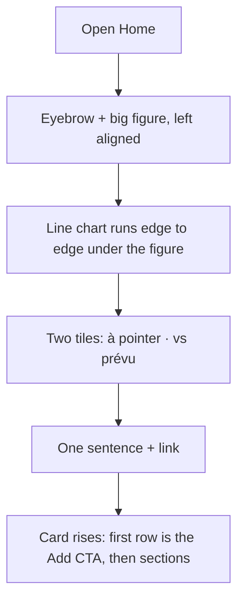

# Instruction: Home hero — edge-to-edge chart, one hierarchy

## Architecture projection

> Tree of the final files. ✅ create · ✏️ modify · ❌ delete

```txt
ios/Pulpe
├── Features/CurrentMonth
│   ├── Components/HomeHeroCard.swift              ✏️ order: figure → chart (full bleed) → tiles → sentence; `HeroFigure` left-aligned
│   ├── Components/HomeHeroCard+Chart.swift        ✏️ bleed past the hero inset, `.interpolationMethod(.monotone)`, 2pt `heroInk` line, area fade to clear, one label (today point), planned rule label moved to the tile
│   └── CurrentMonthView.swift                     ✏️ hero block keeps horizontal inset for text only; "Ajouter une opération" CTA becomes the first element of the content card
├── Shared/Design/DesignTokens.swift               ✏️ `Chart.dashboardHeight` 120 → 150, `Chart.lineWidth` 2
└── Components/CurrentMonthSkeletonView.swift      ✏️ skeleton bars match the new hero slots (chrome never waits, pixel-matched)
ios/PulpeTests/Features/CurrentMonth/HomeHeroCardChartTests.swift ✏️ label-position helpers still pass; add case for gap label hidden when chart bleeds
```

## User Journey



## Test Scope

```mermaid
---
title: Test scope
---
journey
  section Setup
    Seed account, current month with drift => home loaded with trajectory: 5: system
  section Happy path
    Open Home => chart spans the full screen width, no side inset: 5: browser
    Read the hero top to bottom => figure, chart, two tiles, one sentence; no other text in the hero: 5: browser
    Tap the Add CTA on the card => add sheet opens: 5: browser
  section Edge case - no trajectory
    Today outside the period => hero shows figure, tiles and sentence, no empty chart slot: 1: browser
  section Edge case - amounts hidden
    amountsHidden on => figure and tiles masked, chart still drawn: 1: browser
```

## Wireframe

```txt
┌──────────────────────────────────┐
│ (1) Août                    (D)  │
│ (2) estimé fin août               │
│     221.02 CHF                    │
│(3)╱‾‾‾‾‾‾‾‾╲________●- - - - - - │  ← bleeds to both screen edges
│ (4) [13 à pointer] [-588 vs prévu>]│
│ (5) Sous le plan depuis le 15.    │
│     Voir le détail ›              │
│╭─────────────────────────────────╮│
││ (6) [+ Ajouter une opération]   ││
││ (7) sections…                   ││
```

1. Nav bar on forest (unchanged).
2. Eyebrow + figure, left aligned with the text rail.
3. Chart full width: monotone line, area fading to clear, today marker, dashed projection; one label only (today gap), planned amount lives in the `vs prévu` tile.
4. Two metric tiles.
5. Verdict sentence and its link.
6. Flat primary CTA as the card's first row.
7. Existing sections unchanged.

## Tasks to do

### `1)` Re-order and de-clutter the hero

> One read order: figure, chart, tiles, sentence.

1. `HomeHeroCard.body`: `HeroFigure(alignment: .leading)` → `balanceChart` → `summaryMetrics` → `verdictSentence`; spacing `lg` between groups.
2. Remove the "Planned 809.02 CHF" rule label from the chart; the planned rule stays as a dashed line. Keep the today point and the gap label.
3. Move `addOperationRow` from below the hero to the top of `dashboardDetails` (first child of the content card), `.padding(.top, lg)`.

### `2)` Chart edge to edge

> The plot is the picture, not a widget.

1. In `HomeHeroCard+Chart.swift`: `.padding(.horizontal, -DesignTokens.Spacing.xxl)` on the chart so it cancels the hero inset; `chartXScale` unchanged; `.chartPlotStyle { $0.padding(0) }`.
2. `LineMark` width `Chart.lineWidth` (2pt) in `heroInk`, `.interpolationMethod(.monotone)` for both the landing and the projection; `AreaMark` gradient `heroInk.opacity(heroArea) → clear`.
3. Height token `Chart.dashboardHeight` → 150.
4. Gap label anchored so it never clips at the edges (`annotation(position: .overlay, alignment:)` computed from `gapLabelPosition`); `showsGapLabel` unchanged.
5. Skeleton: one bar per slot in the same order and heights; loaded data arrives by a one-shot blur(4)+opacity 0.4 → sharp (oa-design "data arrives by focus"), not by a pop; off under Reduce Motion.

### `3)` Verify

> Screenshot match with the wireframe.

1. Build, run, screenshot Home at rest and in the no-trajectory seed (`Preview` with `trajectory: nil`).
2. `xcodebuild test -only-testing:PulpeTests/HomeHeroCardChartTests`, plus `PulpeUITests` home harness if present.

## Test acceptance criteria

| Task | Acceptance criteria              |
| ---- | -------------------------------- |
| 1 | The hero contains exactly: eyebrow, figure, chart, two tiles, one sentence with its link. |
| 1 | The Add CTA is the first row of the content card and `homeAddOperationButton` still opens the add sheet. |
| 2 | The chart's leading and trailing edges touch the screen edges in the screenshot. |
| 2 | No chart label is clipped at any edge for the seed data and for a gap at day 1 and day 30 (unit test on `gapLabelPosition`). |
| 2 | Skeleton slots overlay the loaded hero within 4pt (visual check, pixel diff). |
| 3 | Named tests green, swiftlint strict clean. |
