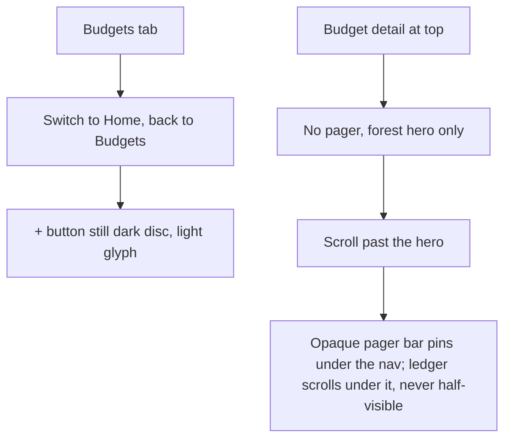
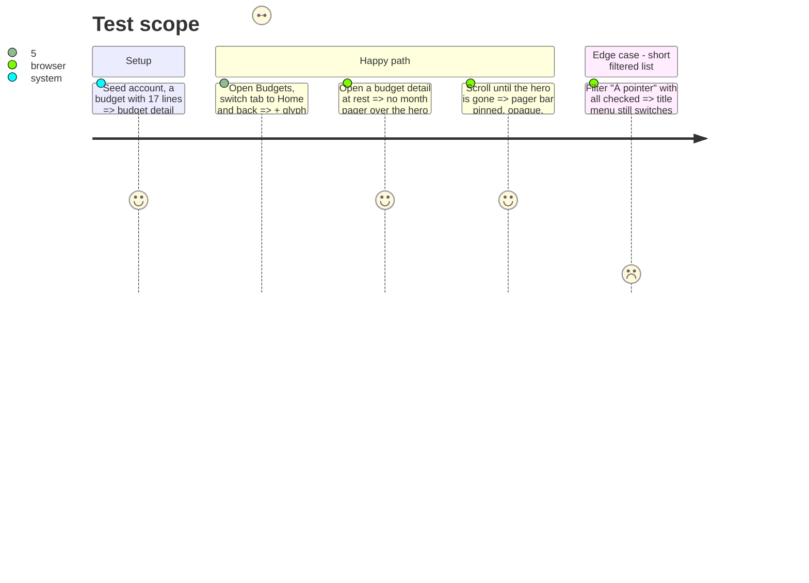

# Instruction: Hero chrome — legible toolbar buttons, month pager that never hides content

## Architecture projection

> Tree of the final files. ✅ create · ✏️ modify · ❌ delete

```txt
ios/Pulpe
├── Shared/Design/PrimaryButtonStyle.swift               ✏️ `HeroToolbarButtonStyle` (`.heroToolbarButtonStyle()`): 36pt disc `heroTile` over `heroInk` glyph, no glass, no scheme dependency
├── Features/Budgets/BudgetList/BudgetListView.swift      ✏️ `createButton` uses it while `isOnHeroSurface`
├── Features/Budgets/BudgetDetails/BudgetDetailsView.swift ✏️ the two trailing buttons use it while `isBudgetPresent`; pager reveal keyed on hero bottom edge
├── Features/SavingsGoals/SavingsGoalDetailView.swift      ✏️ edit button uses it
├── Features/CurrentMonth/CurrentMonthView.swift           ✏️ avatar ring uses `heroTile`
├── Features/Budgets/BudgetDetails/BudgetDetailsScrollTracker.swift ✏️ `update(heroMaxY:navBottom:)`: opacity 0 until the hero's bottom passes the nav bar, then 1 over 24pt
└── Features/Budgets/BudgetDetails/BudgetDetailsStickyPagerLayer.swift ✏️ opaque `appBackground` bar + bottom hairline; delete `ProgressiveBlurEdge` + bridge gradient use here
```

## User Journey



## Test Scope



## Tasks to do

### `1)` Toolbar buttons own their contrast

> No reliance on `toolbarColorScheme` for the button disc.

1. Add `HeroToolbarButtonStyle` in `PrimaryButtonStyle.swift`: label `heroInk`, 36pt circle `Color.heroInk.opacity(Opacity.heroTile)`, 44pt hit frame, pressed opacity; iOS 26 glass disabled on the item (`.buttonStyle` overrides it; verify on the simulator that no glass halo remains, else `.toolbarBackgroundVisibility(.hidden, for: .navigationBar)`).
2. Apply on Budgets list `+`, budget detail `chart.bar.fill` + `+`, goal detail edit, home avatar ring. Flat canvas states keep `.iconButtonStyle()`.
3. Add the pair `heroInk on heroTile-over-heroSurface` to `HeroContrastTests` (composite the tile alpha over the surface before measuring).

### `2)` Pager reveals after the hero, as an opaque bar

> Content scrolls under a real bar, not a blur band.

1. `BudgetDetailsScrollTracker.update(heroMaxY:)` — opacity = clamp((navBottom − heroMaxY) / 24pt); feed it from the existing hero `onGeometryChange` using `.global` `maxY` and the safe-area top inset read from the same proxy.
2. `BudgetDetailsStickyPagerLayer`: `ZStack` → `VStack(spacing: 0) { BudgetMonthPagerBar; Divider() }.background(Color.appBackground)`; remove `ProgressiveBlurEdge` and the bridge gradient from this file (keep the component if other callers exist, else delete it).
3. Keep `allowsHitTesting(opacity > 0.5)` and the title-menu fallback comment updated. Reveal fade ≤ 0.16s easeOut in, 0.1s out (oa-design micro fades).

### `3)` Verify

1. Reproduce the `+` contrast bug before the fix (Budgets → Home → Budgets) and screenshot after.
2. Screenshot budget detail at rest and scrolled; run `BudgetListAccessibilityTests`, `BudgetLineLongPressTests`.

## Test acceptance criteria

| Task | Acceptance criteria              |
| ---- | -------------------------------- |
| 1 | After Budgets → Home → Budgets, the `+` glyph on its disc measures ≥ 4.5:1 (screenshot pixel pick). |
| 1 | `HeroContrastTests` includes the tile pair and passes in light and dark. |
| 2 | At the top of a budget detail no pager is visible; once the hero bottom passes the nav bar the pager is fully opaque. |
| 2 | Scrolled, the first section header below the pager is entirely visible or entirely hidden, never partially blurred. |
| 3 | Named UI tests green, swiftlint strict clean. |
